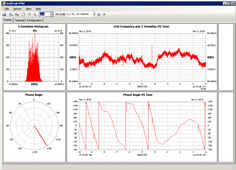

|   |   |   |   |
|---|---|---|---|
| **[Grid Protection Alliance](http://www.gridprotectionalliance.org)** | **[openPDC Project on GitHub](https://github.com/GridProtectionAlliance/openPDC)** | **[openPDC Wiki Home](../openPDC_Home.md)** | **[Documentation](../openPDC_Documentation_Home.md)** |

# Contributor - ajstadlin

### Personal Statement

I am a full time systems administrator, software engineer, and electronics technology enthusiast.  I developed an independent project to design and produce the [GridTrak Open Source PMU](https://github.com/ajstadlin/GridTrak) an inexpensive SynchroPhasor PMU sensor for research and development.  

My interest in openPDC is developing and testing the interaces and protocols that the PMU sensor will use to interface with openPDC.  I also edit some of the openPDC project documentation.

//AJ

[GridTrak Open Source PMU Project on GitHub](https://github.com/ajstadlin/GridTrak)

---
* Updated Nov 9, 2016 [//aj](https://github.com/ajstadlin)
* Extracted Oct 10, 2015 from [ajstadlin@CodePlex](http://www.codeplex.com/site/users/view/ajstadlin)

