[](openPDC_Home.md "The Open Source Phasor Data Concentrator")

|   |   |   |   |   |
|---|---|---|---|---|
| **[Grid Protection Alliance](http://www.gridprotectionalliance.org "Grid Protection Alliance Home Page")** | **[openPDC Project](https://github.com/GridProtectionAlliance/openPDC "openPDC Project on GitHub")** | **[openPDC Wiki](openPDC_Home.md "openPDC Wiki Home Page")** | **[Documentation](openPDC_Documentation_Home.md "openPDC Documentation Home Page")** | **[Latest Release](https://github.com/GridProtectionAlliance/openPDC/releases "openPDC Releases Home Page")** |

```diff
+ .
- ** THIS DOCUMENTATION IS DEPRECATED **
```

See [Grid Solutions Framework](https://github.com/GridProtectionAlliance/gsf) for latest code base.

# About the Code

Below you will find a high level hierarchical overview of the code which provides a summary of solutions, namespaces and classes within the API portions of the openPDC. For more detail about the code you can download the [API help](http://www.gridsolutions.org/NightlyBuilds/openPDC/Help/) which includes standalone compiled help files (.chm) as well as help files that directly integrate within Visual Studio. We have also made our help system available online, here are the primary help links for each of the major solutions:

- [Framework](http://tvacodelibrary.codeplex.com/documentation)
- [Historian](http://www.gridprotectionalliance.org/NightlyBuilds/openHistorian/Help/)
- [Synchrophasor](http://www.gridprotectionalliance.org/NightlyBuilds/openPDC/Help/)
&nbsp;  
&nbsp;
- [TVA Solution and Namespace Overview](#tva-solution-and-namespace-overview)
    - [TVA Solution Overview](#tva-solution-overview)
    - [TVA Code Namespace Overview](#tva-code-namespace-overview)
- [TVA Class Hierarchical Overview](#tva-class-hierarchical-overview)
- [Phasor Protocol Relationship Diagrams](#phasor-protocol-relationship-diagrams)
    - [Analog Definition Relationships](#analog-definition-relationships)
    - [Analog Value Relationships](#analog-value-relationships)
    - [CommandCell Collection Relationships](#commandcell-collection-relationships)
    - [CommandCell Relationships](#commandcell-relationships)
    - [CommandFrame Relationships](#commandframe-relationships)
    - [ConfigurationCell Collection Relationships](#configurationcell-collection-relationships)
    - [ConfigurationCell Relationships](#configurationcell-relationships)
    - [ConfigurationFrame Relationships](#configurationframe-relationships)
    - [DataCell Collection Relationships](#datacell-collection-relationships)
    - [DataCell Relationships](#datacell-relationships)
    - [DataFrame Relationships](#dataframe-relationships)
    - [Digital Definition Relationships](#digital-definition-relationships)
    - [Digital Value Relationships](#digital-value-relationships)
    - [FrameParser Relationships](#frameparser-relationships)
    - [Frequency Definition Relationships](#frequency-definition-relationships)
    - [Frequency Value Relationships](#frequency-value-relationships)
    - [HeaderCell Collection Relationships](#headercell-collection-relationships)
    - [HeaderCell Relationships](#headercell-relationships)
    - [HeaderFrame Relationships](#headerframe-relationships)
    - [Phasor Definition Relationships](#phasor-definition-relationships)
    - [Phasor Value Relationships](#phasor-value-relationships)

---

## TVA Solution and Namespace Overview

This section offers brief descriptions of the solutions and namespaces as well as a list of the assemblies associated with them.

### TVA Solution Overview

| Solution | Description | Assemblies |
| -------- | ----------- | ---------- |
| [Framework](#framework) | The Framework solution contains all code that is foundational to all other code within the openPDC; it is the "code library" that all other solutions and code depend on. | `TVA.Core.dll, TVA.Communication.dll, TVA.Windows.dll, TVA.Services.dll` |
| [Historian](#historian) | The historian solution contains all code that is used for archiving data within the openPDC; specifically, this is the code that allows the system to perform basic in-process archiving. | `TVA.Historian.dll` |
| [Synchrophasor](#synchrophasor) | The synchrophasor solution contains all code related to the primary system executables of the openPDC as well as the phasor protocol parsing and generating library. | `TVA.PhasorProtocols.dll` |

### TVA Code Namespace Overview

| Namespace | Description | Assembly Location |
| --------- | ----------- | ----------------- |
| [TVA](#tva) | Contains fundamental classes that define commonly-used value and reference data types, interfaces, and basic type extension functions. | `TVA.Core.dll` |
| [TVA.Collections](#tvacollections) | Contains classes and type extension functions related to any fundamental collection, including thread-based processing queues. | `TVA.Core.dll` |
| [TVA.Communication](#tvacommunication) | Contains high-level classes and components related to any data communications, including sockets, as well as serial- and file-based transports used to simplify and standardize data access. | `TVA.Communication.dll` |
| [TVA.Configuration](#tvaconfiguration) | Contains classes, base classes, and attributes related to simplifying access to configuration files, including creating a categorized settings section. | `TVA.Core.dll` |
| [TVA.Console](#tvaconsole) | Contains classes used for parsing command line parameters and managing console applications. | `TVA.Core.dll` |
| [TVA.Data](#tvadata) | Contains extension functions used to simplify and standardize database access. | `TVA.Core.dll` |
| [TVA.Diagnostics](#tvadiagnostics) | Contains classes used to simplify and standardize performance monitoring for applications. | `TVA.Core.dll` |
| [TVA.Drawing](#tvadrawing) | Contains extension functions used to simplify managing images. | `TVA.Core.dll` |
| [TVA.ErrorManagement](#tvaerrormanagement) | Contains classes used to simplify and standardize error management for applications. | `TVA.Core.dll` |
| [TVA.Historian](#tvahistorian) | Contains fundamental classes used by all historian code. | `TVA.Historian.dll` |
| [TVA.Historian.Exporters](#tvahistorianexporters) | Contains classes used for automating data exports in a variety of formats. | `TVA.Historian.dll` |
| [TVA.Historian.Files](#tvahistorianfiles) | Contains classes used for manipulating archive files. | `TVA.Historian.dll` |
| [TVA.Historian.MetadataProviders](#tvahistorianmetadataproviders) | Contains classes that allow the historian to collect its required point metadata definitions from a variety of sources. | `TVA.Historian.dll` |
| [TVA.Historian.Notifiers](#tvahistoriannotifiers) | Contains classes and interfaces that allow standard and custom historian notifications about critical system events. | `TVA.Historian.dll` |
| [TVA.Historian.Packets](#tvahistorianpackets) | Contains classes that define packet definitions used for transmission of data points and metadata. | `TVA.Historian.dll` |
| [TVA.Historian.Services](#tvahistorianservices) | Contains classes that define the fundamental web services for a historian. | `TVA.Historian.dll` |
| [TVA.Identity](#tvaidentity) | Contains classes used to simplify and standardize access to information about a domain user retrieved from Active Directory. | `TVA.Core.dll` |
| [TVA.Interop](#tvainterop) | Contains classes used to handle interoperability with older legacy applications. | `TVA.Core.dll` |
| [TVA.IO](#tvaio) | Contains classes and extension functions used to simplify and standardize operations related to files and streams. | `TVA.Core.dll` |
| [TVA.Checksums](#tvachecksums) | Contains classes and extension functions used to calculate standard checksums and CRC's. | `TVA.Core.dll` |
| [TVA.Compression](#tvacompression) | Contains classes and extension functions used to simplify and standardize using compression in applications. | `TVA.Core.dll` |
| [TVA.Measurements](#tvameasurements) | Contains classes used to abstractly define measured values and to provide mechanisms for concentrating streaming measurements. | `TVA.Core.dll` |
| [TVA.Measurements.Routing](#tvameasurementsrouting) | Contains classes that define an adapter interface layer used to route measurements through a cycle of input, sorted actions, and queued output. | `TVA.Core.dll` |
| [TVA.Media](#tvamedia) | Contains classes used to create and manipulate waveform audio format (WAV) files. | `TVA.Core.dll` |
| [TVA.Media.Sound](#tvamediasound) | Contains classes used to create dual-tone, multi-frequency sounds and standard touch tones. | `TVA.Core.dll` |
| [TVA.Net.Ftp](#tvanetftp) | Contains classes used to create client connections to FTP servers for uploading and downloading files. | `TVA.Core.dll` |
| [TVA.Net.Smtp](#tvanetsmtp) | Contains classes used to simplify and standardize operations related to sending e-mail messages. | `TVA.Core.dll` |
| [TVA.NumericalAnalysis](#tvanumericalanalysis) | Contains classes and extension functions used to calculate common numerical operations such as curve fits and standard deviations. | `TVA.Core.dll` |
| [TVA.Parsing](#tvaparsing) | Contains classes used to simplify, standardize and automate any kind of stream-based parsing operation. | `TVA.Core.dll` |
| [TVA.PhasorProtocols](#tvaphasorprotocols) | Contains fundamental classes and interfaces used by all phasor protocol parsing and generating code. | `TVA.PhasorProtocols.dll` |
| [TVA.PhasorProtocols.Anonymous](#tvaphasorprotocolsanonymous) | Contains a generic implementation of phasor classes used to represent phasor data that is not associated with any particular protocol. | `TVA.PhasorProtocols.dll` |
| [TVA.PhasorProtocols.BpaPdcStream](#tvaphasorprotocolsbpapdcstream) | Contains an implementation of the phasor classes used to parse or generate a stream of data in the BPA PDCstream format. | `TVA.PhasorProtocols.dll` |
| [TVA.PhasorProtocols.FNet](#tvaphasorprotocolsfnet) | Contains an implementation of the phasor classes used to parse or generate a stream of data in the F-NET device format. | `TVA.PhasorProtocols.dll` |
| [TVA.PhasorProtocols.Ieee1344](#tvaphasorprotocolsieee1344) | Contains an implementation of the phasor classes used to parse or generate a stream of data in the IEEE 1344-1995 standard format. | `TVA.PhasorProtocols.dll` |
| [TVA.PhasorProtocols.IeeeC37_118](#tvaphasorprotocolsieeec37_118) | Contains an implementation of the phasor classes used to parse or generate a stream of data in the IEEE C37.118-2005 standard format. | `TVA.PhasorProtocols.dll` |
| [TVA.PhasorProtocols.Macrodyne](#tvaphasorprotocolsmacrodyne) | Contains an implementation of the phasor classes used to parse or generate a stream of data in the Macrodyne PMU device format. | `TVA.PhasorProtocols.dll` |
| [TVA.PhasorProtocols.SelFastMessage](#tvaphasorprotocolsselfastmessage) | Contains an implementation of the phasor classes used to parse or generate a stream of data in the SEL Fast Message format used by a variety of SEL devices. | `TVA.PhasorProtocols.dll` |
| [TVA.Reflection](#tvareflection) | Contains classes and extension functions used to simplify and standardize access to assembly information and attributes in applications. | `TVA.Core.dll` |
| [TVA.Scheduling](#tvascheduling) | Contains classes used to schedule operations using standard UNIX crontab syntax. | `TVA.Core.dll` |
| [TVA.Security.Cryptography](#tvasecuritycryptography) | Contains classes and extension functions used to simplify and standardize usage of basic cryptography using a combination of standard and proprietary encryption algorithms to produce decent obfuscations of strings, buffers and streams of data. | `TVA.Core.dll` |
| [TVA.Services](#tvaservices) | Contains classes used to simplify and standardize development and operation of Windows services that are remotely manageable. | `TVA.Services.dll` |
| [TVA.Threading](#tvathreading) | Contains classes used to define managed threads that can be used for debugging threads by providing automatic tracking, total thread runtime, and the ability to run threads in alternate execution contexts. | `TVA.Core.dll` |
| [TVA.Units](#tvaunits) | Contains classes used to simplify and standardize standard unit and SI conversions. | `TVA.Core.dll` |
| TVA.Windows.Forms ([TVA.Core](#tvawindowsforms), [TVA.Windows](#tvawindowsforms-1)) | Contains classes, extension functions, and forms used to simplify and standardize usage of basic Windows forms. | `TVA.Core.dll, TVA.Windows.dll` |
| [TVA.Xml](#tvaxml) | Contains extension functions used to simplify and standardize usage of standard XML objects. | `TVA.Core.dll` |

---

## TVA Class Hierarchical Overview

**[Framework](#framework)**  
- [TVA.Communication](#tvacommunication)
    - TVA
        - [Communication](#communication)
        - [ClientBase](#clientbase)
        - [ClientState](#clientstate)
        - [FileClient](#fileclient)
        - [IClient](#iclient)
        - [IServer](#iserver)
        - [Payload](#payload)
        - [SerialClient](#serialclient)
        - [ServerBase](#serverbase)
        - [ServerState](#serverstate)
        - [TcpClient](#tcpclient)
        - [TcpServer](#tcpserver)
        - [Transport](#transport)
        - [TransportProtocol](#transportprotocol)
        - [TransportProvider](#transportprovider)
        - [TransportStatistics](#transportstatistics)
        - [UdpClient](#udpclient)
        - [UdpServer](#udpserver)
&nbsp;  
&nbsp;
- [TVA.Core](#tvacore)
    - [TVA](#tva)
        - [AdapterLoader](#adapterloader)
        - [ApplicationType](#applicationtype)
        - [BaselineTimeInterval](#baselinetimeinterval)
        - [BigBinaryValue](#bigbinaryvalue)
        - [BigEndianOrder](#bigendianorder)
        - [BinaryCodedDecimal](#binarycodeddecimal)
        - [BinaryValue](#binaryvalue)
        - [BinaryValueBase](#binaryvaluebase)
        - [BitExtensions](#bitextensions)
        - [Bits](#bits)
        - [BitwiseCast](#bitwisecast)
        - [BufferExtensions](#bufferextensions)
        - [ByteEncoding](#byteencoding)
        - [CharExtensions](#charextensions)
        - [Common](#common)
        - [ComplexNumber](#complexnumber)
        - [CompoundValue](#compoundvalue)
        - [DateTimeExtensions](#datetimeextensions)
        - [Endianness](#endianness)
        - [EndianOrder](#endianorder)
        - [EventArgs](#eventargs)
        - [IdentifiableItem](#identifiableitem)
        - [Int24](#int24)
        - [IProvideStatus](#iprovidestatus)
        - [ISupportLifecycle](#isupportlifecycle)
        - [LittleBinaryValue](#littlebinaryvalue)
        - [LittleEndianOrder](#littleendianorder)
        - [NativeEndianOrder](#nativeendianorder)
        - [NtpTimeTag](#ntptimetag)
        - [NumericExtensions](#numericextensions)
        - [ObjectState](#objectstate)
        - [PrecisionTimer](#precisiontimer)
        - [ProcessProgress](#processprogress)
        - [ProcessProgressHandler](#processprogresshandler)
        - [Serialization](#serialization)
        - [StringExtensions](#stringextensions)
        - [Ticks](#ticks)
        - [TimerCapabilities](#timercapabilities)
        - [TimerStartException](#timerstartexception)
        - [TimeTagBase](#timetagbase)
        - [TypeExtensions](#typeextensions)
        - [UInt24](#uint24)
        - [UnixTimeTag](#unixtimetag)
        - [USTimeZones](#ustimezones)
        - [Word](#word)
        - [Collections](#tvacollections)
            - [CollectionExtensions](#collectionextensions)
            - [DictionaryList](#dictionarylist)
            - [KeyedProcessQueue](#keyedprocessqueue)
            - [ProcessQueue](#processqueue)
            - [ProcessQueueStatistics](#processqueuestatistics)
            - [QueueProcessingStyle](#queueprocessingstyle)
            - [QueueThreadingMode](#queuethreadingmode)
            - [RequeueMode](#requeuemode)
        - [Configuration](#tvaconfiguration)
            - [AppSettingsBase](#appsettingsbase)
            - [CategorizedSettingsBase](#categorizedsettingsbase)
            - [CategorizedSettingsElement](#categorizedsettingselement)
            - [CategorizedSettingsElementCollection](#categorizedsettingselementcollection)
            - [CategorizedSettingsSection](#categorizedsettingssection)
            - [ConfigurationFile](#configurationfile)
            - [EncryptSettingAttribute](#encryptsettingattribute)
            - [IniSettingsBase](#inisettingsbase)
            - [IPersistSettings](#ipersistsettings)
            - [RegistrySettingsBase](#registrysettingsbase)
            - [SerializeSettingAttribute](#serializesettingattribute)
            - [SettingNameAttribute](#settingnameattribute)
            - [SettingsBase](#settingsbase)
        - [Console](#tvaconsole)
            - [Arguments](#arguments)
            - [Events](#events)
        - [Data](#tvadata)
            - [DataExtensions](#dataextensions)
        - [Diagnostics](#tvadiagnostics)
            - [PerformanceCounter](#performancecounter)
            - [PerformanceMonitor](#performancemonitor)
        - [Drawing](#tvadrawing)
            - [BitmapExtensions](#bitmapextensions)
        - [ErrorManagement](#tvaerrormanagement)
            - [ErrorDialog](#errordialog)
            - [ErrorLogger](#errorlogger)
            - [ErrorModule](#errormodule)
            - [SmtpTraceListener](#smtptracelistener)
        - [Identity](#tvaidentity)
            - [UserInfo](#userinfo)
        - [Interop](#tvainterop)
            - [IniFile](#inifile)
            - [VBArrayDescriptor](#vbarraydescriptor)
            - [WindowsApi](#windowsapi)
        - [IO](#tvaio)
            - [ExportDestination](#exportdestination)
            - [FilePath](#filepath)
            - [IsamDataFileBase](#isamdatafilebase)
            - [LogFile](#logfile)
            - [LogFileFullOperation](#logfilefulloperation)
            - [MultipleDestinationExporter](#multipledestinationexporter)
            - [StreamExtensions](#streamextensions)
        - [Checksums](#tvachecksums)
            - [ChecksumExtensions](#checksumextensions)
            - [ChecksumType](#checksumtype)
            - [Crc16](#crc16)
            - [Crc32](#crc32)
            - [CrcCCITT](#crcccitt)
            - [Xor16](#xor16)
            - [Xor32](#xor32)
            - [Xor64](#xor64)
            - [Xor8](#xor8)
        - [Compression](#tvacompression)
            - [CompressionExtensions](#compressionextensions)
            - [CompressionStrength](#compressionstrength)
            - [FileCompressor](#filecompressor)
        - [Measurements](#tvameasurements)
            - [ConcentratorBase](#concentratorbase)
            - [Frame](#frame)
            - [FrameQueue](#framequeue)
            - [IFrame](#iframe)
            - [IMeasurement](#imeasurement)
            - [ImmediateMeasurements](#immediatemeasurements)
            - [Measurement](#measurement)
            - [MeasurementKey](#measurementkey)
            - [TemporalMeasurement](#temporalmeasurement)
            - [Routing](#tvameasurementsrouting)
                - [ActionAdapterBase](#actionadapterbase)
                - [ActionAdapterCollection](#actionadaptercollection)
                - [AdapterBase](#adapterbase)
                - [AdapterCollectionBase](#adaptercollectionbase)
                - [AdapterCommandAttribute](#adaptercommandattribute)
                - [AllAdaptersCollection](#alladapterscollection)
                - [IActionAdapter](#iactionadapter)
                - [IAdapter](#iadapter)
                - [IAdapterCollection](#iadaptercollection)
                - [IInputAdapter](#iinputadapter)
                - [InputAdapterBase](#inputadapterbase)
                - [InputAdapterCollection](#inputadaptercollection)
                - [IOutputAdapter](#ioutputadapter)
                - [OutputAdapterBase](#outputadapterbase)
                    - [OutputAdapterCollection](#outputadaptercollection)           
        - [Media](#tvamedia)
            - [BitsPerSample](#bitspersample)
            - [DataChannels](#datachannels)
            - [DataFormatSubType](#dataformat)
            - [RiffChunk](#riffchunk)
            - [RiffHeaderChunk](#riffheaderchunk)
            - [SampleRate](#samplerate)
            - [Speakers](#speakers)
            - [WaveDataChunk](#wavedatachunk)
            - [WaveFile](#wavefile)
            - [WaveFormat](#waveformat)
            - [WaveFormatChunk](#waveformatchunk)
            - [WaveFormatExtensible](#waveformatextensible)
            - [Sound](#tvamediasound)
                - [DTMF](#dtmf)
                - [TouchTone](#touchtone)
                - [TouchToneKey](#touchtonekey)
        - Net
            - [Ftp](#tvanetftp)
                - [FtpAsyncResult](#ftpasyncresult)
                - [FtpAuthenticationException](#ftpauthenticationexception)
                - [FtpClient](#ftpclient)
                - [FtpCommandException](#ftpcommandexception)
                - [FtpControlChannel](#ftpcontrolchannel)
                - [FtpDataStream](#ftpdatastream)
                - [FtpDataTransferException](#ftpdatatransferexception)
                - [FtpDirectory](#ftpdirectory)
                - [FtpExceptionBase](#ftpexceptionbase)
                - [FtpFile](#ftpfile)
                - [FtpFileNotFoundException](#ftpfilenotfoundexception)
                - [FtpFileWatcher](#ftpfilewatcher)
                - [FtpInputDataStream](#ftpinputdatastream)
                - [FtpInvalidResponseException](#ftpinvalidresponseexception)
                - [FtpOutputDataStream](#ftpoutputdatastream)
                - [FtpResponse](#ftpresponse)
                - [FtpResumeNotSupportedException](#ftpresumenotsupportedexception)
                - [FtpServerDownException](#ftpserverdownexception)
                - [FtpUserAbortException](#ftpuserabortexception)
                - [IFtpFile](#iftpfile)
                - [TransferDirection](#transferdirection)
                - [TransferMode](#transfermode)
            - [Smtp](#tvanetsmtp)
                - [Mail](#mail)   
        - [NumericalAnalysis](#tvanumericalanalysis)
            - [CurveFit](#curvefit)
            - [NumericalAnalysisExtensions](#numericalanalysisextensions)
            - [RealTimeSlope](#realtimeslope)
        - [Parsing](#tvaparsing)
            - [BinaryImageBase](#binaryimagebase)
            - [BinaryImageParserBase](#binaryimageparserbase)
            - [CommonHeaderBase](#commonheaderbase)
            - [FrameImageParserBase](#frameimageparserbase)
            - [IBinaryImageParser](#ibinaryimageparser)
            - [ICommonHeader](#icommonheader)
            - [IFrameImageParser](#iframeimageparser)
            - [ISupportBinaryImage](#isupportbinaryimage)
            - [ISupportFrameImage](#isupportframeimage)
            - [MultiSourceFrameImageParserBase](#multisourceframeimageparserbase)
        - [Reflection](#tvareflection)
            - [AssemblyExtensions](#assemblyextensions)
            - [AssemblyInfo](#assemblyinfo)
            - [MemberInfoExtensions](#memberinfoextensions)
        - [Scheduling](#tvascheduling)
            - [DateTimePart](#datetimepart)
            - [Schedule](#schedule)
            - [ScheduleManager](#schedulemanager)
            - [SchedulePart](#schedulepart)
            - [SchedulePartTextSyntax](#scheduleparttextsyntax)
        - Security
            - [Cryptography](#tvasecuritycryptography)
                - [Cipher](#cipher)
                - [CipherStrength](#cipherstrength)
                - [Random](#random)
                - [SymmetricAlgorithmExtensions](#symmetricalgorithmextensions)
        - [Threading](#tvathreading)
            - [ManagedThread](#managedthread)
            - [ManagedThreadPool](#managedthreadpool)
            - [ManagedThreads](#managedthreads)
            - [ThreadStatus](#threadstatus)
            - [ThreadType](#threadtype)
        - [Units](#tvaunits)
            - [Angle](#angle)
            - [Charge](#charge)
            - [Current](#current)
            - [Energy](#energy)
            - [Length](#length)
            - [Mass](#mass)
            - [Power](#power)
            - [SI](#si)
            - [SI2](#si2)
            - [Speed](#speed)
            - [Temperature](#temperature)
            - [Time](#time)
            - [Voltage](#voltage)
            - [Volume](#volume)
        - Windows
            - [Forms](#tvawindowsforms)
                - [FormExtensions](#formextensions)
                - [ScreenArea](#screenarea)
        - [Xml](#tvaxml)
            - [XmlExtensions](#xmlextensions)
&nbsp;  
&nbsp;
- [TVA.Services](#tvaservices)
    - TVA
        - [Services](#tvaservices-1)
            - [ClientHelper](#clienthelper)
            - [ClientInfo](#clientinfo)
            - [ClientRequest](#clientrequest)
            - [ClientRequestHandler](#clientrequesthandler)
            - [ClientRequestInfo](#clientrequestinfo)
            - [IdentityToken](#identitytoken)
            - [ServiceHelper](#servicehelper)
            - [ServiceProcess](#serviceprocess)
            - [ServiceProcessState](#serviceprocessstate)
            - [ServiceResponse](#serviceresponse)
            - [ServiceState](#servicestate)
&nbsp;  
&nbsp;
- [TVA.Windows](#tvawindows)
    - TVA
        - Windows
            - [Forms](#tvawindowsforms-1)
                - [AboutDialog](#aboutdialog)
                - [PropertyGridExtensions](#propertygridextensions)

**[Historian](#tvahistorian)**
- [TVA.Historian](#tvahistorian)
    - TVA
        - [Historian](#tvahistorian-1)                                             
            - [DataListener](#datalistener)
            - [IArchive](#iarchive)
            - [IDataPoint](#idatapoint)
            - [Quality](#quality)
            - [TimeTag](#timetag)
            - [Exporters](#tvahistorianexporters)
                - [CsvExporter](#csvexporter)
                - [DataMonitorExporter](#datamonitorexporter)
                - [Export](#export)
                - [ExporterBase](#exporterbase)
                - [ExportProcessResult](#exportprocessresult)
                - [ExportRecord](#exportrecord)
                - [ExportSetting](#exportsetting)
                - [ExportType](#exporttype)
                - [FileHelper](#filehelper)
                - [IExporter](#iexporter)
                - [RawDataExporter](#rawdataexporter)
                - [RebroadcastExporter](#rebroadcastexporter)
                - [RollingHistoryExporter](#rollinghistoryexporter)
                - [StatisticsExporter](#statisticsexporter)
                - [XmlExporter](#xmlexporter)
            - [Files](#tvahistorianfiles)
                - [ArchiveData](#archivedata)
                - [ArchiveDataBlock](#archivedatablock)
                - [ArchiveDataBlockPointer](#archivedatablockpointer)
                - [ArchiveFile](#archivefile)
                - [ArchiveFileAllocationTable](#archivefileallocationtable)
                - [ArchiveFileStatistics](#archivefilestatistics)
                - [ArchiveFileType](#archivefiletype)
                - [DataType](#datatype)
                - [IntercomFile](#intercomfile)
                - [IntercomRecord](#intercomrecord)
                - [MetadataFile](#metadatafile)
                - [MetadataRecord](#metadatarecord)
                - [MetadataRecordAlarmFlags](#metadatarecordalarmflags)
                - [MetadataRecordAnalogFields](#metadatarecordanalogfields)
                - [MetadataRecordComposedFields](#metadatarecordcomposedfields)
                - [MetadataRecordConstantFields](#metadatarecordconstantfields)
                - [MetadataRecordDigitalFields](#metadatarecorddigitalfields)
                - [MetadataRecordGeneralFlags](#metadatarecordgeneralflags)
                - [MetadataRecordSecurityFlags](#metadatarecordsecurityflags)
                - [MetadataRecordSummary](#metadatarecordsummary)
                - [StateFile](#statefile)
                - [StateRecord](#staterecord)
                - [StateRecordData](#staterecorddata)
                - [StateRecordSummary](#staterecordsummary)
            - [MetadataProviders](#tvahistorianmetadataproviders)
                - [AdoMetadataProvider](#adometadataprovider)
                - [IMetadataProvider](#imetadataprovider)
                - [MetadataProviderBase](#metadataproviderbase)
                - [MetadataProviders](#metadataproviders)
                - [MetadataUpdater](#metadataupdater)
                - [OleDbMetadataProvider](#oledbmetadataprovider)
                - [RestWebServiceMetadataProvider](#restwebservicemetadataprovider)
            - [Notifiers](#tvahistoriannotifiers)
                - [EmailNotifier](#emailnotifier)
                - [INotifier](#inotifier)
                - [NotificationTypes](#notificationtypes)
                - [NotifierBase](#notifierbase)
                - [Notifiers](#notifiers)
            - [Packets](#tvahistorianpackets)
                - [IPacket](#ipacket)
                - [PacketBase](#packetbase)
                - [PacketCommonHeader](#packetcommonheader)
                - [PacketParser](#packetparser)
                - [PacketType1](#packettype1)
                - [PacketType101](#packettype101)
                - [PacketType101Data](#packettype101data)
                - [PacketType11](#packettype11)
                - [PacketType2](#packettype2)
                - [PacketType3](#packettype3)
                - [PacketType4](#packettype4)
                - [PacketType5](#packettype5)
                - [QueryPacketBase](#querypacketbase)
            - [Services](#tvahistorianservices)
                - [DataFlowDirection](#dataflowdirection)
                - [IMetadataService](#imetadataservice)
                - [IService](#iservice)
                - [ITimeSeriesDataService](#itimeseriesdataservice)
                - [MetadataService](#metadataservice)
                - [SerializableMetadata](#serializablemetadata)
                - [SerializableMetadataRecord](#serializablemetadatarecord)
                - [SerializableTimeSeriesData](#serializabletimeseriesdata)
                - [SerializableTimeSeriesDataPoint](#serializabletimeseriesdatapoint)
                - [Serialization](#serialization-1)
                - [SerializationFormat](#serializationformat)
                - [Service](#service)
                - [Services](#services)
                - [TimeSeriesDataService](#timeseriesdataservice)

**[Synchrophasor](#synchrophasor)**
- [TVA.PhasorProtocols](#tvaphasorprotocols)
    - TVA
        - [PhasorProtocols](#tvaphasorprotocols-1)
            - [AnalogDefinitionBase](#analogdefinitionbase)
            - [AnalogDefinitionCollection](#analogdefinitioncollection)
            - [AnalogType](#analogtype)
            - [AnalogValueBase](#analogvaluebase)
            - [AnalogValueCollection](#analogvaluecollection)
            - [ChannelBase](#channelbase)
            - [ChannelCellBase](#channelcellbase)
            - [ChannelCellCollectionBase](#channelcellcollectionbase)
            - [ChannelCellParsingStateBase](#channelcellparsingstatebase)
            - [ChannelCellCollectionBase](#channelcollectionbase)
            - [ChannelDefinitionBase](#channeldefinitionbase)
            - [ChannelDefinitionCollectionBase](#channeldefinitioncollectionbase)
            - [ChannelFrameBase](#channelframebase)
            - [ChannelFrameCollectionBase](#channelframecollectionbase)
            - [ChannelFrameParsingStateBase](#channelframeparsingstatebase)
            - [ChannelParsingStateBase](#channelparsingstatebase)
            - [ChannelValueBase](#channelvaluebase)
            - [ChannelValueCollectionBase](#channelvaluecollectionbase)
            - [ChannelValueMeasurement](#channelvaluemeasurement)
            - [CommandCell](#commandcell)
            - [CommandCellCollection](#commandcellcollection)
            - [CommandFrameBase](#commandframebase)
            - [CommandFrameParsingState](#commandframeparsingstate)
            - [Common](#common-1)
            - [CommonStatusFlags](#commonstatusflags)
            - [CompositeFrequencyValue](#compositefrequencyvalue)
            - [CompositePhasorValue](#compositephasorvalue)
            - [ConfigurationCellBase](#configurationcellbase)
            - [ConfigurationCellCollection](#configurationcellcollection)
            - [ConfigurationCellParsingState](#configurationcellparsingstate)
            - [ConfigurationFrameBase](#configurationframebase)
            - [ConfigurationFrameCollection](#configurationframecollection)
            - [ConfigurationFrameParsingState](#configurationframeparsingstate)
            - [ConnectionParametersBase](#connectionparametersbase)
            - [CoordinateFormat](#coordinateformat)
            - [DataCellBase](#datacellbase)
            - [DataCellCollection](#datacellcollection)
            - [DataCellParsingState](#datacellparsingstate)
            - [DataFormat](#dataformat-1)
            - [DataFrameBase](#dataframebase)
            - [DataFrameCollection](#dataframecollection)
            - [DataFrameParsingState](#dataframeparsingstate)
            - [DataSortingType](#datasortingtype)
            - [DeviceCommand](#devicecommand)
            - [DigitalDefinitionBase](#digitaldefinitionbase)
            - [DigitalDefinitionCollection](#digitaldefinitioncollection)
            - [DigitalValueBase](#digitalvaluebase)
            - [DigitalValueCollection](#digitalvaluecollection)
            - [FrameParserBase](#frameparserbase)
            - [FrequencyDefinitionBase](#frequencydefinitionbase)
            - [FrequencyDefinitionCollection](#frequencydefinitioncollection)
            - [FrequencyValueBase](#frequencyvaluebase)
            - [FrequencyValueCollection](#frequencyvaluecollection)
            - [FundamentalFrameType](#fundamentalframetype)
            - [HeaderCell](#headercell)
            - [HeaderCellCollection](#headercellcollection)
            - [HeaderFrameBase](#headerframebase)
            - [HeaderFrameParsingState](#headerframeparsingstate)
            - [IAnalogDefinition](#ianalogdefinition)
            - [IAnalogValue](#ianalogvalue)
            - [IChannel](#ichannel)
            - [IChannelCell](#ichannelcell)
            - [IChannelCellCollection](#ichannelcellcollection)
            - [IChannelCellParsingState](#ichannelcellparsingstate)
            - [IChannelCollection](#ichannelcollection)
            - [IChannelDefinition](#ichanneldefinition)
            - [IChannelFrame](#ichannelframe)
            - [IChannelFrameParsingState](#ichannelframeparsingstate)
            - [IChannelParsingState](#ichannelparsingstate)
            - [IChannelValue](#ichannelvalue)
            - [ICommandCell](#icommandcell)
            - [ICommandFrame](#icommandframe)
            - [ICommandFrameParsingState](#icommandframeparsingstate)
            - [IConfigurationCell](#iconfigurationcell)
            - [IConfigurationCellParsingState](#iconfigurationcellparsingstate)
            - [IConfigurationFrame](#iconfigurationframe)
            - [IConfigurationFrameParsingState](#iconfigurationframeparsingstate)
            - [IConnectionParameters](#iconnectionparameters)
            - [IDataCell](#idatacell)
            - [IDataCellParsingState](#idatacellparsingstate)
            - [IDataFrame](#idataframe)
            - [IDataFrameParsingState](#idataframeparsingstate)
            - [IDigitalDefinition](#idigitaldefinition)
            - [IDigitalValue](#idigitalvalue)
            - [IFrameParser](#iframeparser)
            - [IFrequencyDefinition](#ifrequencydefinition)
            - [IFrequencyValue](#ifrequencyvalue)
            - [IHeaderCell](#iheadercell)
            - [IHeaderFrame](#iheaderframe)
            - [IHeaderFrameParsingState](#iheaderframeparsingstate)
            - [IPhasorDefinition](#iphasordefinition)
            - [IPhasorValue](#iphasorvalue)
            - [LineFrequency](#linefrequency)
            - [MultiProtocolFrameParser](#multiprotocolframeparser)
            - [PhasorDataConcentratorBase](#phasordataconcentratorbase)
            - [PhasorDefinitionBase](#phasordefinitionbase)
            - [PhasorDefinitionCollection](#phasordefinitioncollection)
            - [PhasorMeasurementMapper](#phasormeasurementmapper)
            - [PhasorProtocol](#phasorprotocol)
            - [PhasorType](#phasortype)
            - [PhasorValueBase](#phasorvaluebase)
            - [PhasorValueCollection](#phasorvaluecollection)
            - [SignalReference](#signalreference)
            - [SignalReferenceMeasurement](#signalreferencemeasurement)
            - [SignalType](#signaltype)
            - [Anonymous](#tvaphasorprotocolsanonymous)
                - [AnalogDefinition](#analogdefinition)
                - [ConfigurationCell](#configurationcell)
                - [ConfigurationCellCollection](#configurationcellcollection-1)
                - [ConfigurationFrame](#configurationframe)
                - [DigitalDefinition](#digitaldefinition)
                - [FrequencyDefinition](#frequencydefinition)
                - [PhasorDefinition](#phasordefinition)
            - [BpaPdcStream](#tvaphasorprotocolsbpapdcstream)
                - [AnalogDefinition](#analogdefinition-1)
                - [AnalogValue](#analogvalue)
                - [ChannelFlags](#channelflags)
                - [Common](#common-2)
                - [CommonFrameHeader](#commonframeheader)
                - [ConfigurationCell](#configurationcell-1)
                - [ConfigurationCellCollection](#configurationcellcollection-2)
                - [ConfigurationFrame](#configurationframe-1)
                - [ConfigurationFrameParsingState](#configurationframeparsingstate-1)
                - [ConnectionParameters](#connectionparameters)
                - [DataCell](#datacell)
                - [DataCellCollection](#datacellcollection-1)
                - [DataFrame](#dataframe)
                - [DataFrameParsingState](#dataframeparsingstate-1)
                - [DigitalDefinition](#digitaldefinition-1)
                - [DigitalValue](#digitalvalue)
                - [FormatFlags](#formatflags)
                - [FrameParser](#frameparser)
                - [FrameType](#frametype)
                - [FrequencyDefinition](#frequencydefinition-1)
                - [FrequencyValue](#frequencyvalue)
                - [IniFileNameEditor](#inifilenameeditor)
                - [PhasorDefinition](#phasordefinition-1)
                - [PhasorValue](#phasorvalue)
                - [PMUStatusFlags](#pmustatusflags)
                - [ReservedFlags](#reservedflags)
                - [RevisionNumber](#revisionnumber)
                - [StreamType](#streamtype)
            - [FNet](#tvaphasorprotocolsfnet)
                - [Common](#common-3)
                - [CommonFrameHeader](#commonframeheader-1)
                - [ConfigurationCell](#configurationcell-2)
                - [ConfigurationCellCollection](#configurationcellcollection-3)
                - [ConfigurationFrame](#configurationframe-2)
                - [ConnectionParameters](#connectionparameters-1)
                - [DataCell](#datacell-1)
                - [DataCellCollection](#datacellcollection-2)
                - [DataFrame](#dataframe-1)
                - [FrameParser](#frameparser-1)
                - [FrequencyDefinition](#frequencydefinition-2)
                - [FrequencyValue](#frequencyvalue-1)
                - [PhasorDefinition](#phasordefinition-2)
                - [PhasorValue](#phasorvalue-1)
            - [Ieee1344](#tvaphasorprotocolsieee1344)
                - [CommandFrame](#commandframe)
                - [Common](#common-4)
                - [CommonFrameHeader](#commonframeheader-2)
                - [ConfigurationCell](#configurationcell-3)
                - [ConfigurationCellCollection](#configurationcellcollection-4)
                - [ConfigurationFrame](#configurationframe-3)
                - [DataCell](#datacell-2)
                - [DataCellCollection](#datacellcollection-3)
                - [DataFrame](#dataframe-2)
                - [DigitalDefinition](#digitaldefinition-2)
                - [DigitalValue](#digitalvalue-1)
                - [FrameImageCollector](#frameimagecollector)
                - [FrameParser](#frameparser-2)
                - [FrameType](#frametype-1)
                - [FrequencyDefinition](#frequencydefinition-3)
                - [FrequencyValue](#frequencyvalue-2)
                - [HeaderFrame](#headerframe)
                - [PhasorDefinition](#phasordefinition-3)
                - [PhasorValue](#phasorvalue-2)
                - [TriggerStatus](#triggerstatus)
            - [IeeeC37_118](#tvaphasorprotocolsieeec37_118)
                - [AnalogDefinition](#analogdefinition-2)
                - [AnalogValue](#analogvalue-1)
                - [CommandFrame](#commandframe-1)
                - [Common](#common-5)
                - [CommonFrameHeader](#commonframeheader-3)
                - [Concentrator](#concentrator)
                - [ConfigurationCell](#configurationcell-4)
                - [ConfigurationCellCollection](#configurationcellcollection-5)
                - [ConfigurationFrame1](#configurationframe1)
                - [ConfigurationFrame1Draft6](#configurationframe1draft6)
                - [ConfigurationFrame2](#configurationframe2)
                - [ConfigurationFrame2Draft6](#configurationframe2draft6)
                - [DataCell](#datacell-3)
                - [DataCellCollection](#datacellcollection-4)
                - [DataFrame](#dataframe-3)
                - [DigitalDefinition](#digitaldefinition-3)
                - [DigitalValue](#digitalvalue-2)
                - [DraftRevision](#draftrevision)
                - [FormatFlags](#formatflags-1)
                - [FrameParser](#frameparser-3)
                - [FrameType](#frametype-2)
                - [FrequencyDefinition](#frequencydefinition-4)
                - [FrequencyValue](#frequencyvalue-3)
                - [HeaderFrame](#headerframe-1)
                - [PhasorDefinition](#phasordefinition-4)
                - [PhasorValue](#phasorvalue-3)
                - [StatusFlags](#statusflags)
                - [TimeQualityFlags](#timequalityflags)
                - [TimeQualityIndicatorCode](#timequalityindicatorcode)
                - [TriggerReason](#triggerreason)
                - [UnlockedTime](#unlockedtime)
            - [Macrodyne](#tvaphasorprotocolsmacrodyne)
                - [ClockStatusFlags](#clockstatusflags)
                - [CommandFrame](#commandframe-2)
                - [Common](#common-6)
                - [CommonFrameHeader](#commonframeheader-4)
                - [ConfigurationCell](#configurationcell-5)
                - [ConfigurationCellCollection](#configurationcellcollection-6)
                - [ConfigurationFrame](#configurationframe-4)
                - [DataCell](#datacell-4)
                - [DataCellCollection](#datacellcollection-5)
                - [DataFrame](#dataframe-4)
                - [DataInputCommand](#datainputcommand)
                - [DeviceCommand](#devicecommand-1)
                - [DevicePort](#deviceport)
                - [DigitalDefinition](#digitaldefinition-4)
                - [DigitalValue](#digitalvalue-3)
                - [FrameParser](#frameparser-4)
                - [FrequencyDefinition](#frequencydefinition-5)
                - [FrequencyValue](#frequencyvalue-4)
                - [GpsStatus](#gpsstatus)
                - [OnlineDataFormatFlags](#onlinedataformatflags)
                - [OperationalLimitFlags](#operationallimitflags)
                - [PhasorDefinition](#phasordefinition-5)
                - [PhasorValue](#phasorvalue-4)
                - [StatusFlags](#statusflags-1)
                - [TriggerReason](#triggerreason-1)
            - [SelFastMessage](#tvaphasorprotocolsselfastmessage)
                - [CommandFrame](#commandframe-3)
                - [Common](#common-7)
                - [CommonFrameHeader](#commonframeheader-5)
                - [ConfigurationCell](#configurationcell-6)
                - [ConfigurationCellCollection](#configurationcellcollection-7)
                - [ConfigurationFrame](#configurationframe-5)
                - [ConnectionParameters](#connectionparameters-2)
                - [DataCell](#datacell-5)
                - [DataCellCollection](#datacellcollection-6)
                - [DataFrame](#dataframe-5)
                - [DeviceCommand](#devicecommand-2)
                - [FrameParser](#frameparser-5)
                - [FrameSize](#framesize)
                - [FrequencyDefinition](#frequencydefinition-6)
                - [FrequencyValue](#frequencyvalue-5)
                - [MessagePeriod](#messageperiod)
                - [PhasorDefinition](#phasordefinition-6)
                - [PhasorValue](#phasorvalue-5)
                - [StatusFlags](#statusflags-2)

---

## Framework

The framework solution contains all code that is foundational to all other code within the openPDC; it is the "code library" that all other solutions and code depend on.

`TVA.Core.dll, TVA.Communications.dll, TVA.Windows.dll, TVA.Services.dll`

### TVA.Communication

This assembly contains high-level classes and components related to any data communications, including sockets, as well as serial- and file-based transports used to simplify and standardize data access.

`TVA.Communication.dll`

#### Communication

Contains high-level classes and components related to any data communications, including sockets, as well as serial- and file-based transports used to simplify and standardize data access.

##### ClientBase

Base class for a client involved in server-client communication.

##### ClientState

Indicates the current state of the client.

##### FileClient

Represents a communication client based on FileStream.

##### IClient

Defines a client involved in server-client communication.

##### IServer

Defines a server involved in server-client communication.

##### Payload

A helper class containing methods for manipulation of payload.

##### SerialClient

Represents a communication client based on SerialPort.

##### ServerBase

Base class for a server involved in server-client communication.

##### ServerState

Indicates the current state of the server.

##### TcpClient

Represents a TCP-based communication client.

##### TcpServer

Represents a TCP-based communication server.

##### Transport

A helper class containing methods related to server-client communication.

##### TransportProtocol

Indicates the protocol used in server-client communication.

##### TransportProvider

A class for managing the communication between server and client.

##### TransportStatistics

A class for statistics related to server-client communication.

##### UdpClient

Represents a UDP-based communication server.

##### UdpServer

Represents a UDP-based communication server.

---

### TVA.Core

This assembly contains fundamental classes that define commonly-used value and reference data types, interfaces, and basic type extension functions.

`TVA.Core.dll`

#### TVA

Contains fundamental classes that define commonly-used value and reference data types, interfaces, and basic type extension functions.

##### AdapterLoader

Represents a generic loader of adapters.

##### ApplicationType

Specifies the type of the application.

##### BaselineTimeInterval

Time intervals enumeration used by BaselinedTimestamp(BaselineTimeInterval) method.

##### BigBinaryValue

Represents a big-endian ordered binary data sample stored as a byte array, but implicitly castable to most common native types.

##### BigEndianOrder

Represents a big-endian byte order interoperability class.

##### BinaryCodedDecimal

Defines functions related to binary-coded decimals.

##### BinaryValue

Represents a binary data sample stored as a byte array ordered in the endianness of the OS, but implicitly castable to most common native types.

##### BinaryValueBase

Represents the base class for a binary data sample stored as a byte array, but implicitly castable to most common native types.

##### BitExtensions

Defines extension methods related to bit operations.

##### Bits

Represents bits in a signed or unsigned integer value.

##### BitwiseCast

Defines specialized bitwise integer data type conversion functions.

##### BufferExtensions

Defines extension functions related to buffer manipulation.

##### ByteEncoding

Defines a set of methods used to convert byte buffers to and from user presentable data formats.

##### CharExtensions

Defines extension functions related to character manipulation.

##### Common

Defines common global functions.

##### ComplexNumber

Represents a complex number.

##### CompoundValue

Represents a collection of individual values that together represent a compound value once all the values have been assigned.

##### DateTimeExtensions

Defines extension functions related to Date/Time manipulation.

##### Endianness

Endian Byte Order Enumeration

##### EndianOrder

Represents an endian byte order interoperability class.

##### EventArgs

Represents a generic event arguments class with one data argument.

##### IdentifiableItem

Represents an identifiable item.

##### Int24

Represents a 3-byte, 24-bit signed integer.

##### IProvideStatus

Defines an interface for any object to allow it to provide a name and status that can be displayed for informational purposes.

##### ISupportLifecycle

Specifies that this object provides support for performing tasks during the key stages of object lifecycle.

##### LittleBinaryValue

Represents a little-endian ordered binary data sample stored as a byte array, but implicitly castable to most common native types.

##### LittleEndianOrder

Represents a little-endian byte order interoperability class.

##### NativeEndianOrder

Represents a native-endian byte order interoperability class.

##### NtpTimeTag

Represents a standard Network Time Protocol (NTP) timetag.

##### NumericExtensions

Defines extension functions related to numbers.

##### ObjectState

A serializable class that can be used to track the current and previous state of an object.

##### PrecisionTimer

Represents a high-resolution timer and timestamp class.

##### ProcessProgress

Represents current process progress for an operation.

##### ProcessProgressHandler

Defines a delegate handler for a [TVA.ProcessProgress](#processprogress) instance.

##### Serialization

Common serialization related functions.

##### StringExtensions

Defines extension functions related to string manipulation.

##### Ticks

Represents an instant in time, or time period, as a 64-bit signed integer with a value that is expressed as the number of 100-nanosecond intervals that have elapsed since 12:00:00 midnight, January 1, 0001.

##### TimerCapabilities

Represents information about the system's multimedia timer capabilities.

##### TimerStartException

Represents an exception that is thrown when a [PrecisionTimer](#precisiontimer) fails to start.

##### TimeTagBase

Represents tha base class for alternate timetag implementations.

##### TypeExtensions

Extensions to all Type objects.

##### UInt24

Represents a 3-byte, 24-bit unsigned integer.

##### UnixTimeTag

Represents a standard Unix timetag.

##### USTimeZones

Defines a few common United States time zones.

##### Word

Represents functions and extensions related to 16-bit words, 32-bit double-words and 64-bit quad-words.

---

#### TVA.Collections

Contains classes and type extension functions related to any fundamental collection, including thread-based processing queues.

##### CollectionExtensions

Defines extension functions related to manipulation of arrays and collections.

##### DictionaryList

Represents a sorted dictionary style list that supports IList.

##### KeyedProcessQueue

Represents a keyed collection of items that get processed on independent threads with a consumer provided function.

##### ProcessQueue

Represents a collection of items that get processed on independent threads with a consumer provided function.

##### ProcessQueueStatistics

Represents the statistics of a [ProcessQueue](#processqueue).

##### QueueProcessingStyle

Enumeration of possible [ProcessQueue](#processqueue) processing styles.

##### QueueThreadingMode

Enumeration of possible [ProcessQueue](#processqueue) threading modes.

##### RequeueMode

Enumeration of possible requeue modes.

---

#### TVA.Configuration

Contains classes, base classes and attributes related to simplifying access to configuration files including creating a categorized settings section.

##### AppSettingsBase

Represents the base class for application settings that are synchronized with the *appSettings* section in a configuration file.

##### CategorizedSettingsBase

Represents the base class for application settings that are synchronized with a categorized section in a configuration file.

##### CategorizedSettingsElement

Represents a settings entry in the config file.

##### CategorizedSettingsElementCollection

Represents a collection of [CategorizedSettingsElement](#categorizedsettingselement) objects.

##### CategorizedSettingsSection

Represents a section in the config file with one or more [CategorizedSettingsElementCollection](#categorizedsettingselementcollection) representing categories, each containing one or more [CategorizedSettingsElement](#categorizedsettingselement) objects representing settings under a specific category.

##### ConfigurationFile

Represents a configuration file of a Windows or Web application.

##### EncryptSettingAttribute

Represents an attribute that determines if a property or field in a class derived from [CategorizedSettingsBase](#categorizedsettingsbase) or [AppSettingsBase](#appsettingsbase) should be encrypted when it is serialized to the configuration file.

##### IniSettingsBase

Represents the base class for application settings that are synchronized to an INI file.

##### IPersistSettings

Defines as interface that specifies that this object can persists settings to a config file.

##### RegistrySettingsBase

Represents the base class for application settings that are synchronized to the registry.

##### SerializeSettingAttribute

Represents an attribute that determines if a property or field in a class derived from [CategorizedSettingsBase](#categorizedsettingsbase) or [AppSettingsBase](#appsettingsbase) should be serialized to the configuration file.

##### SettingNameAttribute

Represents an attribute that defines the setting name of a property or field in a class derived from
[CategorizedSettingsBase](#categorizedsettingsbase) or [AppSettingsBase](#appsettingsbase) when serializing the value to the configuration file.

##### SettingsBase

Represents the base class for application settings that are synchronized with its configuration file.

---

#### TVA.Console

Contains classes used for parsing command line parameters and managing console applications.

##### Arguments

Represents an ordered set of arguments along with optional arguments parsed from a command-line.

##### Events

Defines a set of consumable events that can be raised by a console application.

---

#### TVA.Data

Contains extension functions used to simplify and standardize database access.

##### DataExtensions

Defines extension functions related to database and SQL interaction.

---

#### TVA.Diagnostics

Contains classes used to simplify and standardize performance monitoring for applications.

##### PerformanceCounter

Represents an extension of the basic System.Diagnostics.PerformanceCounter providing additional statistical logic.

##### PerformanceMonitor

Represents a process performance monitor that operates similar to the Windows Performance Monitor utility that can be used to monitor system performance.

---

#### TVA.Drawing

Contains extension functions used to simplify managing images.

##### BitmapExtensions

Defines extension functions related to bitmap image manipulation.

---

#### TVA.ErrorManagement

Contains classes used to simplify and standardize error management for applications.

##### ErrorDialog

Represents a dialog box that can be used to display detailed exception inmormation.

##### ErrorLogger

Represents a logger that can be used for logging handled as well as unhandled exceptions across multiple application types (Windows Application, Console Application, Windows Service, Web Application, Web Service).

##### ErrorModule

Represents an HTTP module that can be used to handle exceptions globally in Web Sites and Web Services.

##### SmtpTraceListener

Represents an e-mail based TraceListener.

---

#### TVA.Identity

Contains classes used to simplify and standardize access to information about a domain user retrieved from Active Directory.

##### UserInfo

Represents information about a domain user retrieved from Active Directory.

---

#### TVA.Interop

Contains classes used to handle interoperability with older legacy applications.

##### IniFile

Represents a Windows INI style configuration file.

##### VBArrayDescriptor

Represents an old style Visual Basic array descriptor.

##### WindowsApi

Defines common Windows API functions.

---

#### TVA.IO

Contains classes and extension functions used to simplify and standardize operations related to files and streams.

##### ExportDestination

Represents a destination location when exporting data using [MultipleDestinationExporter](#multipledestinationexporter).

##### FilePath

Contains File and Path manipulation methods.

##### IsamDataFileBase

An abstract class that defines the read/write capabilities for ISAM (Indexed Sequential Access Method) file.

##### LogFile

Represents a file that can be used for logging messages in real-time.

##### LogFileFullOperation

Specifies the operation to be performed on the [LogFile](#logfile) when it is full.

##### MultipleDestinationExporter

Handles the exporting of a file to multiple destinations that are defined in the config file.

##### StreamExtensions

Defines extension functions related to Stream manipulation.

---

#### TVA.Checksums
Contains classes and extension functions used to calculate standard checksums and CRC's.

##### ChecksumExtensions

Defines extension functions related to computing checksums.

##### ChecksumType

Indicates type of CRC-16 calculation performed.

##### Crc16

Generates a byte-wise 16-bit CRC calculation.

##### Crc32

Generates a byte-wise 32-bit CRC calculation.

##### CrcCCITT

Generates a 16-bit CRC-CCITT checksum.

##### Xor16

Calculates word length (16-bit) XOR-based check-sum on specified portion of a buffer.

##### Xor32

Calculates double-word length (32-bit) XOR-based check-sum on specified portion of a buffer.

##### Xor64

Calculates quad-word length (64-bit) XOR-based check-sum on specified portion of a buffer.

##### Xor8

Calculates byte length (8-bit) XOR-based check-sum on specified portion of a buffer.

---

#### TVA.Compression

Contains classes and extension functions used to simplify and standardize using compression in applications.

##### CompressionExtensions

Defines extension functions related to compression.

##### CompressionStrength

Level of compression enumeration.

##### FileCompressor

Performs basic compression and decompression on a file.

---

#### TVA.Measurements

Contains classes used to abstractly define measured values and provide mechanisms for concentrating streaming measurements.

##### ConcentratorBase

Measurement concentrator base class.

##### Frame

Implementation of a basic [IFrame](#iframe).

##### FrameQueue

Represents a real-time queue of [IFrame](#iframe) instances used by the [ConcentratorBase](#concentratorbase) class.

##### IFrame

Abstract frame interface representing a collection of measurements at an exact moment in time.

##### IMeasurement

Represents an interface for an abstract measurement value measured by a device at an extact time.

##### ImmediateMeasurements

Represents the absolute latest measurement values received by a [ConcentratorBase](#concentratorbase) implementation.

##### Measurement

Implementation of a basic measurement.

##### MeasurementKey

Represents a primary key for a measurement.

##### TemporalMeasurement

Represents a time constrained measured value.

---

#### TVA.Measurements.Routing

Contains classes that define an adapter interface layer used to route measurements through a cycle of input, sorted actions and queued output.

##### ActionAdapterBase

Represents the base class for action adapters.

##### ActionAdapterCollection

Represents a collection of [IActionAdapter](#iactionadapter) implementations.

##### AdapterBase

Represents the base class for any adapter.

##### AdapterCollectionBase

Represents a collection of [IAdapter](#iadapter) implementations.

##### AdapterCommandAttribute

Represents an attribute that allows a method in an [IAdapter](#iadapter)
 class to be exposed as an invokable command.

##### AllAdaptersCollection

Represents a collection of all [IAdapterCollection](#iadaptercollection) implementations (i.e., a collection of [IAdapterCollection](#iadaptercollection)'s).

##### IActionAdapter

Represents thet abstract interface for any action adapter.

##### IAdapter

Represents the abstract interface for any adapter.

##### IAdapterCollection

Represents the abstract interface for a collection of adapters.

##### IInputAdapter

Represents the abstract interface for any incoming adapter.

##### InputAdapterBase

Represents the base class for any incoming input adapter.

##### InputAdapterCollection

Represents a collection of [IInputAdapter]#iinputadapter) implementations.

##### IOutputAdapter

Represents that abstract interface for any outgoing adapter.

##### OutputAdapterBase

Represents that base class for any outgoing data stream.

##### OutputAdapterCollection

Represents a collection of [IOutputAdapter](#ioutputadapter) implementations.

---

#### TVA.Media

Contains classes used to create and manipulate waveform audio format (WAV) files.

##### BitsPerSample

Typical bit sizes supported by wave files.

##### DataChannels

Typical number of data channels used by wave files.

##### DataFormat

Common sub-type GUID's for SubFormat property.

##### RiffChunk

Represents the type ID and size for a "chunk" in a RIFF media format file.

##### RiffHeaderChunk

Represents the header chunk in a RIFF media format file.

##### SampleRate

Typical samples rates supported by wave files.

##### Speakers

Spatial positioning flags for ChannelMask property.

##### WaveDataChunk

Represents the data chunk in a WAVE media format file.

##### WaveFile

Represents a waveform audio format file (WAV).

##### WaveFormat

Common WAVE audio encoding formats.

##### WaveFormatChunk

Represents the format chunk in a WAVE media format file.

##### WaveFormatExtensible

Represents the "extensible" format structure for a WAVE media format file.

---

#### TVA.Media.Sound

Contains classes used to create dual tone multi-frequency sounds and standard touch tones.

##### DTMF

Dual Tone Multi-Frequency Class.

##### TouchTone</strong><br>
Touch tone generator.<br>

##### TouchToneKey</strong><br>
Touch tone key enumeration.</p>

---

#### TVA.Net.Ftp

Contains classes used to create client connections to FTP servers for uploading and downloading files.

##### FtpAsyncResult

Asynchronous transfer result.

##### FtpAuthenticationException

FTP authentication exception.

##### FtpClient

Represents a FTP session.

##### FtpCommandException

FTP command exception.

##### FtpControlChannel

FTP control channel.

##### FtpDataStream

FTP data stream.

##### FtpDataTransferException

FTP data transfer exception.

##### FtpDirectory

Represents a FTP directory.

##### FtpExceptionBase

FTP exception base class.

##### FtpFile

Represents a FTP file.

##### FtpFileNotFoundException

FTP file not found exception.

##### FtpFileWatcher

FTP File Watcher

##### FtpInputDataStream

Defines a FTP data input stream for remote files.

##### FtpInvalidResponseException

Invalid FTP response exception.

##### FtpOutputDataStream

Defines a FTP data output stream for remote files.

##### FtpResponse

Defines a FTP response.

##### FtpResumeNotSupportedException

FTP resume not supported exception.

##### FtpServerDownException

FTP server down exception.

##### FtpUserAbortException

FTP user abort exception.

##### IFtpFile

Abstract representation of a FTP file or directory.

##### TransferDirection

FTP file transfer direction enumeration.

##### TransferMode

FTP transfer mode enumeration.

---

#### TVA.Net.Smtp

Contains classes used to simplify and standardize operations related to sending e-mail messages.

##### Mail

A wrapper class to the MailMessage class that simplifies sending mail messages.

---

#### TVA.NumericalAnalysis

Contains classes and extension functions used to calculate common numerical operations such as curve fits and standard deviations.

##### CurveFit

Linear regression algorithm.

##### NumericalAnalysisExtensions

Defines extension functions related to numerical analysis over a sequence of data.

##### RealTimeSlope

Calculates slope for a real-time continuous data stream.

---

#### TVA.Parsing

Contains classes used to simplify, standardize and automate any kind of stream based parsing operation.

##### BinaryImageBase

Defines a base class that represents binary images for parsing or generation in terms of a header, body and footer.

##### BinaryImageParserBase

This class defines the fundamental functionality for parsing any stream of binary data.

##### CommonHeaderBase

Represents the base class for a common binary image header implementation.

##### FrameImageParserBase

This class defines a basic implementation of parsing functionality suitable for automating the parsing of a binary data stream represented as frames with common headers and returning the parsed data via an event.

##### IBinaryImageParser

This interface represents the protocol independent representation of a streaming data parser.

##### ICommonHeader

Defines the common header of a frame image for a set of parsed types, consisting at least of a type ID.

##### IFrameImageParser

This interface represents a basic implementation of parsing functionality suitable for automating the parsing of a binary data stream represented as frames with common headers and returning the parsed data via an event.

##### ISupportBinaryImage

Specifies that this Type can support production or consumption of a binary image that represents the object.

##### ISupportFrameImage

Specifies that this Type can produce or consume a frame of data represented as a binary image.

##### MultiSourceFrameImageParserBase

This class defines a basic implementation of parsing functionality suitable for automating the parsing of multiple binary data streams, each represented as frames with common headers and returning the parsed data via an event.

---

#### TVA.Reflection

Contains classes and extension functions used to simplify and standardize access to assembly information and attributes in applications.

##### AssemblyExtensions

Defines extension functions related to Assemblies.

##### AssemblyInfo

Assembly Information Class.

##### MemberInfoExtensions

Defines extensions methods related to MemberInfo objects and derived types (e.g., FieldInfo, PropertyInfo, MethodInfo, etc.)

---

#### TVA.Scheduling

Contains classes used to schedule operations using standard UNIX crontab syntax.

##### DateTimePart

Indicates the date/time element that a [SchedulePart](#schedulepart) represents.

##### Schedule

Represents a schedule defined using UNIX crontab syntax.

##### ScheduleManager

Monitors multiple [Schedule](#schedule) at an interval of one minute to check if they are due.

##### SchedulePart

Represents a part of the [Schedule](#schedule).

##### SchedulePartTextSyntax

Indicates the syntax used in a [SchedulePart](#schedulepart) for specifying its values.

---

#### TVA.Security.Cryptography

Contains classes and extension functions used to simplify and standardize usage of basic cryptography using a combination of standard and proprietary encryption algorithms to produce decent obfuscations of strings, buffers and streams of data.

##### Cipher

Provides general use cryptographic functions.

##### CipherStrength

Cryptographic strength enumeration.

##### Random

Generates cryptographically strong random numbers.

##### SymmetricAlgorithmExtensions

Defines extension functions related to cryptographic SymmetricAlgorithm objects.

---

#### TVA.Threading

<p>Contains classes used to define managed threads that can be used for debugging threads by providing automatic tracking, total thread runtime and the ability to run threads in alternate execution contexts.<br>

##### ManagedThread

Defines a managed thread

##### ManagedThreadPool

Defines a managed thread pool

##### ManagedThreads

Maintains a reference to all managed threads

##### ThreadStatus

Managed Thread States

##### ThreadType

Managed Thread Types

---

#### TVA.Units

Contains classes used to simplify and standardize standard unit and SI conversions.

##### Angle

Represents an angle, in radians, as a double-precision floating-point number.

##### Charge

Represents an electric charge measurement, in coulombs (i.e., ampere-seconds), as a double-precision floating-point number.

##### Current

Represents an electric current measurement, in amperes, as a double-precision floating-point number.

##### Energy

Represents an energy measurement, in joules (i.e., watt-seconds), as a double-precision floating-point number.

##### Length

Represents a length measurement, in meters, as a double-precision floating-point number.

##### Mass

Represents a mass measurement, in kilograms, as a double-precision floating-point number.

##### Power

Represents a power measurement, in watts, as a double-precision floating-point number.

##### SI

Defines constant factors for SI units of measure to handle metric conversions.

##### SI2

Defines constant factors based on 1024 for related binary SI units of measure used in computational measurements.

##### Speed

Represents a speed measurement, in meters per second, as a double-precision floating-point number.

##### Temperature

Represents a temperature, in kelvin, as a double-precision floating-point number.

##### Time

Represents a time measurement, in seconds, as a double-precision floating-point number.

##### Voltage

Represents an electromotive force (i.e., voltage) measurement, in volts, as a double-precision floating-point number.

##### Volume

Represents a volume measurement, in cubic meters, as a double-precision floating-point number.

---

#### TVA.Windows.Forms

Contains classes, extension functions and forms used to simplify and standardize usage of basic Windows forms.

##### FormExtensions

Extensions applied to all System.Windows.Forms.Form objects.

##### ScreenArea

Returns screen area statistics and capture functionality for all connected screens.

---

#### TVA.Xml

Contains extension functions used to simplify and standardize usage of standard Xml objects.

##### XmlExtensions

Defines extension functions related to Xml elements.

---

### TVA.Services
This assembly contains classes used to simplify and standardize development and operation of Windows services that are remotely manageable.<br>

`TVA.Services.dll`

#### TVA.Services

Contains classes used to simplify and standardize development and operation of Windows services that are remotely manageable.

##### ClientHelper

Component that provides client-side functionality to [ServiceHelper](#servicehelper).

##### ClientInfo

Represents information about a client using [ClientHelper]#clienthelper) for connecting to a Windows Service that uses [ServiceHelper](#servicehelper).

##### ClientRequest

Represents a request sent by [ClientHelper]#clienthelper) to [ServiceHelper](#servicehelper).

##### ClientRequestHandler

Represents a handler for [ClientRequest](#clientrequest)s sent by [ClientHelper]#clienthelper).

##### ClientRequestInfo

Represents information about a [ClientRequest](#clientrequest) sent by [ClientHelper]#clienthelper).

##### IdentityToken

Indicates the type of SecurityToken to be sent to the [ServiceHelper](#servicehelper) for authentication.

##### ServiceHelper

Component that provides added functionality to a Windows Service.

##### ServiceProcess

Represents a process that executes asynchronously inside a [ServiceHelper](#servicehelper).

##### ServiceProcessState

Indicates the current state of [ServiceProcess](#serviceprocess).

##### ServiceResponse

Represents a response sent by the [ServiceHelper](#servicehelper) to a [ClientRequest](#clientrequest) from the [ClientHelper](#clienthelper).

##### ServiceState

Indicates the state of a Windows Service.

---

### TVA.Windows

This assembly contains classes, extension functions, and forms used to simplify and standardize usage of basic Windows forms.

#### TVA.Windows.Forms

Contains classes, extension functions, and forms used to simplify and standardize usage of basic Windows forms.

##### AboutDialog

Represents a common about dialog box.

##### PropertyGridExtensions

Defines extension functions for the PropertyGrid control.

---

### TVA.Historian

This assembly contains fundamental classes used by all historian code.

#### TVA.Historian

Contains fundamental classes used by all historian code.

##### DataListener

Represents a listener that can receive time series data in real-time using Sockets.

##### IArchive

Defines a repository where time series data is warehoused by a historian.

##### IDataPoint

Defines time series data warehoused by a historian.

##### Quality

Indicates the quality of time series data.

##### TimeTa

Represents a historian time tag as number of seconds from the BaseDate.

#### TVA.Historian.Exporters

Contains classes used for automating data exports in a variety of formats.

##### CsvExporter

Represents an exporter that can export the current time series data in CSV format to a file.

##### DataMonitorExporter

Represents an exporter that can export real-time time series data over a TCP server socket.

##### Export

A class with information that can be used by an exporter for exporting time series data.

##### ExporterBase

A base class for an exporter of real-time time series data.

##### ExportProcessResult

Indicates the processing result of an [Export](#export).

##### ExportRecord

A class that can be used to define the time series data to be exported for an [Export](#export).

##### ExportSetting

A class that can be used to add custom settings to an [Export](#export).

##### ExportType

Indicates the processing frequency of an [Export](#export).

##### FileHelper

A class with helper methods for file related operations.

##### IExporter

Defines an exporter of real-time time series data.

##### RawDataExporter

Represents an exporter that can export real-time time series data in CSV or XML format to a file.

##### RebroadcastExporter

Represents an exporter that can export real-time time series data using TCP or UDP to a listening Socket.

##### RollingHistoryExporter

Represents an exporter that can export current and runtime historic time series data in CSV or XML format to a file.

##### StatisticsExporter

Represents an exporter that can export the StatisticsExporter.Statistics in CSV or XML format to a file.

##### XmlExporter

Represents an exporter that can export the current time series data in XML format to a file.

---

#### TVA.Historian.Files

Contains classes used for manipulating archive files.

##### ArchiveData

Represents time series data stored in [ArchiveFile](#archivefile).

##### ArchiveDataBlock

Represents a block of [ArchiveData](#archivedata) in an [ArchiveFile](#archivefile).

##### ArchiveDataBlockPointer

Represents a pointer to an [ArchiveDataBlock](#archivedatablock).

##### ArchiveFile

Represents a file that contains [ArchiveData](#archivedata).

##### ArchiveFileAllocationTable

Represents the File Allocation Table of an [ArchiveFile](#archivefile).

##### ArchiveFileStatistics

A class that contains the statistics of an [ArchiveFile](#archivefile).

##### ArchiveFileType

Indicates the type of [ArchiveFile](#archivefile).

##### DataType

Indicates the type of data being archived for a [MetadataRecord](#metadatarecord).

##### IntercomFile

Represents a file containing [IntercomRecord](#intercomrecord).

##### IntercomRecord

Represents a record in the [IntercomFile](#intercomfile) that contains runtime information of a historian.

##### MetadataFile

Represents a file containing [MetadataRecord](#metadatarecord)s.

##### MetadataRecord

Represents a record in the [MetadataFile](#MetadataFile) that contains the various attributes associates to a HistorianID.

##### MetadataRecordAlarmFlags

Defines which data [Quality](#quality) should trigger an alarm notification.

##### MetadataRecordAnalogFields

Defines specific fields for [MetadataRecord](#metadatarecord)s that are of type Analog.

##### MetadataRecordComposedFields

Defines specific fields for [MetadataRecord](#metadatarecord)s that are of type Composed.

##### MetadataRecordConstantFields

Defines specific fields for [MetadataRecord](#metadatarecord)s that are of type Constant.

##### MetadataRecordDigitalFields

Defines specific fields for [MetadataRecord](#metadatarecord)s that are of type Digital.

##### MetadataRecordGeneralFlags

Defines general boolean settings for a [MetadataRecord](#metadatarecord).

##### MetadataRecordSecurityFlags

Defines the security level for a [MetadataRecord](#metadatarecord).

##### MetadataRecordSummary

A class with a subset of information defined in [MetadataRecord](#MetadataRecord). The BinaryImage of **MetadataRecordSummary** is sent back as a reply to [PacketType3](#packettype3) and [PacketType4](#packettype4).

##### StateFile

Represents a file containing [StateRecord](#staterecord)s.

##### StateRecord

Represents a record in the [StateFile](#statefile) that contains the state information associated to a HistorianID.

##### StateRecordData

Represents time series data stored in [StateFile](#statefile).

##### StateRecordSummary

A class with just CurrentData. The BinaryImage of [MetadataRecordSummary](#metadatarecordsummary) is sent back as a reply to [PacketType11](#packettype11).

---

#### TVA.Historian.MetadataProviders

Contains classes that allow the historian to collect its required point metadata definitions from a variety of sources.

##### AdoMetadataProvider

Represents a provider of data to a [MetadataFile](#metadatafile) from any ADO.NET based data store.

##### IMetadataProvider

Defines a provider of updates to the data in a [MetadataFile](#metadatafile).

##### MetadataProviderBase

A base class for a provider of updates to the data in a [MetadataFile](#metadatafile).

##### MetadataProviders

A class that loads all Metadata Provider adapters.

##### MetadataUpdater

A class that can update data in a [MetadataFile](#metadatafile).

##### OleDbMetadataProvider

Represents a provider of data to a [MetadataFile](#metadatafile) from any OLE DB data store.

##### RestWebServiceMetadataProvider

Represents a provider of data to a [MetadataFile](#metadatafile) from a REST (Representational State Transfer) web service.

---

#### TVA.Historian.Notifiers

Contains classes and interfaces that allow standard and custom historian notifications about critical system events.

##### EmailNotifier

Represents a notifier that can send notifications in email messages.

##### INotifier

Defines a notifier that can process notification messages.

##### NotificationTypes

Indicates the type of notification being sent using a Notifier.

##### NotifierBase

A base class for a notifier that can process notification messages.

##### Notifiers

A class that loads all Notifier adapters.

---

#### TVA.Historian.Packets

Contains classes that define packet definitions used for transmission of data points and metadata.

##### IPacket

Defines a binary packet received by a historian.

##### PacketBase

A base class for a binary packet received by a historian.

##### PacketCommonHeader

Represents the common header information that is present in the binary image of all Types that implement the [IPacket](#ipacket) interface.

##### PacketParser

Represents a data parser that can parse binary data in to [IPacket](#ipacket)s.

##### PacketType1

Represents a packet to be used for sending single time series data point to a historian for archival.

##### PacketType101

Represents a packet that can be used to send multiple time series data points to a historian for archival.

##### PacketType101Data

Represents time series data transmitted in [PacketType101](#packettype101).

##### PacketType11

Represents a packet to be used for requesting Summary for the RequestIDs.

##### PacketType2

Represents a packet to be used for sending single time (expanded format) series data point to a historian for archival.

##### PacketType3

Represents a packet to be used for requesting Summary for the RequestIDs.

##### PacketType4

Represents a packet to be used for requesting Summary for the RequestIDs only if the [MetadataRecord](#metadatarecord) has changed.

##### PacketType5

Represents a packet that can be used to query the status of a historian.

##### QueryPacketBase

A base class for a packet to be used for requesting information from a historian.

---

#### TVA.Historian.Services

Contains classes that define the fundamental web services for a historian.

##### DataFlowDirection

Indicates the direction in which data will be flowing from a web service.

##### IMetadataService

Defines a REST web service for historian metadata.

##### IService

Defines a web service that can send and receive data over REST (Representational State Transfer) interface.

##### ITimeSeriesDataService

Defines a REST web service for time-series data.

##### MetadataService

Represents a REST web service for historian metadata.

##### SerializableMetadata

Represents a container for [SerializableMetadataRecord](#serializablemetadatarecord)s that can be serialized using XmlSerializer or DataContractJsonSerializer.

##### SerializableMetadataRecord

Represents a flattened [MetadataRecord](#metadatarecord) that can be serialized using XmlSerializer, DataContractSerializer or DataContractJsonSerializer.

##### SerializableTimeSeriesData

Represents a container for [SerializableTimeSeriesDataPoint](#serializabletimeseriesdatapoint)s that can be serialized using XmlSerializer or DataContractJsonSerializer.

##### SerializableTimeSeriesDataPoint

Represents a time-series data-point that can be serialized using XmlSerializer, DataContractSerializer or DataContractJsonSerializer.

##### Serialization

Helper class to serialize and deserialize Objects to web service compatible [SerializationFormats](#serializationformat)
.

##### SerializationFormat

Indicates the format of Object serialization or deserialization.

##### Service

A base class for web service that can send and receive data over REST (Representational State Transfer) interface.

##### Services

A class that loads all of the web services.

##### TimeSeriesDataService

Represents a REST web service for time-series data.

---

## Synchrophasor

The synchrophasor solution contains all code related to the primary system executables of the openPDC as well as the phasor protocol parsing and generating library.

### TVA.PhasorProtocols

This assembly contains fundamental classes and interfaces used by all phasor protocol parsing and generating code.

#### TVA.PhasorProtocols

Contains fundamental classes and interfaces used by all phasor protocol parsing and generating code.

##### AnalogDefinitionBase

Represents the common implementation of the protocol independent definition of an [IAnalogValue](#ianalogvalue).

##### AnalogDefinitionCollection

Represents a protocol independent collection of [IAnalogDefinition](#ianalogdefinition) objects.

##### AnalogType

Analog types enumeration.

##### AnalogValueBase

Represents the common implementation of the protocol independent representation of an analog value.

##### AnalogValueCollection

Represents a protocol independent collection of [IAnalogValue](#ianalogvalue) objects.

##### ChannelBase

Represents the common implementation of the protocol independent definition of any kind of data that can be parsed or generated. 

This is the base class of all parsing/generating classes in the phasor protocols library; it is the root of the parsing/generating class hierarchy.

##### ChannelCellBase

Represents the common implementation of the protocol independent representation of any kind of data cell.

##### ChannelCellCollectionBase

Represents a protocol independent collection of [IChannelCell](#ichannelcell) objects.

##### ChannelCellParsingStateBase

Represents the protocol independent common implementation of the parsing state used by any [IChannelCell](#ichannelcell).

##### ChannelCollectionBase

Represents a protocol independent collection of [IChannel](#ichannel) objects. This is the base class of all collection classes in the phasor protocols library; it is the root of the collection class hierarchy.

##### ChannelDefinitionBase

Represents the common implementation of the protocol independent definition of any kind of [IChannel](#ichannel) data.

##### ChannelDefinitionCollectionBase

Represents a protocol independent collection of [IChannelDefinition](#ichanneldefinition) objects.

##### ChannelFrameBase

Represents the protocol independent common implementation of any frame of data that can be sent or received.

##### ChannelFrameCollectionBase

Represents a protocol independent collection of [IChannelFrame](#ichannelframe) objects.

##### ChannelFrameParsingStateBase

Represents the protocol independent common implementation of the parsing state used by any [IChannelFrame](#ichannelframe).

##### ChannelParsingStateBase

Represents the common implementation of the protocol independent parsing state class used by any kind of data. 

This is the base class of all parsing state classes in the phasor protocols library; it is the root of the parsing state class hierarchy.

##### ChannelValueBase

Represents the common implementation of the protocol independent representation of any kind of data value.

##### ChannelValueCollectionBase

Represents a protocol independent collection of [IChannelValue](#ichannelvalue) objects.

##### ChannelValueMeasurement

Represents a IMeasurement implementation for composite values of a given [IChannelValue]("#ichannelvalue).

##### CommandCell

Represents the protocol independent common implementation of an element of extended data for cells in a [ICommandFrame](#icommandframe).

##### CommandCellCollection
Represents a protocol independent collection of [ICommandCell](#icommandcell) objects.

##### CommandFrameBase

Represents the protocol independent common implementation of any [ICommandFrame](#icommandframe) that can be sent or received.

##### CommandFrameParsingState

Represents the protocol independent common implementation of the parsing state used by any [ICommandFrame](#icommandframe).

##### Common

Common constants, functions and extensions for phasor classes.

##### CommonStatusFlags

Protocol independent common status flags enumeration.

##### CompositeFrequencyValue

Composite frequency value indicies enumeration.

##### CompositePhasorValue

Composite polar value indicies enumeration.

##### ConfigurationCellBase

Represents the protocol independent common implementation of all configuration elements for cells in a [IConfigurationFrame](#iconfigurationframe).

##### ConfigurationCellCollection

Represents a protocol independent collection of [IConfigurationCell](#iconfigurationcell) objects.

##### ConfigurationCellParsingState

Represents the protocol independent common implementation of the parsing state used by any [IConfigurationCell](#iconfigurationcell).

##### ConfigurationFrameBase

Represents the protocol independent common implementation of any [IConfigurationFrame](#iconfigurationframe) that can be sent or received.

##### ConfigurationFrameCollection

Represents a protocol independent collection of [IConfigurationFrame](#iconfigurationframe).

##### ConfigurationFrameParsingState

Represents the protocol independent common implementation of the parsing state used by any [IConfigurationFrame](#iconfigurationframe).

##### ConnectionParametersBase

Represents the common implementation of the protocol independent set of extra connection parameters.

##### CoordinateFormat

Phasor coordinate formats enumeration.

##### DataCellBase

Represents the protocol independent common implementation of all elements for cells in a [IDataFrame](#idataframe).

##### DataCellCollection

Represents a protocol independent collection of [IDataCell](#idatacell) objects.

##### DataCellParsingState

Represents the protocol independent common implementation of the parsing state used by any [IDataCell](#idatacell).

##### DataFormat

Data transmission formats enumeration.

##### DataFrameBase

Represents the protocol independent common implementation of any [IDataFrame](#idataframe) that can be sent or received.

##### DataFrameCollection

Represents a protocol independent collection of [IDataFrame](#idataframe) objects.

##### DataFrameParsingState

Represents the protocol independent common implementation of the parsing state used by any [IDataFrame](#idataframe).

##### DataSortingType

Data sorting types enumeration.

##### DeviceCommand

Phasor enabled device commands enumeration.

##### DigitalDefinitionBase

Represents the common implementation of the protocol independent definition of a [IDigitalValue](#idigitalvalue).

##### DigitalDefinitionCollection

Represents a protocol independent collection of [IDigitalDefinition](#idigitaldefinition) objects.

##### DigitalValueBase

Represents the common implementation of the protocol independent representation of a digital value.

##### DigitalValueCollection

Represents a protocol independent collection of [IDigitalValue](#idigitalvalue) objects.

##### FrameParserBase

Represents a frame parser that defines the basic functionality for a protocol to parse a binary data stream and return the parsed data via events.

##### FrequencyDefinitionBase

Represents the common implementation of the protocol independent definition of a [IFrequencyValue](#ifrequencyvalue).

##### FrequencyDefinitionCollection

Represents a protocol independent collection of [IFrequencyDefinition](#ifrequencydefinition) objects.

##### FrequencyValueBase

Represents the common implementation of the protocol independent representation of a frequency and df/dt value.

##### FrequencyValueCollection

Represents a protocol independent collection of [IFrequencyValue](#ifrequencyvalue) objects.

##### FundamentalFrameType

Fundamental frame types enumeration.

##### HeaderCell

Represents the protocol independent common implementation of an element of header data for cells in a [IHeaderFrame](#iheaderframe).

##### HeaderCellCollection

Represents a protocol independent collection of [IHeaderCell](#iheadercell) objects.

##### HeaderFrameBase

Represents the protocol independent common implementation of any [IHeaderFrame](#iheaderframe) that can be sent or received.

##### HeaderFrameParsingState

Represents the protocol independent common implementation of the parsing state used by any [IHeaderFrame](#iheaderframe).

##### IAnalogDefinition

Represents a protocol independent interface representation of a definition of an [IAnalogValue](#ianalogvalue).

##### IAnalogValue

Represents a protocol independent interface representation of an analog value.

##### IChannel

Represents a protocol independent interface representation of any data type that can be parsed or generated.

This is the base interface implemented by all parsing/generating classes in the phasor protocols library; it is the root of the parsing/generating interface hierarchy.

##### IChannelCell

Represents a protocol independent interface representation of any kind of [IChannelFrame](#ichannelframe) cell.

##### IChannelCellCollection

Represents a protocol independent interface representation of a collection of [IChannelCell](#ichannelcell) objects.

##### IChannelCellParsingState

Represents a protocol independent interface representation of the parsing state of any kind of [IChannelCell](#ichannelcell).

##### IChannelCollection

Represents a protocol independent interface representation of a collection of any [IChannel](#ichannel) objects. 

This is the base interface implemented by all collections classes in the phasor protocols library; it is the root of the collection interface hierarchy.

##### IChannelDefinition

Represents a protocol independent interface representation of a definition of any kind of [IChannel](#ichannel) data.

##### IChannelFrame

Represents a protocol independent interface representation of any kind of frame of data that contains a collection of [IChannelCell](#ichannelcell) objects.

##### IChannelFrameParsingState

Represents a protocol independent interface representation of the parsing state of any kind of [IChannelFrame](#ichannelframe).

##### IChannelParsingState

Represents a protocol independent interface representation of the parsing state used by any kind of [IChannel](#ichannel) data.

This is the base interface implemented by all parsing state classes in the phasor protocols library; it is the root of the parsing state interface hierarchy.

##### IChannelValue

Represents a protocol independent interface representation any kind of [IChannel](#IChannel) data value.

##### ICommandCell

Represents a protocol independent interface representation of any kind of [ICommandFrame](#icommandframe) cell.

##### ICommandFrame

Represents a protocol independent interface representation of any kind of command frame that contains a collection of
[ICommandCell](#icommandcell) objects.

##### ICommandFrameParsingState

Represents a protocol independent interface representation of the parsing state of a [ICommandFrame](#icommandframe).

##### IConfigurationCell

Represents a protocol independent interface representation of any kind of [IConfigurationFrame](#iconfigurationframe) cell.<br>

##### IConfigurationCellParsingState

Represents a protocol independent interface representation of the parsing state of any kind of [IConfigurationCell](#iconfigurationcell).

##### IConfigurationFrame

Represents a protocol independent interface representation of any kind of configuration frame that contains a collection of [IConfigurationCell](#iconfigurationcell) objects.

##### IConfigurationFrameParsingState

Represents a protocol independent interface representation of the parsing state of a [IConfigurationFrame](#iconfigurationframe).

##### IConnectionParameters

Represents a protocol independent interface representation of custom connection parameters.

##### IDataCell

Represents a protocol independent interface representation of any kind of [IDataFrame](#idataframe) cell.

##### IDataCellParsingState

Represents a protocol independent interface representation of the parsing state of any kind of [IDataCell](#idatacell).

##### IDataFrame

Represents a protocol independent interface representation of any kind of data frame that contains a collection of [IDataCell](#idatacell) objects.

##### IDataFrameParsingState

Represents a protocol independent interface representation of the parsing state of a [IDataFrame](#idataframe).

##### IDigitalDefinition

Represents a protocol independent interface representation of a definition of a [IDigitalValue](#idigitalvalue).

##### IDigitalValue

Represents a protocol independent interface representation of a digital value.

##### IFrameParser

Represents a protocol independent representation of a frame parser.

##### IFrequencyDefinition

Represents a protocol independent interface representation of a definition of a [IFrequencyValue](#ifrequencyvalue).

##### IFrequencyValue

Represents a protocol independent interface of a frequency value.

##### IHeaderCell

Represents a protocol independent interface representation of any kind of [IHeaderFrame](#iheaderframe) cell.

##### IHeaderFrame

Represents a protocol independent interface representation of any kind of header frame that contains a collection of [IHeaderCell](#iheadercell) objects.

##### IHeaderFrameParsingState

Represents a protocol independent interface representation of the parsing state of a [IHeaderFrame](#iheaderframe).

##### IPhasorDefinition

Represents a protocol independent interface representation of a definition of a [IPhasorValue](#iphasorvalue).

##### IPhasorValue

Represents a protocol independent interface representation of a phasor value.

##### LineFrequency

Nominal line frequencies enumeration.

##### MultiProtocolFrameParser

Protocol independent frame parser.

##### PhasorDataConcentratorBase

Represents an [IActionAdapter](#iactionadapter) used to generate and transmit concentrated stream of phasor measurements in a specific phasor protocol.

##### PhasorDefinitionBase

Represents the common implementation of the protocol independent definition of a [IPhasorValue](#iphasorvalue).

##### PhasorDefinitionCollection

Represents a protocol independent collection of [IPhasorDefinition](#iphasordefinition) objects.

##### PhasorMeasurementMapper

Represents an [IInputAdapter](#iinputadapter) used to map measured values from a connection to a phasor measurement device to new [IMeasurement](#imeasurement) values.

##### PhasorProtocol

Phasor data protocols enumeration.

##### PhasorType

Phasor types enumeration.

##### PhasorValueBase

Represents the common implementation of the protocol independent representation of a phasor value.

##### PhasorValueCollection

Represents a protocol independent collection of [IPhasorValue](#iphasorvalue) objects.

##### SignalReference

Represents a signal that can be referenced by its constituent components.

##### SignalReferenceMeasurement

Represents a basic [IMeasurement](#imeasurement) value that is associated with a given [SignalReference](#signalreference).

##### SignalType

Signal type enumeration.

---

#### TVA.PhasorProtocols.Anonymous

Contains a generic implementation of phasor classes used to represent phasor data that is not associated with any particular protocol.

##### AnalogDefinition

Represents a protocol independent implementation of an [IAnalogDefinition(#ianalogdefinition).

##### ConfigurationCell

Represents a protocol independent implementation of a [IConfigurationCell](#iconfigurationcell) that can be sent or received.

##### ConfigurationCellCollection

Represents a protocol independent implementation of a collection of [IConfigurationCell](#iconfigurationcell) objects.

##### ConfigurationFrame

Represents a protocol independent implementation of a [IConfigurationFrame](#iconfigurationframe) that can be sent or received.

##### DigitalDefinition

Represents a protocol independent implementation of an [IDigitalDefinition](#idigitaldefinition).

##### FrequencyDefinition

Represents a protocol independent implementation of a [IFrequencyDefinition](#ifrequencydefinition).

##### PhasorDefinition

Represents a protocol independent implementation of a [IPhasorDefinition](#iphasordefinition).

---

#### TVA.PhasorProtocols.BpaPdcStream

Contains an implementation of the phasor classes used to parse or generate a stream of data in the BPA PDCstream format.

##### AnalogDefinition

Represents the BPA PDCstream implementation of an [IAnalogDefinition](#ianalogdefinition).

##### AnalogValue

Represents the BPA PDCstream implementation of an [IAnalogValue](#ianalogvalue).

##### ChannelFlags

Channel flags enumeration.

##### Common

Common BPA PDCstream declarations and functions.

##### CommonFrameHeader

Represents the common header for all BPA PDCstream frames of data.

##### ConfigurationCell

Represents the BPA PDCstream implementation of a [IConfigurationCell](#iconfigurationcell) that can be sent or received.

##### ConfigurationCellCollection

Represents a BPA PDCstream implementation of a collection of [IConfigurationCell](#iconfigurationcell) objects.

##### ConfigurationFrame

Represents the BPA PDCstream implementation of a [IConfigurationFrame](#iconfigurationframe) that can be sent or received.

##### ConfigurationFrameParsingState

Represents the BPA PDCstream implementation of the parsing state used by a [IConfigurationFrame](#iconfigurationframe).

##### ConnectionParameters

Represents the extra connection parameters required for a connection to a BPA PDCstream.

##### DataCell

Represents the BPA PDCstream implementation of a [IDataCell](#idatacell) that can be sent or received.

##### DataCellCollection

Represents a BPA PDCstream implementation of a collection of [IDataCell](#idatacell) objects.

##### DataFrame

Represents the BPA PDCstream implementation of a [IDataFrame](#idataframe) that can be sent or received.

##### DataFrameParsingState

Represents the BPA PDCstream protocol implementation of the parsing state used by a [IDataFrame](#idataframe).

##### DigitalDefinition

Represents the BPA PDCstream implementation of an [IDigitalDefinition](#idigitaldefinition).

##### DigitalValue

Represents the BPA PDCstream implementation of an [IDigitalValue](#idigitalvalue).

##### FormatFlags

Format flags enumeration.

##### FrameParser

Represents a frame parser for a BPA PDCstream binary data stream and returns parsed data via events.

##### FrameType

Frame type enumeration.

##### FrequencyDefinition

Represents the BPA PDCstream implementation of a [IFrequencyDefinition](#ifrequencydefinition).

##### FrequencyValue

Represents the BPA PDCstream implementation of a [IFrequencyValue](#ifrequencyvalue).

##### IniFileNameEditor

INI file name browser used with BPA PDCstream [ConnectionParameters](#connectionparameters).

##### PhasorDefinition

Represents the BPA PDCstream implementation of a [IPhasorDefinition](#iphasordefinition).

##### PhasorValue

Represents the BPA PDCstream implementation of a [IPhasorValue](#iphasorvalue).

##### PMUStatusFlags

PMU status flags enumeration.

##### ReservedFlags

Reserved flags enumeration.

##### RevisionNumber

Stream revision number enumeration.

##### StreamType

Stream type enueration.

---

#### TVA.PhasorProtocols.FNet

Contains an implementation of the phasor classes used to parse or generate a stream of data in the F-NET device format.

##### Common

Common F-NET declarations and functions.

##### CommonFrameHeader

Represents the common header for a F-NET frame of data.

##### ConfigurationCell

Represents the F-NET implementation of a [IConfigurationCell](#iconfigurationcell) that can be sent or received.

##### ConfigurationCellCollection

Represents a F-NET implementation of a collection of [IConfigurationCell](#iconfigurationcell) objects.

##### ConfigurationFrame

Represents the F-NET implementation of a [IConfigurationFrame](#iconfigurationframe) that can be sent or received.

##### ConnectionParameters

Represents the extra connection parameters required for a connection to a F-NET device.

##### DataCell

Represents the F-NET implementation of a [IDataCell](#idatacell) that can be sent or received.

##### DataCellCollection

Represents a F-NET implementation of a collection of [IDataCell](#idatacell) objects.

##### DataFrame

Represents the F-NET implementation of a [IDataFrame](#idataframe) that can be sent or received.

##### FrameParser

Represents a frame parser for a F-NET text based data stream that returns parsed data via events.

##### FrequencyDefinition

Represents the F-NET implementation of a [IFrequencyDefinition](#ifrequencydefinition).

##### FrequencyValue

Represents the F-NET implementation of a [IFrequencyValue](#ifrequencyvalue).

##### PhasorDefinition

Represents the F-NET implementation of a [IPhasorDefinition](#iphasordefinition).

##### PhasorValue

Represents the F-NET implementation of a [IPhasorValue](#iphasorvalue).

---

#### TVA.PhasorProtocols.Ieee1344

Contains an implementation of the phasor classes used to parse or generate a stream of data in the IEEE 1344-1995 standard format.

##### CommandFrame

Represents the IEEE 1344 implementation of a [ICommandFrame](#icommandframe) that can be sent or received.

##### Common

Common IEEE 1344 declarations and functions.

##### CommonFrameHeader

Represents the common header for all IEEE 1344 frames of data.

##### ConfigurationCell

Represents the IEEE 1344 implementation of a [IConfigurationCell](#iconfigurationcell) that can be sent or received.

##### ConfigurationCellCollection

Represents a IEEE 1344 implementation of a collection of [IConfigurationCell](#iconfigurationcell) objects.

##### ConfigurationFrame

Represents the IEEE 1344 implementation of a [IConfigurationFrame](#iconfigurationframe) that can be sent or received.

##### DataCell

Represents the IEEE 1344 implementation of a [IDataCell](#idatacell) that can be sent or received.

##### DataCellCollection

Represents a IEEE 1344 implementation of a collection of [IDataCell](#idatacell) objects.

##### DataFrame

Represents the IEEE 1344 implementation of a [IDataFrame](#idataframe) that can be sent or received.

##### DigitalDefinition

Represents the IEEE 1344 implementation of a [IDigitalDefinition](#idigitaldefinition).

##### DigitalValue

Represents the IEEE 1344 implementation of a [IDigitalValue](#idigitalvalue).

##### FrameImageCollector

Collects frame images until a full IEEE 1344 frame has been received.

##### FrameParser

Represents a frame parser for an IEEE 1344 binary data stream that returns parsed data via events.

##### FrameType

IEEE 1344 frame types enumeration.

##### FrequencyDefinition

Represents the IEEE 1344 implementation of a [IFrequencyDefinition](#ifrequencydefinition).

##### FrequencyValue

Represents the IEEE 1344 implementation of a [IFrequencyValue](#ifrequencyvalue).

##### HeaderFrame

Represents the IEEE 1344 implementation of a [IHeaderFrame](#iheaderframe) that can be sent or received.

##### PhasorDefinition

Represents the IEEE 1344 implementation of a [IPhasorDefinition](#iphasordefinition).

##### PhasorValue

Represents the IEEE 1344 implementation of a [IPhasorValue](#iphasorvalue).

##### TriggerStatus

IEEE 1344 trigger status enumeration.

---

#### TVA.PhasorProtocols.IeeeC37_118

Contains an implementation of the phasor classes used to parse or generate a stream of data in the IEEE C37.118-2005 standard format.

##### AnalogDefinition

Represents the IEEE C37.118 implementation of an [IAnalogDefinition](#ianalogdefinition).

##### AnalogValue

Represents the IEEE C37.118 implementation of an [IAnalogValue](#ianalogvalue).

##### CommandFrame

Represents the IEEE C37.118 implementation of a [ICommandFrame](#icommandframe) that can be sent or received.

##### Common

Common IEEE C37.118 declarations and functions.

##### CommonFrameHeader

Represents the common header for all IEEE C37.118 frames of data.

##### Concentrator

Represents an IEEE C37.118 phasor data concentrator.

##### ConfigurationCell

Represents the IEEE C37.118 implementation of a [IConfigurationCell](#iconfigurationcell) that can be sent or received.

##### ConfigurationCellCollection

Represents a IEEE C37.118 implementation of a collection of [IConfigurationCell](#iconfigurationcell) objects.

##### ConfigurationFrame1

Represents the IEEE C37.118 implementation of a [IConfigurationFrame](#iconfigurationframe), type 1, that can be sent or received.

##### ConfigurationFrame1Draft6

Represents the IEEE C37.118 draft 6 implementation of a [IConfigurationFrame](#iconfigurationframe), type 1, that can be sent or received.

##### ConfigurationFrame2

Represents the IEEE C37.118 implementation of a [IConfigurationFrame](#iconfigurationframe), type 2, that can be sent or received.

##### ConfigurationFrame2Draft6

Represents the IEEE C37.118 draft 6 implementation of a [IConfigurationFrame](#iconfigurationframe), type 2, that can be sent or received.

##### DataCell

Represents the IEEE C37.118 implementation of a [IDataCell](#idatacell) that can be sent or received.

##### DataCellCollection

Represents a IEEE C37.118 implementation of a collection of [IDataCell](#idatacell) objects.

##### DataFrame

Represents the IEEE C37.118 implementation of a [IDataFrame](#idataframe) that can be sent or received.

##### DigitalDefinition

Represents the IEEE C37.118 implementation of a [IDigitalDefinition](#idigitaldefinition).

##### DigitalValue

Represents the IEEE C37.118 implementation of a [IDigitalValue](#idigitalvalue).

##### DraftRevision

Protocol draft revision numbers enumeration.

##### FormatFlags

Data format flags enumeration.

##### FrameParser

Represents a frame parser for an IEEE C37.118 binary data stream and returns parsed data via events.

##### FrameType

IEEE C37.118 frame types enumeration.

##### FrequencyDefinition

Represents the IEEE C37.118 implementation of a [IFrequencyDefinition](#ifrequencydefinition).

##### FrequencyValue

Represents the IEEE C37.118 implementation of a [IFrequencyValue](#ifrequencyvalue).

##### HeaderFrame

Represents the IEEE C37.118 implementation of a [IHeaderFrame](#iheaderframe) that can be sent or received.

##### PhasorDefinition

Represents the IEEE C37.118 implementation of a [IPhasorDefinition](#iphasordefinition).

##### PhasorValue

Represents the IEEE C37.118 implementation of a [IPhasorValue](#iphasorvalue).

##### StatusFlags

Status flags enumeration.

##### TimeQualityFlags

Time quality flags enumeration.

##### TimeQualityIndicatorCode

Time quality indicator code enumeration.

##### TriggerReason

Trigger reason enumeration.

##### UnlockedTime

Unlocked time enumeration.

---

#### TVA.PhasorProtocols.Macrodyne

Contains an implementation of the phasor classes used to parse or generate a stream of data in the Macrodyne PMU device format.

##### ClockStatusFlags

Macrodyne clock status flags enumeration (from byte 1 in time string).

##### CommandFrame

Represents the Macrodyne implementation of a [ICommandFrame](#icommandframe) that can be sent or received.

##### Common

Common Macrodyne declarations and functions.

##### CommonFrameHeader

Represents the common header for all Macrodyne frames of data.

##### ConfigurationCell

Represents the Macrodyne implementation of a [IConfigurationCell](#iconfigurationcell) that can be sent or received.

##### ConfigurationCellCollection

Represents a Macrodyne implementation of a collection of [IConfigurationCell](#iconfigurationcell) objects.

##### ConfigurationFrame

Represents the Macrodyne implementation of a [IConfigurationFrame](#iconfigurationframe) that can be sent or received.

##### DataCell

Represents the Macrodyne implementation of a [IDataCell](#idatacell) that can be sent or received.

##### DataCellCollection

Represents a Macrodyne implementation of a collection of [IDataCell](#idatacell) objects.

##### DataFrame

Represents the Macrodyne implementation of a [IDataFrame](#idataframe) that can be sent or received.

##### DataInputCommand

Macrodyne data input commands enumeration.

##### DeviceCommand

Macrodyne set and request commands enumeration.

##### DevicePort

Macrodyne device ports enumeration.

##### DigitalDefinition

Represents the Macrodyne implementation of an [IDigitalDefinition](#idigitaldefinition).

##### DigitalValue

Represents the Macrodyne implementation of an [IDigitalValue](#idigitalvalue).

##### FrameParser

Represents a frame parser for a Macrodyne binary data stream that returns parsed data via events.

##### FrequencyDefinition

Represents the Macrodyne implementation of a [IFrequencyDefinition](#ifrequencydefinition).

##### FrequencyValue

Represents the Macrodyne implementation of a [IFrequencyValue](#ifrequencyvalue).

##### GpsStatus

Macrodyne GPS status enumeration (from Status 2 byte, bits 3-4).

##### OnlineDataFormatFlags

Macrodyne ON-LINE data format flags enumeration (from RequestOnlineDataFormat 2 byte response).

##### OperationalLimitFlags

Macrodyne operational limit reached flags enumeration (from RequestOperationalLimitFlags first byte of 3 byte response).

##### PhasorDefinition

Represents the Macrodyne implementation of a [IPhasorDefinition](#iphasordefinition).

##### PhasorValue

Represents the Macrodyne implementation of a [IPhasorValue](#iphasorvalue).

##### StatusFlags

Macrodyne status flags enumeration (from Status 1 byte).

##### TriggerReason

Macrodyne trigger reason enumeration (from Status 2 byte, bits 0-2).

---
#### TVA.PhasorProtocols.SelFastMessage

Contains an implementation of the phasor classes used to parse or generate a stream of data in the SEL Fast Message format used by a variety of SEL devices.

##### CommandFrame

Represents the SEL Fast Message implementation of a [ICommandFrame](#icommandframe) that can be sent or received.

##### Common

Common SEL Fast Message declarations and functions.

##### CommonFrameHeader

Represents the common header for all SEL Fast Message frames of data.

##### ConfigurationCell

Represents the SEL Fast Message implementation of a [IConfigurationCell](#iconfigurationcell) that can be sent or received.

##### ConfigurationCellCollection

Represents a SEL Fast Message implementation of a collection of [IConfigurationCell](#iconfigurationcell) objects.

##### ConfigurationFrame

Represents the SEL Fast Message implementation of a [IConfigurationFrame](#iconfigurationframe) that can be sent or received.

##### ConnectionParameters

Represents the extra connection parameters required for a connection to a SEL device.

##### DataCell

Represents the SEL Fast Message implementation of a [IDataCell](#idatacell) that can be sent or received.

##### DataCellCollection

Represents a SEL Fast Message implementation of a collection of [IDataCell](#idatacell) objects.

##### DataFrame

Represents the SEL Fast Message implementation of a [IDataFrame](#idataframe) that can be sent or received.

##### DeviceCommand

SEL Fast Message device commands enumeration.

##### FrameParser

Represents a frame parser for a SEL Fast Message binary data stream that returns parsed data via events.

##### FrameSize

SEL Fast Message PMDATA setting frame size enumeration.

##### FrequencyDefinition

Represents the SEL Fast Message implementation of a [IFrequencyDefinition](#ifrequencydefinition).

##### FrequencyValue

Represents the SEL Fast Message implementation of a [IFrequencyValue](#ifrequencyvalue).

##### MessagePeriod

SEL Fast Message frame rate enumeration.

##### PhasorDefinition

Represents the SEL Fast Message implementation of a [IPhasorDefinition](#icommandframe).

##### PhasorValue

Represents the SEL Fast Message implementation of a [IPhasorValue](#iphasorvalue).

##### StatusFlags

SEL Fast Message status word flags enumeration.

---

## Phasor Protocol Relationship Diagrams

### Analog Definition Relationships

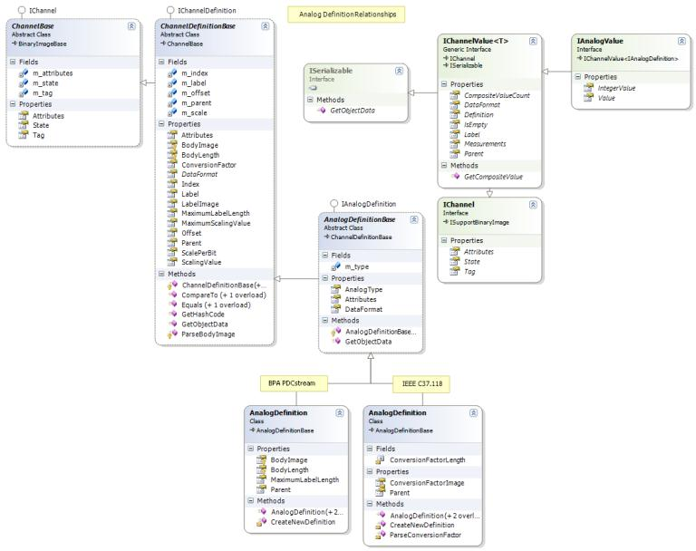

[Click for larger image](Developers_About_the_Code.files/Analog_Definition_Relationships.jpg)

### Analog Value Relationships

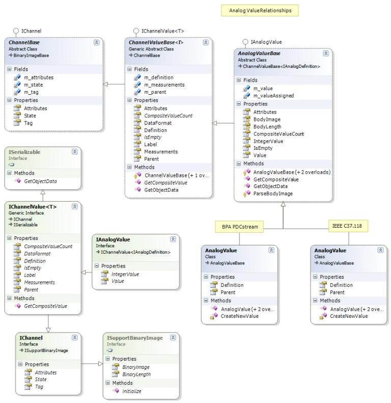

[Click for larger image](Developers_About_the_Code.files/Analog_Value_Relationships.jpg)

### CommandCell Collection Relationships

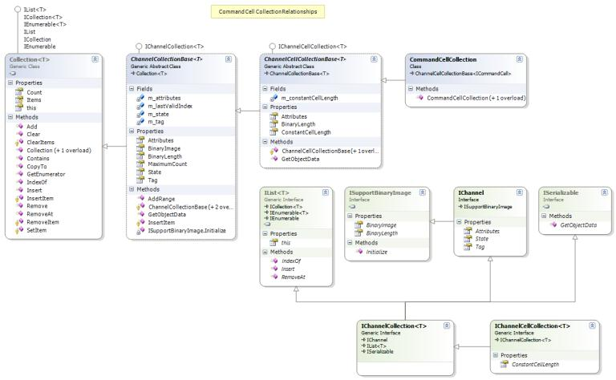

[Click for larger image](Developers_About_the_Code.files/CommandCell_Collection_Relationships.jpg)

### CommandCell Relationships

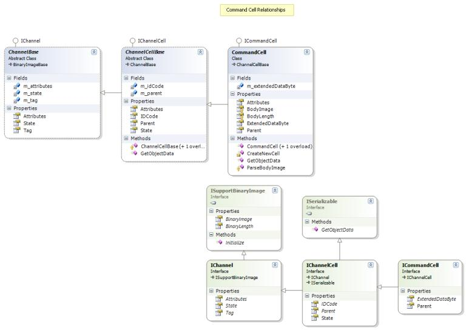

[Click for larger image](Developers_About_the_Code.files/CommandCell_Relationships.jpg)

### CommandFrame Relationships

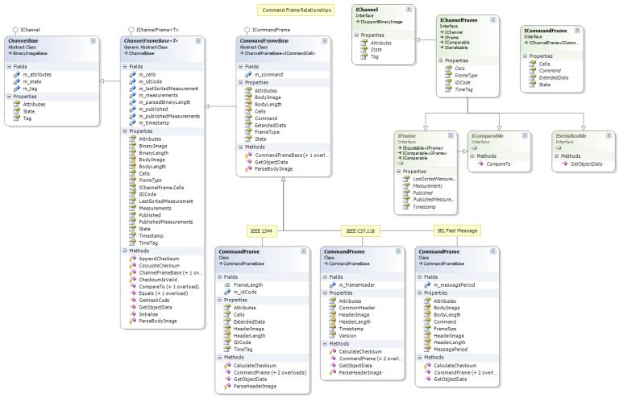

[Click for larger image](Developers_About_the_Code.files/CommandFrame_Relationships.jpg)

### ConfigurationCell Collection Relationships

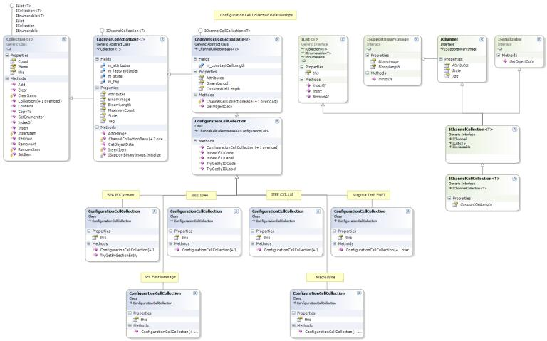

[Click for larger image](Developers_About_the_Code.files/ConfigurationCell_Collection_Relationships.jpg)

### ConfigurationCell Relationships


[Click for larger image](Developers_About_the_Code.files/ConfigurationCell_Relationships.jpg)

### ConfigurationFrame Relationships

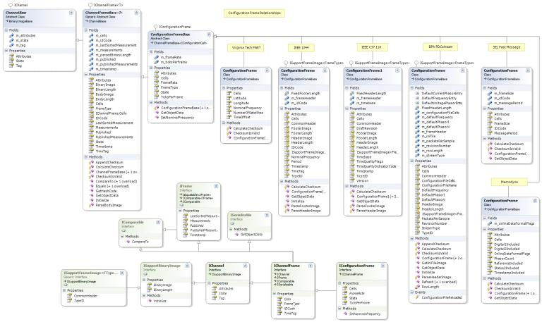

[Click for larger image](Developers_About_the_Code.files/ConfigurationFrame_Relationships.jpg)

### DataCell Collection Relationships

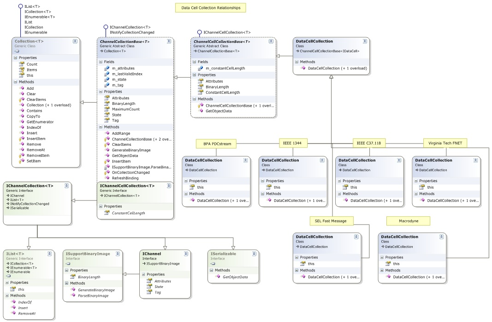

[Click for larger image](Developers_About_the_Code.files/DataCell_Collection_Relationships.jpg)

### DataCell Relationships

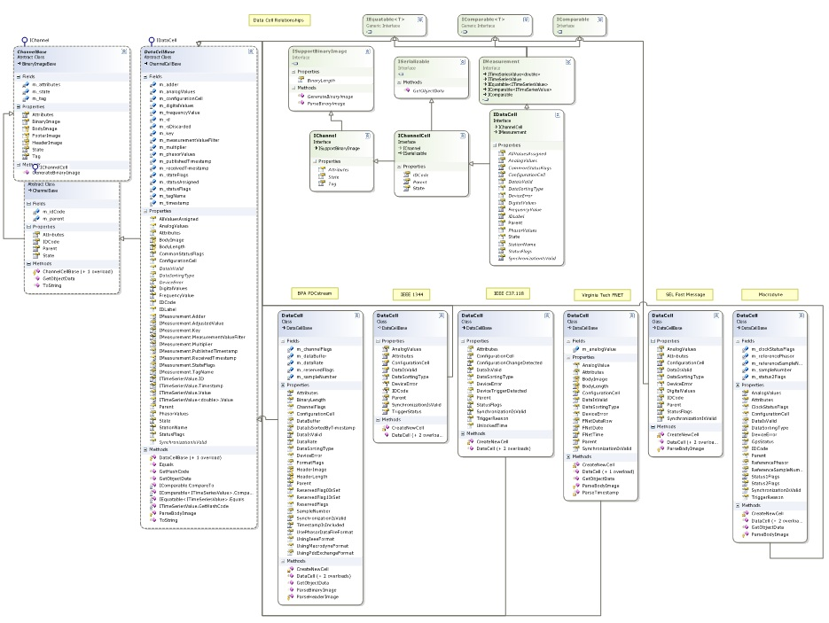

[Click for larger image](Developers_About_the_Code.files/DataCell_Relationships.jpg)

### DataFrame Relationships

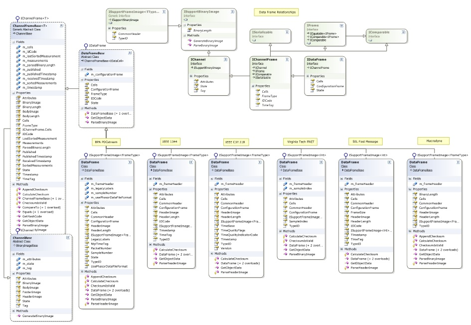

[Click for larger image](Developers_About_the_Code.files/DataFrame_Relationships.jpg)

### Digital Definition Relationships

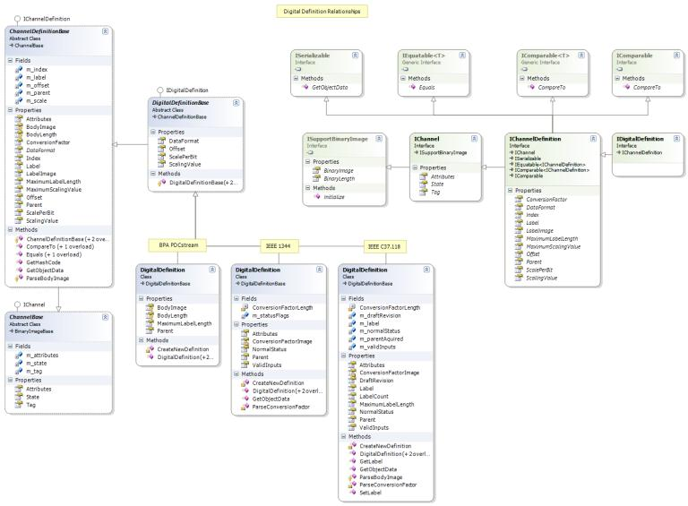

[Click for larger image](Developers_About_the_Code.files/Digital_Definition_Relationships.jpg)

### Digital Value Relationships

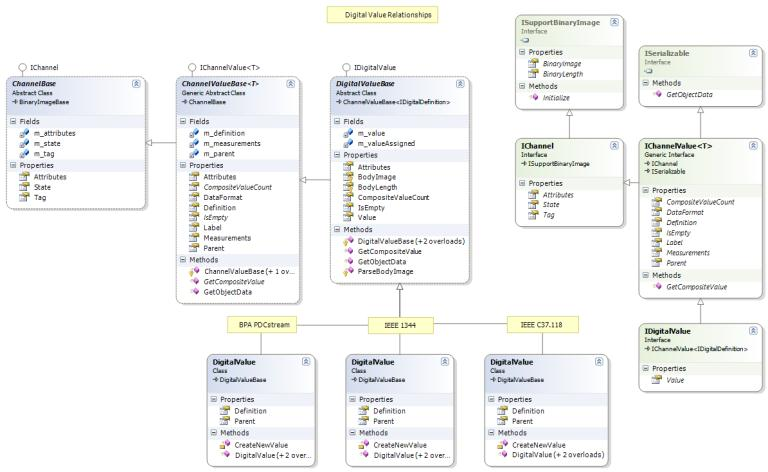

[Click for larger image](Developers_About_the_Code.files/Digital_Value_Relationships.jpg)

### FrameParser Relationships

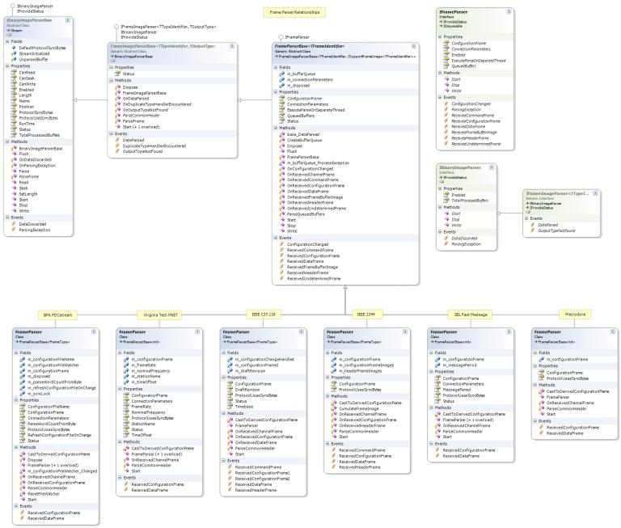

[Click for larger image](Developers_About_the_Code.files/FrameParser_Relationships.jpg)

### Frequency Definition Relationships

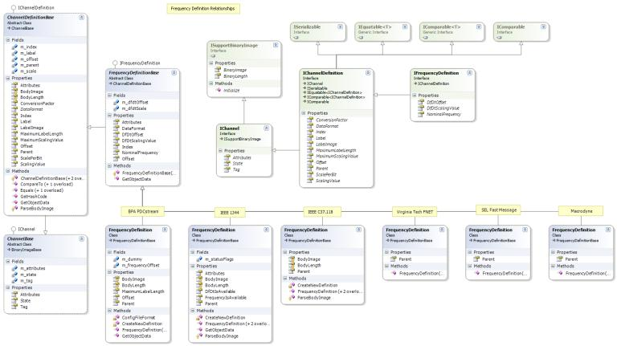

[Click for larger image](Developers_About_the_Code.files/Frequency_Definition_Relationships.jpg)

### Frequency Value Relationships

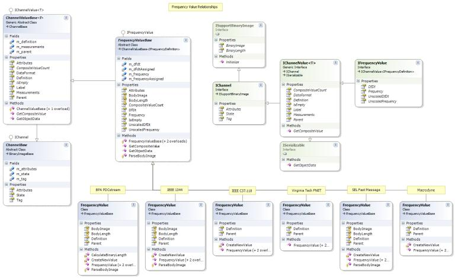

[Click for larger image](Developers_About_the_Code.files/Frequency_Value_Relationships.jpg)

### HeaderCell Collection Relationships

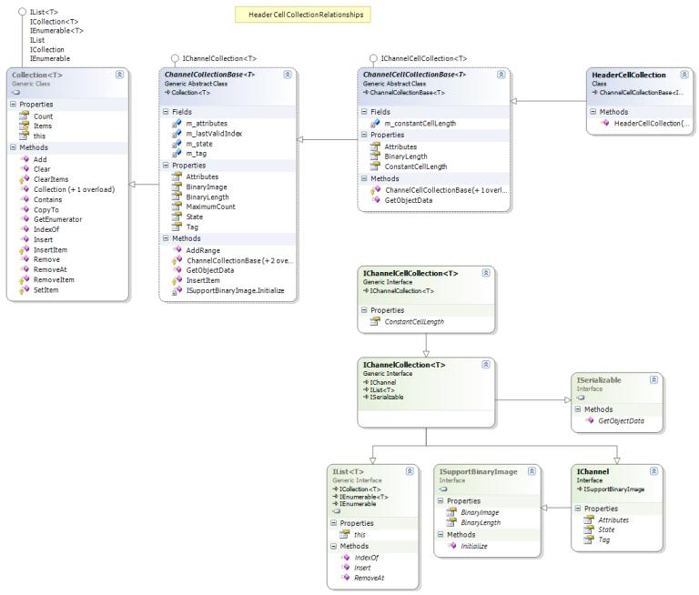

[Click for larger image](Developers_About_the_Code.files/HeaderCell_Collection_Relationships.jpg)

### HeaderCell Relationships

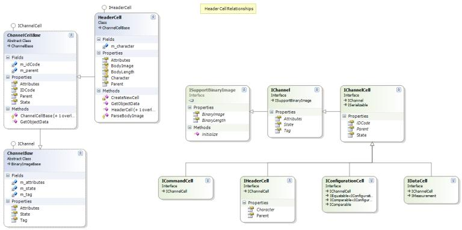

[Click for larger image](Developers_About_the_Code.files/HeaderCell_Relationships.jpg)

### HeaderFrame Relationships

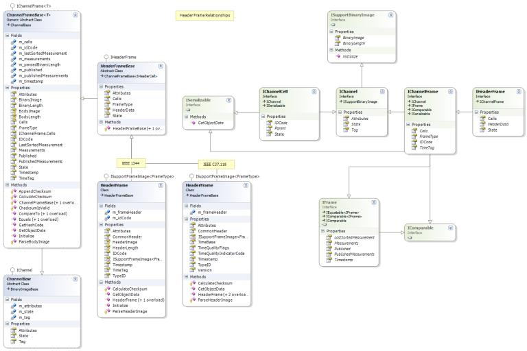

[Click for larger image](Developers_About_the_Code.files/HeaderFrame_Relationships.jpg)

### Phasor Definition Relationships

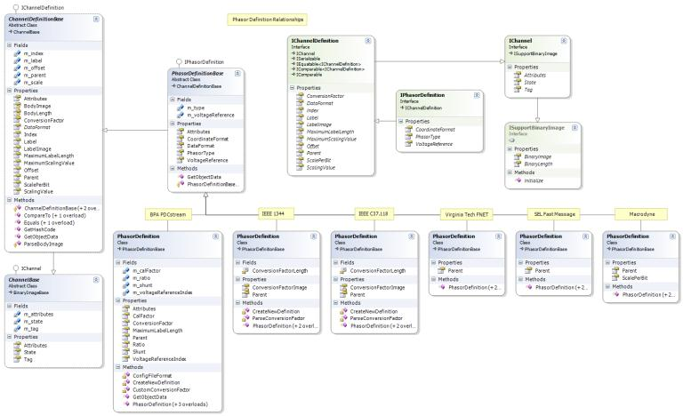

[Click for larger image](Developers_About_the_Code.files/Phasor_Definition_Relationships.jpg)

### Phasor Value Relationships

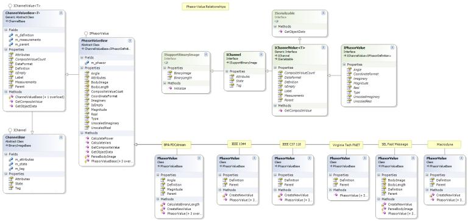

[Click for larger image](Developers_About_the_Code.files/Phasor_Value_Relationships.jpg)

---  

Jun 22, 2012 13:52:42 - Last edited by [alexfoglia](http://www.codeplex.com/site/users/view/alexfoglia), version 5  
Oct 5, 2015 - Migrated from [CodePlex](http://openpdc.codeplex.com/wikipage?title=About%20the%20Code%20%28Developers%29) by [aj](https://github.com/ajstadlin)

---

Copyright 2015 [Grid Protection Alliance](http://www.gridprotectionalliance.org)
