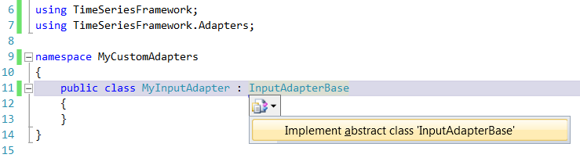

[](openPDC_Home.md "The Open Source Phasor Data Concentrator")

|   |   |   |   |   |
|---|---|---|---|---|
| **[Grid Protection Alliance](http://www.gridprotectionalliance.org "Grid Protection Alliance Home Page")** | **[openPDC Project](https://github.com/GridProtectionAlliance/openPDC "openPDC Project on GitHub")** | **[openPDC Wiki](https://github.com/GridProtectionAlliance/openPDC/wiki)** | **[Documentation](https://github.com/GridProtectionAlliance/openPDC/wiki/Documentation)** | **[Latest Release](https://github.com/GridProtectionAlliance/openPDC/releases "openPDC Releases Home Page")** |

# How to Create a Custom Adapter

This guide is designed to aid in the creation of custom adapters for the openPDC. Custom adapters allow users to easily extend the default functionality of the system. The openPDC defines three types of adapters--input, action, and output -- that are each designed to be used for different purposes.

**InputAdapters**: Typically maps measurements from a data source (i.e., assigns a timestamp and an ID to measured values parsed from a stream of data), new measurements are presented to openPDC by calling `void OnNewMeasurements(ICollection<IMeasurement> measurements)` method. Interface: `IInputAdapter`, base class: `InputAdapterBase`

**ActionAdapters**: Typically filters and sorts measurements by time allowing adapter to take action on a synchronized set of data provided in the `abstract void PublishFrame(IFrame frame, int index)` method which adapter overrides (note that frame contains a collection of measurements all collected into the same time-indexed frame bucket). If the action causes the creation of new measurements (e.g., phase angle and magnitude used to calculate power), new measurements are presented to openPDC by calling `void OnNewMeasurements(ICollection<IMeasurement> measurements)` method. Interface: `IActionAdapter`, base class: `ActionAdapterBase`

**OutputAdapters**: Typically queues all measurements (no sorting) for processing. Queued measurements are presented to the adapter for processing in the `void ProcessMeasurements(IMeasurement[] measurements)` method -- if measurements continue to build up in memory and are not processed in a timely manner they will be removed from the queue as protective measure to prevent catastrophic out-of-memory failures. Since output adapters are used to archive data this is often the slowest part in the system (disks tend to be a bottleneck), outputs can optionally be set to filter based on a measurement's defined "Source" property -- this allows multiple outputs to be targeted to several different distributed outputs which allows large systems to stay ahead of the incoming data stream. Interface: `IOutputAdapter`, base class: `OutputAdapterBase`

If you feel that one of these adapters suits your needs, continue reading.

**Note**: Before you begin, please note that this guide assumes you are using Microsoft Visual Studio and C#.

- [Start a new project](#start-a-new-project)
- [Add references](#add-references)
- [Extending one of the base classes](#extending-one-of-the-base-classes)
- [Implementation](#implementation)
    - [All adapter types](#all-adapter-types)
        - [ConnectionString](#connectionstring)
        - [Settings](#settings)
        - [Initialize()](#initialize)
        - [Start()](#start)
        - [Stop()](#stop)
        - [Dispose(bool)](#disposebool)
        - [OnStatusMessage(string) and OnStatusMessage(string, params object\[\])](#onstatusmessagestring-and-onstatusmessagestring-params-object)
        - [OnProcessException(Exception)](#onprocessexceptionexception)
        - [Status](#status)
        - [DataSource](#datasource)
        - [GetShortStatus(int)](#getshortstatusint)
        - [IsInputMeasurement(MeasurementKey)](#isinputmeasurementmeasurementkey)
        - [WaitForInitialize() and WaitForInitialize(int)](#waitforinitialize-and-waitforinitializeint)
    - [Input adapters](#input-adapters)
        - [AttemptConnection()](#attemptconnection)
        - [AttemptDisconnection()](#attemptdisconnection)
        - [UseAsyncConnect](#useasyncconnect)
        - [OnNewMeasurements(ICollection\<IMeasurement\>)](#onnewmeasurementsicollectionimeasurement)
    - [Action adapters](#action-adapters)
        - [PublishFrame(IFrame, int)](#publishframeiframe-int)
        - [OnNewMeasurements(ICollection\<IMeasurement\>)](#onnewmeasurementsicollectionimeasurement-1)
        - [QueueMeasurementsForProcessing(IEnumerable\<IMeasurement\>)](#queuemeasurementsforprocessingienumerableimeasurement)
    - [Output adapters](#output-adapters)
        - [AttemptConnection()](#attemptconnection-1) 
        - [AttemptDisconnection()](#attemptdisconnection-1)
        - [OutputIsForArchive](#outputisforarchive)
        - [ProcessMeasurements(IMeasurement\[\])](#processmeasurementsimeasurement)
        - [UseAsyncConnect](#useasyncconnect-1)
- [Using your custom adapter](#using-your-custom-adapter)
    - [NodeID](#nodeid)
    - [ID](#id)
    - [AdapterName](#adaptername)
    - [AssemblyName](#assemblyname)
    - [TypeName](#typename)
    - [ConnectionString](#connectionstring)
    - [Settings](#settings)
    - [LoadOrder](#loadorder)
    - [Enabled](#enabled)
- [Other adapter types](#other-adapter-types)
    - [Facile action adapter](#facile-action-adapter)
    - [Calculated measurement](#calculated-measurement)
        - [InputMeasurementKeyTypes](#inputmeasurementkeytypes)
        - [OutputMeasurementTypes](#outputmeasurementtypes)
        - [ConfigurationSection](#configurationsection)
- [Examples](#examples)
    - [ProcessQueue example](#processqueue-example)
    - [QueueMeasurementsForProcessing example](#queuemeasurementsforprocessing-example)

---

## Start a new project

1. In the toolbar within Microsoft Visual Studio, go to "File > New > Project...".
2. Under "Project types" on the left, go to "Visual C# > Windows".
3. Under "Templates" on the right, select "Class library".
4. Enter a name and location for the project.
5. Select the "OK" button.

---

## Add references

1. In the Solution Explorer within Visual Studio, right-click "References" and select "Add Reference...".
2. Select the "Browse" tab and navigate to your [installation directory](Getting_Started.md#installation-directory).
3. Select `GSF.Core.dll` and `GSF.TimeSeries.dll`, then choose "OK".
4. At the top of the autogenerated class file, add the following code to the existing using statements.

```cs
using GSF.TimeSeries;
using GSF.TimeSeries.Adapters;
```

---

## Extending one of the base classes

The next thing you will want to do is to change the name of the autogenerated class and extend the base class corresponding to your chosen adapter type. The following three code snippets show example class names as well as the three adapter base classes.

```cs
public class MyInputAdapter : InputAdapterBase
{
}

public class MyActionAdapter : ActionAdapterBase
{
}

public class MyOutputAdapter : OutputAdapterBase
{
}
```

Once you have properly entered the class definition, you can quickly generate definitions for abstract methods defined in the base class. Click on the name of the base class, click the icon that appears at the far left of the line and click the option labeled "Implement abstract class". The following image shows the use of this feature.



---

### Implementation

The following subsections will go over the details about the methods and properties in each adapter that you can override or use.

### All adapter types

This section will go over methods and properties used by all the adapter types.

#### ConnectionString

Once the adapter has been fully loaded from the database, the `ConnectionString` property can be used to access the connection string that was defined for it. However, the system also parses the connection string and places the key-value pairs into a `Dictionary` so it is recommended to use the `Settings` property instead. For an example of an adapter that uses the `ConnectionString` property, check the adapters in the `MySqlAdapters` project (part of the Synchrophasor solution).

#### Settings

Once the adapter has been fully loaded from the database, the connection string is parsed and the key-value pairs are placed in a `Dictionary` known as the `Settings` property. Typical usage of this property can be found below in the description of the `Initalize()` method.

#### Initialize()

```cs
public override void Initialize()
{
    base.Initialize();
    // custom initialization goes here
}
```

The `Initialize()` method can be overridden by your custom adapter class to initialize user-definable settings. This method is called by the system after the connection string has been set and the settings have been parsed. It is typically used in the following manner.

```cs
// Fields
private string m_mandatorySetting;
private string m_optionalSetting;

// Initialize
// Connection string looks something like this:
//   mandatorySetting=mandatoryValue; optionalSetting=optionalValue
public override void  Initialize()
{
    base.Initialize();
    Dictionary<string, string> settings = Settings;
    string setting;
    m_mandatorySetting = settings["mandatorySetting"];
    if (settings.TryGetValue("optionalSetting", out setting))
        m_optionalSetting = setting;
}
```

#### Start()

```cs
public override void Start()
{
    base.Start();
    // custom behavior goes here
}
```

The `Start()` method can be overridden by your adapter to establish connections or open files. This method may be called multiple times throughout the lifetime of the adapter.

#### Stop()

```cs
public override void Stop()
{
    base.Stop();
    // custom behavior goes here
}
```

The `Stop()` method can be overridden by your adapter to close connections or files. Typically, if an adapter overrides the `Start()` method, the `Stop()` method must also be overridden. This method may be called multiple times throughout the lifetime of the adapter.

#### Dispose(bool)

```cs
private bool m_disposed;
protected override void Dispose(bool disposing)
{
    if (!m_disposed)
    {
        try
        {
            // This will be done regardless of whether
            // the object is finalized or disposed.
            if (disposing)
            {
                // This will be done only when the object
                // is disposed by calling Dispose().
            }
        }
        finally
        {
            m_disposed = true;        // Prevent duplicate dispose.
            base.Dispose(disposing);  // Call base class Dispose().
        }
    }
}
```

If your adapter has any system resources that need to be released at the end of its lifecycle, you will need to override the `Dispose(bool)` method to do it. Typically, any code created for custom disposal should go in the section that will be done only when the object is disposed of by calling `Dispose()`. If you are using the TVA C# code snippets, typing "disposec" inside your class and then pressing the Tab key on your keyboard will automatically generate the code you see above.

#### OnStatusMessage(string) and OnStatusMessage(string, params object\[\])

If your adapter needs to report status to the user at any time, the `OnStatusMessage()` method can be used to display a message on the openPDCConsole. Some typical uses of this method include the following.

```cs
OnStatusMessage("Attempting connection...");
OnStatusMessage("{0} measurements processed in {1} seconds", m_measurementCount, m_upTime);
```

#### OnProcessException(Exception)

If your adapter encounters an error that needs to be reported, the `OnProcessException(Exception)` method can be used to do so. The typical use of this method is shown in the following snippet.

```cs
try
{
    // code that throws an exception goes here
}
catch (Exception ex)
{
    OnProcessException(ex);
}
```

#### Status

```cs
public override string Status
{
    get
    {
        StringBuilder status = new StringBuilder();
        status.Append(base.Status);
        // custom code goes here
        return status.ToString();
    }
}
```

The Status property can be overridden to provide custom status information specific to your type of adapter.

#### DataSource

DataSource is a collection of database tables stored in memory. This collection is available to all adapters. The tables that are stored in `DataSource` are defined by the `ConfigurationEntity` table in the database where `SourceName` is the name of the table in the database and `RuntimeName` is the name by which the adapter recognizes the table. Typical use of the `DataSource` is shown in the following example.

```cs
// Lookup alternate tag for given measurement key
private string LookupAlternateTag(MeasurementKey key)
{
    try
    {
        DataRow row = DataSource.Tables["ActiveMeasurements"].Select(string.Format("ID = '{0}'", key.ToString()))[0];
        return row["AlternateTag"].ToString();
    }
    catch
    {
        return "undefined";
    }
}
```

#### GetShortStatus(int)

```cs
public override string GetShortStatus(int maxLength)
{
    return "Short status";
}
```

`GetShortStatus(int)` is used by the system when listing adapters on the console. When implementing this method, you do not need to make sure your string is shorter than maxLength. Note, however, that the system will truncate the returned string. `ActionAdapterBase` contains an implementation of this method that displays the number of input measurements and the number of output measurements.

#### IsInputMeasurement(MeasurementKey)

Users of your adapter have the option of specifying exactly which measurements should be processed by your adapter. If you wish to enforce this constraint in your adapter's implmementation, you can use the `IsInputMeasurement(MeasurementKey)` method to determine whether a given measurement was selected by the user to be processed by the adapter. `ActionAdapterBase` automatically filters measurements (in `QueueMeasurementsForProcessing()`) using this method before they are sent to the adapter (in `PublishFrame()`). Typical use of `IsInputMeasurement(MeasurementKey)` is shown in the following snippet.

```cs
IMeasurement measurement = getMeasurementFromSomewhere();
if (IsInputMeasurement(measurement.Key))
{
    // process measurement
}
```

#### WaitForInitialize() and WaitForInitialize(int)

If you feel the need to enter your custom code into the `Start()` method before calling `base.Start()`, then your code will bypass many of the safeguards that were placed in the base class. The WaitForInitialize() method was designed to help solve this problem. If your custom code relies on objects that are initialized in your `Initialize()` method, then you have the option of calling the `WaitForInitialize()` method manually.

 Additionally, if there is a possibility that your `Initialize()` method will never finish (for instance, if it throws an exception), then you can specify a timeout (in milliseconds) using the parameter in the `WaitForInitialize(int)` method. Typical use of `WaitForInitialize(int)` is shown in the following snippet.

```cs
public override void Start()
{
    // Make sure we are disconnected before attempting a connection
    if (Enabled)
        Stop();

    WaitForInitialize(10000); // wait for ten seconds or until Initialize() is finished

    if (!Initialized)
        throw new InvalidOperationException("Timeout to wait for initialization expired."
                + " Start() cannot run before Initialize() is finished.");

    // custom code goes here

    base.Start();
}
```

---

### Input adapters

This section will go over methods and properties defined for input adapters that are not defined for all adapter types.

#### AttemptConnection()

```cs
protected override void AttemptConnection()
{
    // code to connect goes here
}
```

This method is used to attempt a connection to the data input source. Any exceptions thrown by this method will result in restart of the connection cycle.

#### AttemptDisconnection()

```cs
protected override void AttemptDisconnection()
{
    // code to disconnect goes here
}
```

This method is used to attempt to disconnect from the data input source.

#### UseAsyncConnect

```cs
protected override bool UseAsyncConnect
{
    get
    {
        // return statement goes here
    }
}
```
This property is used by the system to determine whether to start processing measurements immediately or to wait for notification that the data input source is connected. If the input adapter can guarantee that the data input source is connected when the `AttemptConnection()` method is completed and also that the data input source is disconnected when the `AttemptDisconnection()` method is completed, this property should return false. Otherwise, this property should return true and the adapter must call `OnConnected()` and `OnDisconnected()` when the data input source is connected and disconnected respectively. In most cases, this property should return false.

#### OnNewMeasurements(ICollection\<IMeasurement\>)

When the input adapter has received measurements from the data input source, it needs to call this method in order to notify the system and send in the new measurements.

---

### Action adapters

This section will go over methods and properties defined for action adapters that are not defined for all adapter types.

#### PublishFrame(IFrame, int)

```cs
protected override void PublishFrame(IFrame frame, int index)
{
    // implementation goes here
}
```

This method is called when a collection of measurements is ready to be processed. In most cases, this is where your adapter should process the measurements it receives. This method should not take longer than the time it has available to process the measurements (which depends on the frames per second). For an example of using `TVA.Collections.ProcessQueue` in order to process measurements outside of this method, see the [ProcessQueue example](#processqueue-example).

#### OnNewMeasurements(ICollection\<IMeasurement\>)

If the action adapter creates any measurements, it needs to call this method in order to notify the system and send in the new measurements.

#### QueueMeasurementsForProcessing(IEnumerable\<IMeasurement\>)

```cs
public override void QueueMeasurementsForProcessing(IEnumerable<IMeasurement> measurements)
{
    List<IMeasurement> inputMeasurements = new List<IMeasurement>();
    // custom code goes here
    if (inputMeasurements.Count > 0)
        SortMeasurements(inputMeasurements);
}
```

In most cases, this method should not be overridden. It should be noted, however, that it can be overridden in order to provide a custom filter for measurements that have entered the system. Any measurement sent to the `SortMeasurements()` method will be processed by the action adapter (assuming the measurements have a valid timestamp). For an example of overriding the `QueueMeasurementsForProcessing()` method, see the [QueueMeasurementsForProcessing example](#queuemeasurementsforprocessing-example).

---

### Output adapters

This section will go over methods and properties defined for output adapters that are not defined for all adapter types.

#### AttemptConnection()

```cs
protected override void AttemptConnection()
{
    // code to connect goes here
}
```

This method is used to attempt a connection to the data output stream. Any exceptions thrown by this method will result in restart of the connection cycle.

#### AttemptDisconnection()

```cs
protected override void AttemptDisconnection()
{
    // code to disconnect goes here</span>
}
```

This method is used to attempt to disconnect from the data output stream.

#### OutputIsForArchive

```cs
public override bool OutputIsForArchive
{
    get
    {
        // return statement goes here
    }
}
```

This property should return a flag that determines if measurements sent to the adapter are destined for archival. It allows the `OutputAdapterCollection` to calculate statistics on how many measurements have been archived per minute. Historians would normally set this property to `true`; other custom exports would set this property to `false`.

#### ProcessMeasurements(IMeasurement\[\])

```cs
protected override void ProcessMeasurements(IMeasurement[] measurements)
{
    // implementation goes here
}
```

This method is called by the system when there are measurements that are ready to be processed. This is the method in which measurements should be processed by your output adapter.

#### UseAsyncConnect

```cs
protected override bool UseAsyncConnect
{
    get
    {
        // return statement goes here
    }
}
```

This property is used by the system to determine whether to start processing measurements immediately or to wait for notification that the data output source is connected. If the output adapter can guarantee that the data output source is connected when the `AttemptConnection()` method is completed and also that the data output source is disconnected when the `AttemptDisconnection()` method is completed, this property should return `false`. Otherwise, this property should return true and the adapter must call `OnConnected()` and `OnDisconnected()` when the data output source is connected and disconnected respectively. In most cases, this property should return `false`.

---

## Using your custom adapter

In order to use the custom adapter you've just created, you must define a record in one of the custom adapter tables in the database. Input, action, and output adapters should be defined in the `CustomInputAdapter`, `CustomActionAdapter`, and `CustomOutputAdapter` tables respectively. All three tables have the exactly the same fields which are described below.

#### NodeID

This field contains a `GUID` that defines which node will be using the custom adapter. The value should match one of the records in the [ID](Manual_Configuration.md#the-id-column) column in the [Node table](Manual_Configuration.md#the-node-table).

#### ID

This field contains an integer used to identify each custom adapter. The values are unique and auto-incrementing. There is no need to manually enter a value here.

#### AdapterName

This field contains the [Acronym](Manual_Configuration.md#the-acronym-column) used to identify the adapter. By convention, it should be entered in all uppercase with no embedded spaces. Also by convention, underscore '_' is the only special character allowed. You can enter a maximum of 16 characters.

#### AssemblyName

This field contains the name of the dll into which your custom adapter has been compiled. The dll should be located in the
[openPDC installation directory](Getting_Started.md#installation-directory).

#### TypeName

This field contains the name of the class (including the namespace) of the adapter you wrote.

#### ConnectionString

This field contains the connection string used to set required parameters or to modify default parameters. See the
[Initialize()](#initialize) method for more details.

#### LoadOrder

This field defines the relative order in which to retrieve records from the database. The order goes from smallest LoadOrder to largest. The values are not required to be unique.

#### Enabled

This field contains a boolean value indicating whether your custom adapter is enabled to be used or not. The system will not recognize adapters which are not enabled.

---

## Other adapter types

### Facile action adapter

The facile action adapter is a very simple action adapter with no built-in measurement concentration capabilities. This requires more work, but also allows you to implement your own concentration algorithms when the built-in concentration supplied by `ActionAdapterBase` does not suit the needs of your custom adapter. This adapter type can also be used when an adapter needs to be placed in the action adapter layer, but does not need to process its own measurements. Like the [previous adapter types](#extending-one-of-the-base-classes), the base class for this adapter is located in the `GSF.TimeSeries.Adapters` namespace.

```cs
using GSF.TimeSeries.Adapters;
public class MyFacileActionAdapter : FacileActionAdapter
{
}
```

*Note: Since there is no built-in concentration, the user must override the [`QueueMeasurementsForProcessing(IEnumerable<IMeasurement>)`](#queuemeasurementsforprocessingienumerableimeasurement)  method, however the `SortMeasurements(IEnumerable<IMeasurement>)` method does not exist. Measurements must be filtered and processed according to your `QueueMeasurementsForProcessing(IEnumerable<IMeasurement>)` method.*

In addition to the methods and properties available to [all adapter types](#all-adapter-types), the following methods are available to facile action adapters.

- [OnNewMeasurements(ICollection<IMeasurement>)](#onnewmeasurementsicollectionimeasurement)
- [QueueMeasurementsForProcessing(IEnumerable<IMeasurement>)](#queuemeasurementsforprocessingienumerableimeasurement) method</a>

### Calculated measurement

The calculated measurement type is an extension of the regular action adapter type. This adapter is typically used when the custom adapter needs to calculate values based on its input measurements and reintroduce the calculated values as measurements back into the system. More generally, this adapter type can be used whenever the custom adapter needs to know the [signal type](Manual_Configuration.md#the-signaltypeid-column) of its input measurements. The base class for this adapter is located in the `PhasorProtocolAdapters` namespace. You will need to [add references](#add-references) to `GSF.PhasorProtocols.dll` and `PhasorProtocolAdapters.dll` in order to use this adapter type.

```cs
using PhasorProtocolAdapters;
public class MyCalculatedMeasurement : CalculatedMeasurementBase
{
}
```

In addition to the methods and properties available to [all adapter types](#all-adapter-types) and [action adapters](#action-adapters), calculated measurements have the following extra properties.

#### InputMeasurementKeyTypes

Once the input measurements have been defined for this adapter, the `InputMeasurementKeyTypes` property can be used to access an array of signal types for the input measurements. The index of each signal type matches the index of the corresponding measurement key in the array returned by the InputMeasurementKeys property.

#### OutputMeasurementTypes

Once the output measurements have been defined for this adapter, the `OutputMeasurementTypes` property can be used to access an array of signal types for the output measurements. The index of each signal type matches the index of the corresponding output measurement in the array returned by the OutputMeasurements property.

#### ConfigurationSection

If the custom adapter has settings that need to be saved in the openPDC configuration file, this property represents the section under which these settings should be placed in the configuration file.

---

## Examples

### ProcessQueue example

This example uses ProcessQueue in order to process the measurements outside of the `PublishFrame()` method. This is the preferred method of processing measurements if the operation takes longer than the available time given to `PublishFrame()`.

```cs
public class ProcessQueueExample : ActionAdapterBase
{
    // Fields
    private ProcessQueue<IFrame> m_processQueue;
    private bool m_disposed;
    
    // Initialize()
    public override void Initialize()
    {
        m_processQueue = ProcessQueue<IFrame>.CreateRealTimeQueue(ProcessFrames);
    }
    
    // Start()
    public override void Start()
    {
        base.Start();
        m_processQueue.Start();
    }
    
    // Stop()
    public override void Stop()
    {
        base.Stop();
        m_processQueue.Stop();
    }
    
    // PublishFrame(IFrame, int)
    protected override void PublishFrame(IFrame frame, int index)
    {
        m_processQueue.Add(frame);
    }
    
    // ProcessFrames(IFrame[])
    protected void ProcessFrames(IFrame[] frames)
    {
        // process measurements here
    }
    
    // Dispose(bool)
    protected override void Dispose(bool disposing)
    {
        if (!m_disposed)
        {
            try
            {
                if (disposing)
                {
                    if (m_processQueue != null)
                        m_processQueue.Dispose();
                    m_processQueue = null;
                }
            }
            finally
            {
                base.Dispose(disposing);    // Call base class Dispose().
                m_disposed = true;          // Prevent duplicate dispose.
            }
        }
    }
}
```

### QueueMeasurementsForProcessing example

This example uses `QueueMeasurementsForProcessing(IEnumerable<IMeasurement>)` in order to filter down to the measurements that are timestamped on a specified export interval (in seconds). Note that `QueueMeasurementForProcessing(IMeasurement)` was also overridden to ensure that these measurements do not escape the filter.

```cs
public class QueueMeasurementsForProcessingExample : ActionAdapterBase
{
    // Fields
    private int m_exportInterval;
    
    // Initialize()
    public override void Initialize()
    {
        base.Initialize();
        Dictionary<string, string> settings = Settings;
        string setting, dataChannel, commandChannel;
        m_exportInterval = int.Parse(settings["exportInterval"]);
    }
    
    // QueueMeasurementForProcessing(IMeasurement)
    public override void QueueMeasurementForProcessing(IMeasurement measurement)
    {
        QueueMeasurementsForProcessing(new IMeasurement[] { measurement });
    }
    
    // QueueMeasurementsForProcessing(IEnumerable<IMeasurement>)
    public override void QueueMeasurementsForProcessing(IEnumerable<IMeasurement> measurements)
    {
        List<IMeasurement> inputMeasurements = new List<IMeasurement>();
        Ticks timestamp;
        foreach (IMeasurement measurement in measurements)
        {
            timestamp = measurement.Timestamp;
            bool sort = (new DateTime(timestamp)).Second 
                        % m_exportInterval == 0 
                        && timestamp.DistanceBeyondSecond() < TicksPerFrame 
                        && IsInputMeasurement(measurement.Key);
            if (sort)
                inputMeasurements.Add(measurement);
        }
        if (inputMeasurements.Count > 0)
            SortMeasurements(inputMeasurements);
    }
    
    // PublishFrame(IFrame, int)
    protected override void PublishFrame(IFrame frame, int index)
    {
        // process measurements here
    }
}
```

---

Jun 22, 2012 at 1:23:27 PM - Last edited by [alexfoglia](http://www.codeplex.com/site/users/view/alexfoglia), version 3  
Oct 5, 2015 - Migrated from [CodePlex](http://openpdc.codeplex.com/wikipage?title=Custom%20Adapter%20%28Developers%29) by [aj](https://github.com/ajstadlin)

---

Copyright 2015 [Grid Protection Alliance](http://www.gridprotectionalliance.org)
