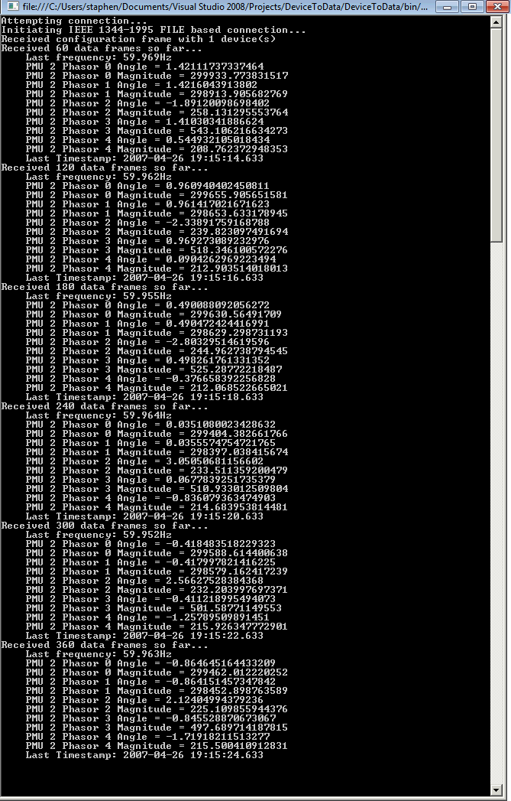

[](openPDC_Home.md "The Open Source Phasor Data Concentrator")

|   |   |   |   |   |
|---|---|---|---|---|
| **[Grid Protection Alliance](http://www.gridprotectionalliance.org "Grid Protection Alliance Home Page")** | **[openPDC Project](https://github.com/GridProtectionAlliance/openPDC "openPDC Project on GitHub")** | **[openPDC Wiki](openPDC_Home.md "openPDC Wiki Home Page")** | **[Documentation](openPDC_Documentation_Home.md "openPDC Documentation Home Page")** | **[Latest Release](https://github.com/GridProtectionAlliance/openPDC/releases "openPDC Releases Home Page")** |

# Device to Data in 5 Easy Steps

This guide is intended to aid you in getting data from your device as quickly and easily as possible. The steps are as follows:

1. [Create a project](#step-1-create-a-project)
2. [Add references](#step-2-add-references)
3. [Copy in the code snippet](#step-3-copy-in-the-code-snippet)
4. [Set up your data source](#step-4-set-up-your-data-source)
5. [Run the application](#step-5-run-the-application)

---

## Step 1: Create a project

The first thing you need to do is create a console application in Microsoft Visual Studio 2015. The following are detailed steps to guide you through the process.

1. Launch Microsoft Visual Studio
2. In the toolbar, go to "File > New > Project..."
3. In the left pane, navigate to "Installed > Templates > Visual C#"
4. In the center pane, select "Console Application"
5. In the text box labeled "Name", enter the name of your application (i.e. "DeviceToData")
6. Click the button labeled "Browse..." and select a directory to store the project
7. Click the "OK" button
8. Right Click on your new project and select "Properties"
9. In the Application settings, change the Target Framework to ".NET Framework 4.6"

## Step 2: Add references

In order to get the code to run, you will need to add references to the openPDC assemblies. The following are detailed steps to guide you through the process.

**Note**: In order to complete this step, you will need to [download the latest openPDC binaries](http://www.gridprotectionalliance.org/NightlyBuilds/openPDC/Beta-VS2012/Synchrophasor.Binaries.zip).

1. In your project's Solution Explorer on the right, right-click "References", select "Add Reference...", then click the Browse button
2. Navigate to "`BINARIESDIR\Applications\openPDC`" (`BINARIESDIR` is the directory where you extracted the openPDC binaries)
3. Select "GSF.Communication.dll", "GSF.Core.dll", "GSF.PhasorProtocols.dll", and "GSF.TimeSeries.dll" then click the "OK" button

## Step 3: Copy in the code snippet

Now you are ready to copy the source code that will interface with your device. Remove everything in Program.cs and replace it with the following code snippet.

```cs
using System;
using GSF;
using GSF.PhasorProtocols;
namespace DeviceToData
{
    class Program
    {
        static MultiProtocolFrameParser parser;
        static long frameCount;
        static void Main(string[] args)
        {
            // Create a new protocol parser
            parser = new MultiProtocolFrameParser();
            // Attach to desired events
            parser.ConnectionAttempt += parser_ConnectionAttempt;
            parser.ConnectionEstablished += parser_ConnectionEstablished;
            parser.ConnectionException += parser_ConnectionException;
            parser.ParsingException += parser_ParsingException;
            parser.ReceivedConfigurationFrame += parser_ReceivedConfigurationFrame;
            parser.ReceivedDataFrame += parser_ReceivedDataFrame;
            // Define the connection string
            parser.ConnectionString = 
                "phasorProtocol=Ieee1344; accessID=2; "
                + "transportProtocol=File; file=Sample1344.PmuCapture";
            
            // When connecting to a file based resource you may want to loop the data
            parser.AutoRepeatCapturedPlayback = true;
            // Start frame parser
            parser.AutoStartDataParsingSequence = true;
            parser.Start();
            // Keep the console open while receiving live data; application will be terminated when the user presses the Enter key:
            Console.ReadLine();
        }
        
        static void parser_ReceivedDataFrame(object sender, EventArgs<IDataFrame> e)
        {
            // Increase the frame count each time a frame is received
            frameCount++;
            // Print information each time we receive 60 frames (every 2 seconds for 30 frames per second)
            // Also check to assure the DataFrame has at least one Cell
            if ((frameCount % 60 == 0) && (e.Argument.Cells.Count > 0))
            {
                IDataCell device = e.Argument.Cells[0];
                Console.WriteLine("Received {0} data frames so far...", frameCount);
                Console.WriteLine("    Last frequency: {0}Hz", device.FrequencyValue.Frequency);
                for (int x = 0; x < device.PhasorValues.Count; x++)
                {
                    Console.WriteLine("PMU {0} Phasor {1} Angle = {2}", device.IDCode, x, device.PhasorValues[x].Angle);
                    Console.WriteLine("PMU {0} Phasor {1} Magnitude = {2}", device.IDCode, x, device.PhasorValues[x].Magnitude);
                }
                Console.WriteLine("    Last Timestamp: {0}", ((DateTime)e.Argument.Timestamp).ToString("yyyy-MM-dd HH:mm:ss.fff"));
            }
        }
        
        static void parser_ReceivedConfigurationFrame(object sender, EventArgs<IConfigurationFrame> e)
        {
            // Notify the user when a configuration frame is received
            Console.WriteLine("Received configuration frame with {0} device(s)", e.Argument.Cells.Count);
        }
       
        static void parser_ParsingException(object sender, EventArgs<Exception> e)
        {
            // Output the exception to the user
            Console.WriteLine("Parsing exception: {0}", e.Argument);
        }
        
        static void parser_ConnectionException(object sender, EventArgs<Exception, int> e)
        {
            // Display which connection attempt failed and the exception that occurred
            Console.WriteLine("Connection attempt {0} failed due to exception: {1}",
                e.Argument2, e.Argument1);
        }
        
        static void parser_ConnectionEstablished(object sender, EventArgs e)
        {
            // Notify the user when the connection is established
            Console.WriteLine("Initiating {0} {1} based connection...",
                parser.PhasorProtocol.GetFormattedProtocolName(),
                parser.TransportProtocol.ToString().ToUpper());
        }
        
        static void parser_ConnectionAttempt(object sender, EventArgs e)
        {
            // Let the user know we are attempting to connect
            Console.WriteLine("Attempting connection...");
        }
    }
}
```

## Step 4: Set up your data source

This step will vary depending on your data source. Information on setting up the connection string can be found on the [Getting Started](Getting_Started.md#configuring-a-connection-string) page.

This example uses the sample data file in the [PMU Connection Tester](https://github.com/GridProtectionAlliance/PMUConnectionTester) project. Copy the "Sample1344.PmuCapture" file from PMU Connection Tester's "`SOURCEDIR\Main\Source\Tools\PMUConnectionTester`" to "`PROJECTDIR\bin\Debug`"

`SOURCEDIR` is the directory where you extracted the PMU Connection Tester source code files, and PROJECTDIR is the directory where you stored your project in step 1.

## Step 5: Run the application

If you followed all the other steps correctly, you should be able to run the project by pressing "F5" from within Microsoft Visual Studio. The result should look something like the example image below.



---

Jun 22, 2012 9:17 AM - Edited by [alexfoglia](http://www.codeplex.com/site/users/view/alexfoglia), version 4  
Oct 5, 2015 - Migrated from [CodePlex]() by [aj](https://github.com/ajstadlin)  
Dec 4, 2016 12:20 AM - Last edited by [aj](https://github.com/ajstadlin), version 5

---

Copyright 2016 [Grid Protection Alliance](http://www.gridprotectionalliance.org)