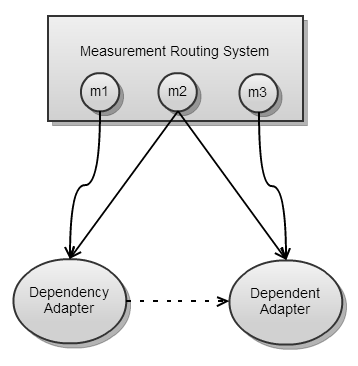
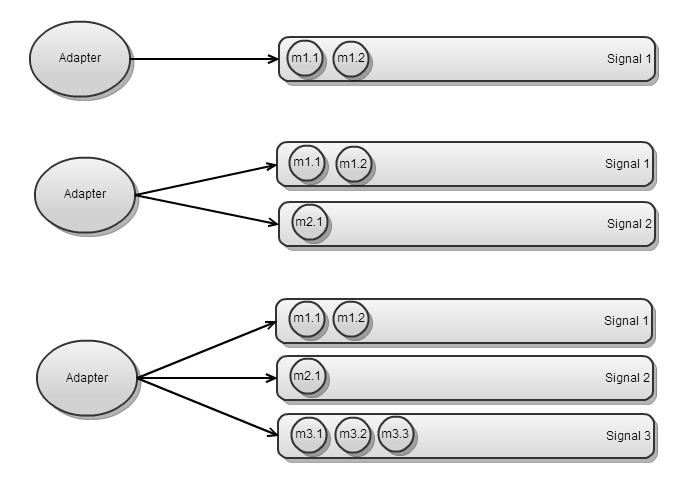

[](openPDC_Home.md "The Open Source Phasor Data Concentrator")

|   |   |   |   |   |
|---|---|---|---|---|
| **[Grid Protection Alliance](http://www.gridprotectionalliance.org "Grid Protection Alliance Home Page")** | **[openPDC Project](https://github.com/GridProtectionAlliance/openPDC "openPDC Project on GitHub")** | **[openPDC Wiki](openPDC_Home.md "openPDC Wiki Home Page")** | **[Documentation](openPDC_Documentation_Home.md "openPDC Documentation Home Page")** | **[Latest Release](https://github.com/GridProtectionAlliance/openPDC/releases "openPDC Releases Home Page")** |

```diff
+ .
- ** THIS DOCUMENTATION IS DEPRECATED **
```

# Multiple Adapter Synchronization

To address limitations in the wait handle pattern for adapter synchronization, as of version 1.5.192 of the openPDC and to be included in the final release of v1.5 SP1, wait handle synchronization has been replaced by the "Queue and Notify pattern.

*Note: Introduction of the queue and notify pattern has replaced the wait handle pattern, in that the wait handle pattern no longer exists. Any systems using the old pattern will need to migrate their connection strings and adapter code to the queue and notify pattern.*

Usage is similar to the wait handle pattern. The following connection string parameters can now be specified on the dependent adapter.

- **`dependencies`** - Comma separated list of adapter acronyms
- **`dependencyTimeout`** - Maximum wait time, in seconds, before proceeding

These connection string parameters instruct the openPDC measurement routing system to wait for an adapter's dependencies to finish processing measurements before providing those measurements to the dependent adapter. Those measurements will instead be queued until either the dependency adapters notify the routing system or the timeout expires.

Any adapter which is acting as a dependency will now be expected to call one of the OnNotify() overloads to indicate that it has finished processing its measurements.

```cs
protected override void PublishFrame(IFrame frame, int index)
    {
        // Set flags for flat-line values
        SetStateFlagsForFlatLineValues(frame.Measurements.Values);
        // Release adapters waiting on flat-line state
        OnNotify(frame.Measurements.Values);
    }
```

*Note: If dependency relationships are updated due to a configuration change, it will be necessary to notify the measurement routing system by sending the 'RefreshRoutes' command via the openPDC Console.

### Advanced information

#### Intelligent queuing

The measurement routing system attempts to determine which measurements need to be queued based on the routes that the measurement is taking through the system. For example, in the following diagram, the measurement routing system has received three measurements (m1, m2, and m3) which are to be routed to at least one of two adapters (Dependency Adapter and Dependent Adapter). Dependent Adapter has listed Dependency Adapter among its dependencies in its connection string.



Measurements m1 and m3 are each being sent to only one of the adapters, so they will be provided immediately to Dependency Adapter and Dependent Adapter respectively. However, m2 is being provided to both adapters. In this case, the measurement routing system recognizes that there is a dependency between the two adapters receiving the measurement and will therefore only provide m2 to Dependency Adapter. It will also hold onto m2 until Dependency Adapter has sent a notification to indicate that it has finished processing. When the routing system receives the notification, that is when it sends m2 to Dependent Adapter.

The key point here is that although m3 is being sent to Dependent Adapter, the routing system recognizes that it is not also being sent to Dependency Adapter. The measurement will not be held pending notification.

#### Signal separation

Measurements are queued by signal for each dependent adapter. This means that a set of queues is created for each dependent adapter, and the number of queues matches the number of signals being received by that dependent adapter and its dependencies. The following diagram shows a system with three dependent adapters and three signals, where each adapter is receiving a different set of signals.



In this scenario, if m1.1 arrives before m2.1, but the dependency adapters finish processing m2.1 before m1.1, then m2.1 can still be dequeued and provided to the adapters without having to wait on m1.1. On the other hand, if a dependency adapter fails to process m1.1 but succeeds in processing m1.2, the routing system must provide these measurements to the dependent adapter in order. The routing system will automatically time out m1.1 so that both measurements can be provided to the dependent adapters immediately.

#### Multiple dependencies

In the case of multiple dependencies, where A3 depends on both A1 and A2, this situation is handled in much the same way as the first example under intelligent queuing. For each measurement that goes through the measurement routing system, the system determines whether any measurements are going to A1 and A3, A2 and A3, or all three of them. Then, for each measurement added to the queue, it stores two sets: a set of the dependencies which also received the measurement and a set of the adapters that have notified. When the set of dependencies matches the set of notifications, the measurement is provided to A3. This way, notifications can come from A1 and A2 at any time and in either order. The measurement will not be provided to A3 until all of its dependencies which also received the measurement have notified.

---

New with any adapter in v1.4 SP2 of the openPDC there are now two new connection string parameters:

- **`waitHandleNames`** - Comma separated list of wait handle names
- **`waitHandleTimeout`** - Maximum wait time, in milliseconds, before proceeding

These two parameters allow any adapter in the system to temporarily postpone processing until all the named wait handles have fired and/or the wait times-out. Waiting is built-in and automated for action and output adapters simply by specifying the wait handle names. This includes remote data subscribers - the subscription methods include these two items as optional parameters.

The wait handle timeout is an optional parameter. The default value for the wait handle timeout on action adapters is based on the frame rate, for example, if the frame rate is 30 samples per second, the default wait handle timeout will be 33 milliseconds. For non-action adapters, the value will default to 33 milliseconds unless otherwise specified.

The multiple wait handle names allows adapters to wait for multiple events (e.g., measurement validation and chained calculation results).

The only code change that will be needed is to "release" the waiting adapters when your custom event or action has completed, for example, in the following code the external event wait handle named "FlatLineState" gets released once the flat-line set has been completed and the state flags have been assigned:

```cs
protected void PublishFrame(IFrame frame, int)
{
    // Set flags for flat-line values
    SetStateFlagsForFlatLineValues(frame.Measurements.Values);

    // Release adapters waiting on flat-line state</span><br>
    GetExternalEventHandle("FlatLineState").Set();
}
```

For the adapter that needs to wait for the state to be set before processing, you would only need to add `"; waitHandleNames=FlatLineState"`
 to your connection string.
 
That should be it - so now any adapter can "wait" on another for input and/or flags to be assigned before processing the measurements.

Thanks!

Ritchie

---

##### Comment C26695 - Feb 26, 2013 4:29 PM - [staphen](http://www.codeplex.com/site/users/view/staphen)

See this discussion for information on how adapter dependencies are normally handled "in the alarm system, for instance" without the need for synchronization. [Discussion 433859](Developers_Multiple_Adapter_Synchronization.files/Discussion_433859.md)

##### Comment C24851 - Aug 30, 2012 at 4:00 PM - [patpentz](http://www.codeplex.com/site/users/view/patpentz)

I assume that multiple, dependent adapters would use this mechanism. How does the alarm system handle measurements created by multiple, dependent adapters?

---

Apr 17, 2013 8:06 PM - Last edited by [staphen](http://www.codeplex.com/site/users/view/staphen), version 13<br />
Oct 5, 2015 Migrated from [CodePlex](http://openpdc.codeplex.com/wikipage?title=Adapter%20Synchronization%20%28Developers%29) by [aj](https://github.com/ajstadlin)

---

Copyright 2015 [Grid Protection Alliance](http://www.gridprotectionalliance.org)
