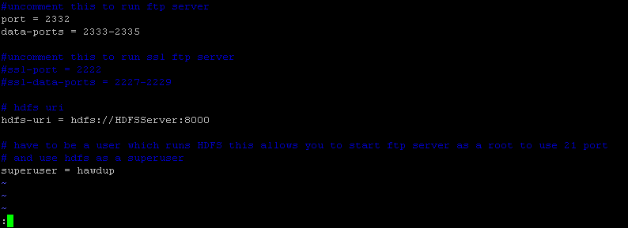
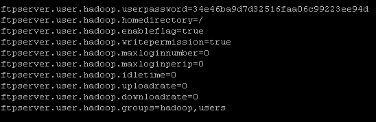

[](openPDC_Home.md "The Open Source Phasor Data Concentrator")

|   |   |   |   |   |
|---|---|---|---|---|
| **[Grid Protection Alliance](http://www.gridprotectionalliance.org "Grid Protection Alliance Home Page")** | **[openPDC Project](https://github.com/GridProtectionAlliance/openPDC "openPDC Project on GitHub")** | **[openPDC Wiki](openPDC_Home.md "openPDC Wiki Home Page")** | **[Documentation](openPDC_Documentation_Home.md "openPDC Documentation Home Page")** | **[Latest Release](https://github.com/GridProtectionAlliance/openPDC/releases "openPDC Releases Home Page")** |

# Processing openPDC data with Hadoop

## Introduction

The openPDC is a complete set of applications for processing streaming time-series data in real-time. Measured data is gathered with GPS-time from multiple input sources, time-sorted and provided to user defined actions, then dispersed to custom output destinations for archival. Hadoop is an ideal architecture for processing the native binary format of the openPDC.

Hadoop is a framework for running applications on large clusters built of commodity hardware. Hadoop includes the Hadoop Distributed File System (HDFS) and the Map Reduce programming model. The openPDC project includes the necessary Hadoop components (InputFormat and RecordReader) to allow Hadoop to work directly with openPDC data points via Map Reduce. In this document we will describe how to get openPDC data into HDFS and then run sample Map Reduce jobs against this data.  *(note: the current Map Reduce code is based on the Hadoop 0.19 API)*

## Getting Started

The focus of this document is data processing once phasor measurement unit (PMU) data has been collected (i.e., offline analysis of large volumes of archived time-series data). We'll assume that the openPDC has been setup and that the user is ready  to move data into HDFS and begin running Map Reduce jobs against the PMU data. The user will either need to already have a Hadoop cluster setup or setup a new Hadoop cluster (there are multiple options for this). We'll divide this process into four steps:

1. [Locate the openPDC PMU data files](#locate-the-openpdc-pmu-data-files)
2. [Copy the data files into the Hadoop HDFS](#copy-the-data-files-into-the-hadoop-hdfs)
3. [Build a basic Map Reduce Job](#build-a-basic-map-reduce-job)
4. [Execute the Map Reduce Job on the Hadoop cluster](#execute-the-map-reduce-job-on-the-hadoop-cluster)

Also included on this page is an extra appendix designed to aid the user in setting up FTP access for HDFS:

* [Appendix A: Setting up FTP Access for HDFS](#appendix-a-setting-up-ftp-access-for-hdfs)


## Locate the openPDC PMU data files

The default directory for the openPDC data files in development mode is one of the following (depending on whether you are compiling in Release mode or Debug mode):

- `{SOURCEDIR}\Syncrhophasor\Current Version\Build\Output\Release\Applications\openPDC\Archive`
- `{SOURCEDIR}\Synchrophasor\Current Version\Build\Output\Debug\Applications\openPDC\Archive`

Where {SOURCEDIR} is the directory where you extracted the openPDC source code.

When the openPDC is installed as a Windows service the default directory for the data files is the directory where you installed the openPDC system, typically:

- `C:\Program Files\openPDC\Archive`

You can always change the destination of the data files by modifying the configuration file *openPDC.config*.

The default file format uses the ".d" file extension and has multiple configurable options in terms of file size.

## Copy the data files into the Hadoop HDFS

Hadoop's distributed file system (HDFS) has multiple ways to copy data into it. They include:

- Using the included bash scripts (for linux) to copy files into HDFS 
- An FTP server that allows basic FTP clients to transfer files into HDFS (see: [Appendix A](#appendix-a-setting-up-ftp-access-for-hdfs))
- FUSE bindings (not currently recommended from windows)

If you are moving files from a win32-based machine, its recommended that you setup the FTP interface (see: [Appendix A](#appendix-a-setting-up-ftp-access-for-hdfs)) available at:

[https://sites.google.com/a/iponweb.net/hadoop/Home/hdfs-over-ftp](https://sites.google.com/a/iponweb.net/hadoop/Home/hdfs-over-ftp)

If you are moving files from a linux based machine, you can simply use the Hadoop bash scripts included. An example command would take the form:

`hadoop fs -copyFromLocal file://mydir/foo.d hdfs://user/hadoop/dest`


## Build a Basic Map Reduce Job

*Note: This code assumes you are running the Hadoop 0.19 API*

If you are not yet familiar with programming for Hadoop and the Map Reduce programming model, it is suggested that you review the information at: [Map Reduce Tutorial](http://hadoop.apache.org/docs/current/hadoop-mapreduce-client/hadoop-mapreduce-client-core/MapReduceTutorial.html)

Familiarity with Map Reduce in general will provide the necessary context for processing openPDC data with Hadoop. The java code in the openPDC project represents the necessary pieces to allow a Hadoop Map Reduce job to work directly with the openPDC binary  file format. An included example of how this can be done is in the file:

```cs
TVA.Hadoop.Samples.TestRecordReader.java
```

This file has a main class `TestRecordReader` that has two inner classes:

```cs
TestRecordReader.MapClass
TestRecordReader.Reduce
```

The MapClass has a single function called `map( &hellip; )` defined as:

```cs
#(Hadoop 1.0)
public void map(LongWritable key, StandardPointFile value, OutputCollector<IntWritable, StandardPointFile> output, Reporter reporter)
#(Hadoop 2.0)
public void map(LongWritable key, StandardPointFile value, Context context)
```

This function defines the K1, V1 key-value pair that is fed to the map class as well as defines the K2, V2 key-value pair that is output as an intermediate value. These K2, V2 key-value pairs are then grouped by key to be fed to a reduce task.

From a practical standpoint this means that the example code takes in time series data points (not guaranteed to be in temporal order) and *maps* each one to a group to be processed by a reducer. Depending on the job function, typically with time series data we want to map data points to a logical group such as a range of time.

In the TestRecordReader class the time series points (StandardPointFile) are mapped to a group by their point ID (StandardPointFile.iPointID) so that they can be counted in the reducer (we'd like to note that this is a very inefficient way to count points, but this verbose example is meant to illustrate simple concepts).

We can alternatively map blocks of time series data into logical groups based on time and allow the reduce phase to do the analysis. A very simple grouping function would be:

```cs
long key = (point_time_stamp_ms / 3600000) * 3600000;
```

where we send each hours worth of data to a separate reducer for analysis. In this case we are rounding timestamps to the nearest hour by dividing and then multiplying by the number of milliseconds in a single hour. This provides a key by which to route the  point to the reducer responsible for that region of time. The reducer then takes this region of time and executes the appropriate analysis technique, emitting the results (if any) back to HDFS.

The reduce phase is primarily used in this setup as the *analysis phase*. The reduce phase is responsible for analyzing its region of time series data and is guaranteed to be able to *see* all of the data, regardless of the physical file location, for a given time region. For simple jobs such as time series window scans, this works very well. Depending on the job, however, the interplay between map and reduce phase responsibilities may change.

In review, for time series data, we suggest that the user *maps* the data into a set of logical timeline blocks; This allows multiple reduce tasks to then work on each logical block of time and focus on analysis.

## Execute the Map Reduce Job on the Hadoop cluster

In order to execute a basic Hadoop job, the user needs access to a linux machine that is configured to launch Hadoop jobs. Once you have compiled your Map Reduce job into a jar file, move the jar file to the same directory that contains `hadoop-0.X.0-core.jar` (hadoop-core-{version}.jar became hadoop-common-{version}.jar starting with Hadoop 2+. There is no hadoop-core.jar for version 2+. You have to download and install both Hadoop Common and MapReduce Client Core jars). With the job jar file in the directory, execute the job with the command:

`bin/hadoop jar {jar_filename} {java_class_name_with_namespace} {data_input_dir} {data_output_dir}`

note: if third-party libraries are used in your program, the correct command to execute the job is:

`export LIBJARS={path to third-party libraries}`

`bin/hadoop jar {jar_filename} {java_class_name_with_namespace} -libjar ${LIBJARS} {data_input_dir} {data_output_dir}`

## Appendix A: Setting up FTP Access for HDFS

1. Download the **[hadoopftp](https://sites.google.com/a/iponweb.net/hadoop/Home/hdfs-over-ftp)** files.  
Archive v1.0.1 hdfs-over-ftp tar files can also be found [here](Developers_Using_Hadoop.files/)
2. Copy tar.gz file to server and unzip
3. Edit hdfs-over-ftp.conf (See [Figure A.1](#figure-a1-editing-hdfs-over-ftpconf) below)
4. Add users to the users.conf (Password is in standard md5 hash, must be hashed manually) (See [Figure A.2](#figure-a2-editing-usersconfg) below)
5. Then execute the FTP Server by using the startup script *./hdfs-over-ftp.sh start*

### Figure A.1: Editing *hdfs-over-ftp.conf*



### Figure A.2: Editing *users.conf*



---
Sep 12, 2017 Updated by [hinfsynz](https://github.com/hinfsynz)
Mar 6, 2015, 9:21:41 PM by [ritchiecarroll](https://github.com/ritchiecarroll), version 4  
Oct 5, 2015  Migrated from [CodePlex](http://openpdc.codeplex.com/wikipage?title=Using%20Hadoop%20%28Developers%29) by [aj](https://github.com/ajstadlin)
Dec 15, 2016  [HDFS Over FTP](https://sites.google.com/a/iponweb.net/hadoop/Home/hdfs-over-ftp) link updated by [aj](https://github.com/ajstadlin)

---

Copyright 2016 [Grid Protection Alliance](http://www.gridprotectionalliance.org)
