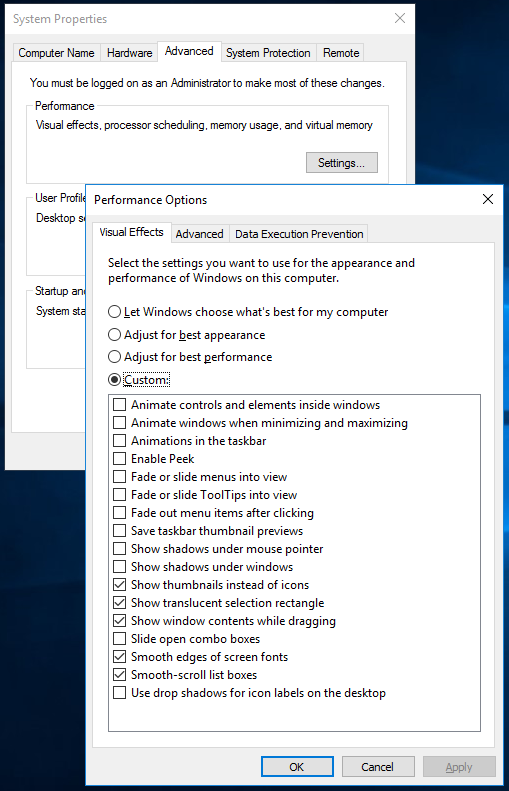
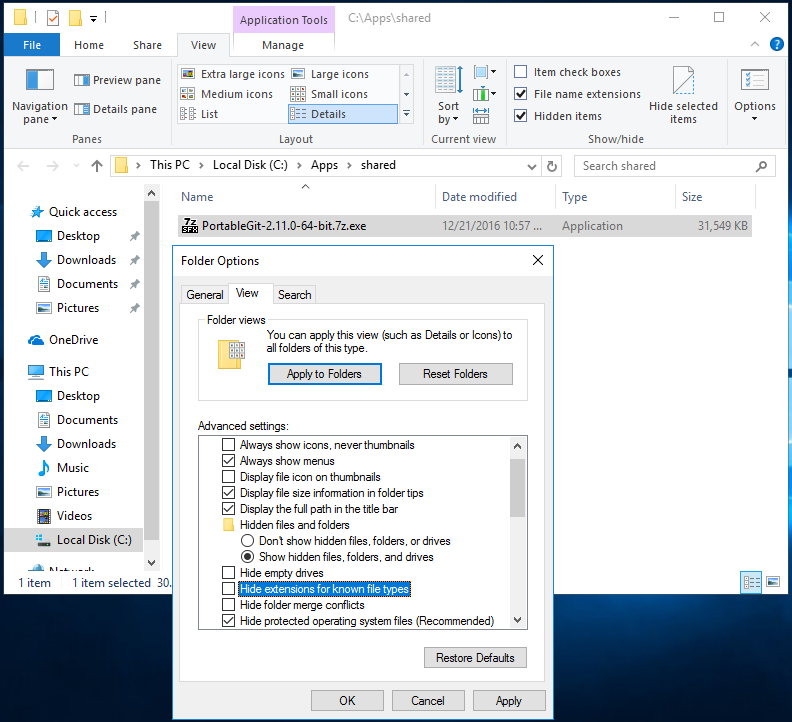

[](openPDC_Home.md "The Open Source Phasor Data Concentrator")

|   |   |   |   |   |   |
|---|---|---|---|---|---|
| **[Grid Protection Alliance](http://www.gridprotectionalliance.org "Grid Protection Alliance Home Page")** | **[openPDC Project](https://github.com/GridProtectionAlliance/openPDC "openPDC Project on GitHub")** | **[openPDC Wiki](openPDC_Home.md "openPDC Wiki Home Page")** | **[Documentation](openPDC_Documentation_Home.md "openPDC Documentation Home Page")** | **[Exercises](Developer_Exercises.md)** | **[Latest Release](https://github.com/GridProtectionAlliance/openPDC/releases "openPDC Releases Home Page")** |

***This document is an exercise procedure for setting up and testing concepts.***

---

# GPA Developer Workstation

This is a *cookbook recipe* style exercise procedure for setting up a workstation virtual machine for developing GridProtectionAlliance software. This procedure was developed and tested using specified operating systems, software versions, and installation sequence. However, with appropriate modifications, this procedure should be adaptable to work in other hardware and software platforms.

- [Platform](#platform)
    - [Platform Description](#platform-description)
    - [Platform Configuration](#platform-configuration)
        - [`GPA-HOST` Platform Host Server](#gpa-host-platform-host-server)
        - [`GPA-DEV` GPA Developer Workstation virtual machine](#gpa-dev-gpa-developer-workstation-virtual-machine)
    - [Host Server Setup](#host-server-setup)
        - [DNS Configuration](#dns-configuration)
        - [Hyper-V Virtual Machines Setup](#hyper-v-virtual-machines-setup)
            - [IMPORTANT: PASSWORDS](#important-passwords)
    - [GPA-DEV Workstation Initial Setup](#gpa-dev-workstation-initial-setup)
- [`GPA-DEV` Workstation Developer Software Installation](#gpa-dev-workstation-developer-software-installation)
    - [Create a Folder on the `GPA-DEV` Workstation for Receiving Software and Files](#create-a-folder-on-the-gpa-dev-workstation-for-receiving-software-and-files)
    - [Downloading and Installing Software Packages Procedure](#downloading-and-installing-software-packages-procedure)
        - [Software Packages for this Exercise](#software-packages-for-this-exercise)
- [Make a *Checkpoint* snapshot image of the current `GPA-DEV` Workstation virtual machine](#make-a-checkpoint-snapshot-image-of-the-current-gpa-dev-workstation-virtual-machine)
    - [Development Forks for this Exercise](#development-forks-for-this-exercise)

---

## Platform

### Platform Description

This example uses a Microsoft Windows Server 2012 R2 Host server, named [GPA-HOST](#gpa-host-platform-host-server) running Hyper-V to host virtual machines configured with various operating systems and GPA software. The GPA-HOST server also runs Microsoft DNS Server to map the host's and virtual machines' names to IP addresses in our local network.  

The virtual machines will be created with a clean operating system and software installed for this example.  This document will try to highlight the non-default customized installation and configuration steps.  This document does not include many *default* installation and configuration steps.

### Platform Configuration

#### **`GPA-HOST`** Platform Host Server
    - Windows Server 2012 R2 Standard with Hyper-V for hosting virtual machines
    - DNS Server
    - CPU = AMD Phenom X4, 3.2GHz
    - RAM = 16GB, 1600 MHz, non-ECC
    - Ethernet with Internet access

#### **`GPA-DEV`** GPA Developer Workstation virtual machine
    - OS = Windows 10 Enterprise 2016 LTSB, 64-bit
    - Software = Developer tools including Git, Microsoft Visual Studio
    - Environment for developing, debugging, and documenting GPA Software
    - CPU = 3 virtual cores
    - RAM = 3072 standard (not dynamic)
    - VHD = 127GB virtual hard drive

---

### Host Server Setup

In this example, the *Host Server* is a general purpose physical server whose function is providing a Hyper-V infrastructure to run the virtual machines and local DNS service.  Setting up the *Host Server* is beyond the scope of this example.  However, the only significant *Host Server* setup beyond a clean Windows install is the installation of Hyper-V and DNS services.

#### DNS Configuration

The Host Server *DNS service* is optional.  The *DNS service* provides reliable and easy to manage Host Name to IP address resolution. This example will use *static IPv4 addresses* for all of the machines.

This example's local area network (LAN) IP Address range is `192.168.1.0 to 192.168.1.255`. Your network will not likely use the same IP Addresses. Also the `gpa.net` domain name is arbitrary. If using a different domain name, make sure it does not conflict with a *real Internet domain* you may want to access. Also, make sure to configure the DNS server's to *Forwarders* properties to resolve Internet side domains' host names.

1. Create a **Forward Lookup Zone** for the domain named:  `gpa.net`
2. Under the `gpa.net` zone, create the following **Host A** records:
    - `GPA-HOST     A  192.168.1.249`
    - `GPA-DEV      A  192.168.1.122`
3. Set the DNS Server's **Forwarders** properties to include your favorite ISP's DNS service or public DNS service.  This example uses Google's public DNS.
    - `8.8.8.8    google-public-dns-a.google.com`

#### Hyper-V Virtual Machines Setup

This example uses [Microsoft Developer Network (**MSDN**)](https://msdn.microsoft.com) subscription releases of the Windows operating system software in ISO file format. The ISO filenames in this document are renamed to be simplified.

##### **IMPORTANT: PASSWORDS**

In Production Deployments, complex passwords are desireable.  However, in these cookbook scenarios, certain test procedures may be easier to troubleshoot if your passwords are at least 8 alpha-numeric characters long, with mixed character cases, and at least 1 numeric digit.  For now, avoid short simple passwords and avoid using symbols in the passwords.

---

### `GPA-DEV` Workstation Initial Setup

- 1. Download the `windows_10_enterprise_2016_ltsb.iso` file to the [`GPA-HOST`](#gpa-host-platform-host-server) server
- 2. On the [`GPA-HOST`](#gpa-host-platform-host-server) server: create the [`GPA-DEV`](#gpa-dev-gpa-developer-workstation-virtual-machine) Workstation virtual machine.
    - Configure [`GPA-DEV's`](#gpa-dev-gpa-developer-workstation-virtual-machine) Hyper-V *Settings* as described in the earlier [Platform Configuration](#platform-configuration) section and assign the `windows_10_enterprise_2016_ltsb.iso` image file to its DVD drive.
- 3. Start the `GPA-DEV` virtual machine and run the Windows installation.  
    - In the *Get going fast* screen, press the "Customize" button.
    - In the 3 *Customize settings* screens, turn All of the options to **Off**.  Optionally leave the "Browser, protection, and update / Use SmartScreen..." turned **On**
- 4. In the *Choose hou you'll connect* screen, select "Join a local Active Directory domain"
- 5. In the *Create an account for this PC* screen, enter the user information and [**Password**](#important-passwords) you want to use and need to remember.
    - The user name in this example is: `tangent`
- 6. Configure the static IP address
    - Open the *`Control Panel\Network and Internet\Network and Sharing Center`*
    - Open the *Ethernet / Properties* and open its *Internet Protocol Version 4 (TCP/IPv4) / Properties* and set the following values:
        - `IP address:            192.168.1.122` - set to match your DNS for `GPA-DEV.gpa.net`
        - `Subnet mask:           255.255.255.0` - set to your network's subnet mask
        - `Default gateway:       192.168.1.1  ` - set to your Router's LAN IP address
        - `Preferred DNS server:  192.168.1.249` - set to the `GPA-HOST` server's IP address
    - *Ping* stuff to test the network and DNS configuration.

```
C:\Users\Administrator> ping gpa-host.gpa.net
    Pinging gpa-host.gpa.net [192.168.1.249] with 32 bytes of data:
    Reply from 192.168.1.249: bytes=32 time<1ms TTL=128
    ...
C:\Users\Administrator> ping google-public-dns-a.google.com
    Pinging www.google.com [8.8.8.8] with 32 bytes of data:
    Reply from 8.8.8.8: bytes=32 time=20ms TTL=45
    ...
C:\Users\Administrator> ping time.nist.gov
    Pinging ntp1.glb.nist.gov [132.163.4.102] with 32 bytes of data:
    Request timed out.
```

- 7. In *`Control Panel\Clock, Language, and Region`* click the "Set the time and date"
    - In the *Date and Time* tab, set the date and time and set the local time zone
    - Set the local time zone
    - In the *Internet Time* tab, click the *Change settings...* button and set the *Server* to `time.nist.gov` then click *Update now* and look for a message like "The clock was successfully synchronized with time.nist.gov on..."
- 8. If everything is working so far, run Windows Update and take a coffee break!
- 9. Reboot after Windows Updates are downloaded and let them complete by rebooting.
- 10. In *`Control Panel\System and Security\System`* click the *Change Settings* link in the *Computer name, domain, and workgroup settings section.
    - In the *System Properties / Computer Name* tab, click the *Change...* button.
    - In the *Computer Name/Domain Changes* dialog, 
        - change the *Computer name* value to `GPA-DEV`
        - change the *Workgroup* value to `GPA.NET`
        - click the *More...* button and set the *Primary DNS suffix of this computer" value to `gpa.net`
        - close the dialogs and reboot 
- 11. Optional: In *`Control Panel\System and Security\System`* 
    - Enable Remote Desktop: click the *Remote Settings* link and select "Allow remote connetions to this computer."
    - Adjust for Best Performance: click the *Advanced system settings* link
        - In the *System Properties / Advanced* tab's *Performance* section, click the *Settings...* button
        - Click the *Adjust for best performance* radio option, and select only the minimum Custom features desired
        - []()
- 12. After rebooted, *Shut Down* the virtual machine and create a Hyper-V Checkpoint recording of this basic installation configuration

---

## `GPA-DEV` Workstation Developer Software Installation

1.  Start the `GPA-DEV` Workstation if it is not already running
    - Sign in with the `tangent` account

### Create a Folder on the `GPA-DEV` Workstation for Receiving Software and Files

**Do the following tasks in the `GPA-DEV` Workstation:**

1. Create the following folders. The `C:\Apps` and `C:\Apps\shared` folders should be made available to any authorized person logging into the GPA-DEV machine.
    - `C:\Apps`
    - `C:\Apps\shared`
2. Configure *Windows System / File Explorer*'s *View* options.
    - Open the *Windows System / File Explorer*
    - Click and drop down the *View* ribbon menu
    - Click the *Options* button
    - Disable the *Hide extensions of known file types* option by unchecking it
    - Click the *Apply* button
    - Click the *Apply to all folders* button
    - []()

### Downloading and Installing Software Packages Procedure

The following is a generalized procedure for installing software packages on the `GPA-DEV` Workstation.

1. Open the *Windows Accessories / Internet Explorer* web browser and navigate to software's Home Page
    - Note:  The Home Page is a good place to start. Download Pages or especially Download Links sometimes change over time.
2. Navigate to the Download Page appropriate for the Windows platform and version (usually the current stable version)
3. Click on appropriate Download :inks or buttons
2. When prompted to save downloads, drop down the *Save* button menu and click **Save as**
3. In the *Save As* dialog, browse to the `C:\Apps\shared` folder, then click the *Save* button
4. Open the *Windows System / File Explorer* and navigate to the `C:\Apps\shared` folder
5. Select the software package and install it in an appropriate location
    - Typical Applications installed in `C:\Apps\{application_name}` folders
        - Git, 7-Zip
    - Typical Applications installed in `C:\Program Files\{vendor_name}\{application_name}` sub folders
        - Microsoft Development Tools
6. Optional: Pin to Start Menu, Pin to Taskbar, or create short cuts for the installed applications

#### Software Packages for this Exercise

| Software | Package | Home Page | Download Link | Install Location | Installation Notes |
|---|---|---|---|---|---|
| **Git Portable** 64-bit | `PortableGit-2.11.0-64-bit.7z.exe` | [Git-Scm.com](`https://git-scm.com/`) | [PortableGit-2.11.0-64-bit.7z.exe](https://github.com/git-for-windows/git/releases/download/v2.11.0.windows.1/PortableGit-2.11.0-64-bit.7z.exe) | `C:\Apps\Git` | Run installer as a Normal User, do Not *Run as Administrator* |
| **7zip** 64-bit | `7z1604-x64.exe` | [7-zip.org](http://www.7-zip.org/) | [7z1604-x64.exe](http://www.7-zip.org/a/7z1604-x64.exe) | `C:\Apps\7z` | Run installer as Administrator |

---

## Make a *Checkpoint* Snapshot Image of the Current `GPA-DEV` Workstation Virtual Machine

At this point in our exercise, we have a very clean, general purpose, workstation virtual machine. By making a *Checkpoint* of the current machine state, we can *export* or *fork* this machine to repurpose it for various development environments and scenarios.

### Development Forks for this Exercise

- Microsoft Visual Studio, Community Edition
- Microsoft Visual Studio, Professional Edition

---

Dec 22, 2016 - Created by [aj](https://github.com/ajstadlin)

---

Copyright 2017 [Grid Protection Alliance](http://www.gridprotectionalliance.org)
