[](openPDC_Home.md "The Open Source Phasor Data Concentrator")

|   |   |   |   |   |
|---|---|---|---|---|
| **[Grid Protection Alliance](http://www.gridprotectionalliance.org "Grid Protection Alliance Home Page")** | **[openPDC Project](https://github.com/GridProtectionAlliance/openPDC "openPDC Project on GitHub")** | **[Documentation](openPDC_Documentation_Home.md "openPDC Documentation Home Page")** | **[Exercises](Developer_Exercises.md)** | **[Latest Release](https://github.com/GridProtectionAlliance/openPDC/releases "openPDC Releases Home Page")** |

***This document is an exercise procedure for setting up and testing concepts.***

---

# openPDC and PMU Connection Tester in Microsoft Windows Server 2016 and Windows 10

This is a *cookbook recipe* style exercise procedure for setting up openPDC and PMU Connection Tester. This procedure was developed and tested using specified operating systems and software versions. However, with appropriate modifications, this procedure should be adaptable to work in other hardware and software platforms.

This is *not a production deployment configuration*.  Production deployments need signifiant additional performance and security tuning.

- [Platform](#platform)
    - [Platform Description](#platform-description)
    - [Platform Configuration](#platform-configuration)
        - [`GPA-HOST` Platform Host Server](#gpa-host-platform-host-server)
        - [`OPDC-01` openPDC Server virtual machine](#opdc-01-openpdc-server-virtual-machine)
        - [`PMU-TESTER` PMU Connection Tester Workstation virtual machine](#pmu-tester-pmu-connection-tester-workstation-virtual-machine)
    - [Host Server Setup](#host-server-setup)
        - [DNS Configuration](#dns-configuration)
        - [Hyper-V Virtual Machines Setup](#hyper-v-virtual-machines-setup)
            - [IMPORTANT: PASSWORDS](#important-passwords)
    - [`OPDC-01` Server, Initial Setup](#opdc-01-server-initial-setup)
    - [`PMU-TESTER` Workstation, Initial Setup](#pmu-tester-workstation-initial-setup)
- [`OPDC-01` Server, GPA Software Installation](#opdc-01-server-gpa-software-installation)
    - [Create a Shared Folder on the `OPDC-01` Server for Receiving Software and Files](#create-a-shared-folder-on-the-opdc-01-server-for-receiving-software-and-files)
    - [Connect the `PMU-TESTER` Workstation to the `OPDC-01` and Map a Drive to the `\\OPDC-01\GPA.shared` Folder](#connect-the-pmu-tester-workstation-to-the-opdc-01-and-map-a-drive-to-the-opdc-01gpashared-folder)
    - [Download the openPDC Software and Save it to the `GPA.shared` Shared Folder on `OPDC-01`](#download-the-openpdc-software-and-save-it-to-the-gpashared-shared-folder-on-opdc-01)
    - [Install the openPDC Software on the `OPDC-01` Server](#install-the-openpdc-software-on-the-opdc-01-server)
    - [Configuration Setup Utility](#configuration-setup-utility)
    - [Download the PMU Connection Tester Software and Save it to the `GPA.shared` Folder](#download-the-pmu-connection-tester-software-and-save-it-to-the-gpashared-folder)
    - [Install the PMU Connection Tester Software on the `OPDC-01` Server](#install-the-pmu-connection-tester-software-on-the-opdc-01-server)
- [`PMU-TESTER` Workstation, GPA Software Installation](#pmu-tester-workstation-gpa-software-installation)
    - [Create a Folder on the PMU-TESTER Workstation for Receiving Software and Files](#create-a-folder-on-the-pmu-tester-workstation-for-receiving-software-and-files)
    - [Download the PMU Connection Tester Software and Save it to the `GPA.shared` Folder](#download-the-pmu-connection-tester-software-and-save-it-to-the-gpashared-folder)
    - [Install the PMU Connection Tester Software on the `PMU-TESTER` Workstation](#install-the-pmu-connection-tester-software-on-the-pmu-tester-workstation)
- [Test openPDC Concentrator Output Streaming to PMU Connection Tester](#test-openpdc-concentrator-output-streaming-to-pmu-connection-tester)
    - [Verify openPDC Concentrator Output Stream Configuration](#verify-openpdc-concentrator-output-stream-configuration)
    - [Test the Output Stream with PMU Connection Tester on the `OPDC-01` Server](#test-the-output-stream-with-pmu-connection-tester-on-the-opdc-01-server)
    - [Configure the Windows Firewall on the `OPDC-01` Server for the Output Stream TCP Port 8900](#configure-the-windows-firewall-on-the-opdc-01-server-for-the-output-stream-tcp-port-8900)
    - [Test the Output Stream over the Network with PMU Connection Tester](#test-the-output-stream-over-the-network-with-pmu-connection-tester)
- [Exercise Conclusion](#exercise-conclusion)

---

## Platform

### Platform Description

This example uses a Microsoft Windows Server 2012 R2 Host server, named [GPA-HOST](#gpa-host-platform-host-server) running Hyper-V to host virtual machines configured with various operating systems and GPA software. The GPA-HOST server also runs Microsoft DNS Server to map the host's and virtual machines' names to IP addresses in our local network.  

The virtual machines will be created with a clean operating system and software installed for this example.  This document will try to highlight the non-default customized installation and configuration steps.  This document does not include many *default* installation and configuration steps.

### Platform Configuration

#### **`GPA-HOST`** Platform Host Server
    - Windows Server 2012 R2 Standard with Hyper-V for hosting virtual machines
    - DNS Server
    - CPU = AMD Phenom X4, 3.2GHz
    - RAM = 16GB, 1600 MHz, non-ECC
    - Ethernet with Internet access

#### **`OPDC-01`** openPDC Server virtual machine
    - OS = Windows Server 2016 Standard
    - Software = **GPA Software**
    - CPU = 2 virtual cores
    - RAM = 4096MB standard (not dynamic)
    - VHD = 127GB virtual hard drive

#### **`PMU-TESTER`** PMU Connection Tester Workstation virtual machine
    - OS = Windows 10 Enterprise 2016 LTSB
    - Software = **GPA Software**
    - Environment for developing, debugging, and documenting GPA Software
    - CPU = 2 virtual cores
    - RAM = 2048MB standard (not dynamic)
    - VHD = 127GB virtual hard drive

---

### Host Server Setup

In this example, the *Host Server* is a general purpose physical server whose function is providing a Hyper-V infrastructure to run the virtual machines and local DNS service.  Setting up the *Host Server* is beyond the scope of this example.  However, the only significant *Host Server* setup beyond a clean Windows install is the installation of Hyper-V and DNS services.

#### DNS Configuration

The Host Server *DNS service* is optional.  The *DNS service* provides reliable and easy to manage Host Name to IP address resolution. This example will use *static IPv4 addresses* for all of the machines.

This example's local area network (LAN) IP Address range is `192.168.1.0 to 192.168.1.255`. Your network will not likely use the same IP Addresses. Also the `gpa.net` domain name is arbitrary. If using a different domain name, make sure it does not conflict with a *real Internet domain* you may want to access. Also, make sure to configure the DNS server's to *Forwarders* properties to resolve Internet side domains' host names.

1. Create a **Forward Lookup Zone** for the domain named:  `gpa.net`
2. Under the `gpa.net` zone, create the following **Host A** records:
    - `GPA-HOST     A  192.168.1.249`
    - `OPDC-01      A  192.168.1.110`
    - `PMU-TESTER   A  192.168.1.120`
3. Set the DNS Server's **Forwarders** properties to include your favorite ISP's DNS service or public DNS service.  This example uses Google's public DNS.
    - `8.8.8.8    google-public-dns-a.google.com`

#### Hyper-V Virtual Machines Setup

This example uses [Microsoft Developer Network (**MSDN**)](https://msdn.microsoft.com) subscription releases of the Windows operating system software in ISO file format. The ISO filenames in this document are renamed to be simplified.

##### **IMPORTANT: PASSWORDS**

In Production Deployments, complex passwords are desireable.  However, in these cookbook scenarios, certain test procedures may be easier to troubleshoot if your passwords are at least 8 alpha-numeric characters long, with mixed character cases, and at least 1 numeric digit.  For now, avoid short simple passwords and avoid using symbols in the passwords.

---

### `OPDC-01` Server, Initial Setup

- 1. Download the `windows_server_2016.iso` file to the [`GPA-HOST`](#gpa-host--platform-host-server) server
- 2. On the [`GPA-HOST`](#gpa-host--platform-host-server) server: create the [`OPDC-01`](#opdc-01--openpdc-server-virtual-machine) openPDC Server virtual machine.
    - Configure [`OPDC-01's`](#opdc-01--openpdc-server-virtual-machine) Hyper-V *Settings* as described in the earlier [Platform Configuration](#platform-configuration) section and assign the `windows_server_2016.iso` image file to its DVD drive.
- 3. Start the `OPDC-01` virtual machine and run the Windows installation.  In the *Windows Setup* dialog's "Select the operating system..." screen, select "Windows Server 2016 Standard (Desktop Experience)"
- 4. During setup, you will be prompted to enter an appropriate password for the *Administrator* account. The *Administrator* account will only be used for software installation and configuration changes requiring elevated privileges.
- 5. Configure the static IP address
    - Open the *`Control Panel\Network and Internet\Network and Sharing Center`*
    - Open the *Ethernet / Properties* and open its *Internet Protocol Version 4 (TCP/IPv4) / Properties* and set the following values:
        - `IP address:            192.168.1.110` - set to match your DNS for `OPDC-01.gpa.net`
        - `Subnet mask:           255.255.255.0` - set to your network's subnet mask
        - `Default gateway:       192.168.1.1  ` - set to your Router's LAN IP address
        - `Preferred DNS server:  192.168.1.249` - set to the `GPA-HOST` server's IP address
    - *Ping* stuff to test the network and DNS configuration.

```
C:\Users\Administrator> ping gpa-host.gpa.net
    Pinging gpa-host.gpa.net [192.168.1.249] with 32 bytes of data:
    Reply from 192.168.1.249: bytes=32 time<1ms TTL=128
    ...
C:\Users\Administrator> ping google-public-dns-a.google.com
    Pinging www.google.com [8.8.8.8] with 32 bytes of data:
    Reply from 8.8.8.8: bytes=32 time=20ms TTL=45
    ...
C:\Users\Administrator> ping time.nist.gov
    Pinging ntp1.glb.nist.gov [132.163.4.102] with 32 bytes of data:
    Request timed out.
```

- 6. In *`Control Panel\Clock, Language, and Region`* click the "Set the time and date"
    - In the *Date and Time* tab, set the date and time and set the local time zone
    - Set the local time zone
    - In the *Internet Time* tab, click the *Change settings...* button and set the *Server* to `time.nist.gov` then click *Update now* and look for a message like "The clock was successfully synchronized with time.nist.gov on..."
- 7. If everything is working so far, run Windows Update and take a coffee break!
- 8. Reboot after Windows Updates are downloaded and let them install by rebooting.
- 9. In *`Control Panel\System and Security\System`* click the *Change Settings* link in the *Computer name, domain, and workgroup settings section.
    - In the *System Properties / Computer Name* tab, click the *Change...* button.
    - In the *Computer Name/Domain Changes* dialog, 
        - change the *Computer name* value to `OPDC-01`
        - change the *Workgroup* value to `GPA.NET`
        - click the *More...* button and set the *Primary DNS suffix of this computer" value to `gpa.net`
        - close the dialogs and reboot 
- 10. Optional: In *`Control Panel\System and Security\System`* 
    - Enable Remote Desktop: click the *Remote Settings* link and select "Allow remote connetions to this computer."
    - Adjust for Best Performance: click the *Advanced system settings* link
        - In the *System Properties / Advanced* tab's *Performance* section, click the *Settings...* button
        - Click the *Adjust for best performance* radio option, and select only the minimum Custom features desired
- 11. After rebooted, *Shut Down* the virtual machine and create a Hyper-V Checkpoint recording of this basic installation configuration
- 12. In *Computer Management / Local Users and Groups / Users*, create a User Account and [**Password**](#important-passwords)
    - The user name in this example is:  `cosine`
    - If you enabled Remote Desktop, add the `cosine` user to the `Remote Desktop Users` Group

---

### `PMU-TESTER` Workstation, Initial Setup

- 1. Download the `windows_10_enterprise_2016_ltsb.iso` file to the [`GPA-HOST`](#gpa-host--platform-host-server) server
- 2. On the [`GPA-HOST`](#gpa-host--platform-host-server) server: create the [`PMU-TESTER`](#pmu-tester--pmu-connection-tester-workstation-virtual-machine) Workstation virtual machine.
    - Configure [`PMU-TESTER's`](#pmu-tester--pmu-connection-tester-workstation-virtual-machine) Hyper-V *Settings* as described in the earlier [Platform Configuration](#platform-configuration) section and assign the `windows_10_enterprise_2016_ltsb.iso` image file to its DVD drive.
- 3. Start the `PMU-TESTER` virtual machine and run the Windows installation.  
    - In the *Get going fast* screen, press the "Customize" button.
    - In the 3 *Customize settings* screens, turn All of the options to **Off**.  Optionally leave the "Browser, protection, and update / Use SmartScreen..." turned **On**
- 4. In the *Choose hou you'll connect* screen, select "Join a local Active Directory domain"
- 5. In the *Create an account for this PC* screen, enter the user information and [**Password**](#important-passwords) you want to use and need to remember.
    - The user name in this example is: `tangent`
- 6. Configure the static IP address
    - Open the *`Control Panel\Network and Internet\Network and Sharing Center`*
    - Open the *Ethernet / Properties* and open its *Internet Protocol Version 4 (TCP/IPv4) / Properties* and set the following values:
        - `IP address:            192.168.1.120` - set to match your DNS for `PMU-TESTER.gpa.net`
        - `Subnet mask:           255.255.255.0` - set to your network's subnet mask
        - `Default gateway:       192.168.1.1  ` - set to your Router's LAN IP address
        - `Preferred DNS server:  192.168.1.249` - set to the `GPA-HOST` server's IP address
    - *Ping* stuff to test the network and DNS configuration.

```
C:\Users\Administrator> ping gpa-host.gpa.net
    Pinging gpa-host.gpa.net [192.168.1.249] with 32 bytes of data:
    Reply from 192.168.1.249: bytes=32 time<1ms TTL=128
    ...
C:\Users\Administrator> ping opdc-01.gpa.net
    Pinging gpa-host.gpa.net [192.168.1.110] with 32 bytes of data:
    Request timed out
    ...
C:\Users\Administrator> ping google-public-dns-a.google.com
    Pinging www.google.com [8.8.8.8] with 32 bytes of data:
    Reply from 8.8.8.8: bytes=32 time=20ms TTL=45
    ...
C:\Users\Administrator> ping time.nist.gov
    Pinging ntp1.glb.nist.gov [132.163.4.102] with 32 bytes of data:
    Request timed out.
```

- 7. In *`Control Panel\Clock, Language, and Region`* click the "Set the time and date"
    - In the *Date and Time* tab, set the date and time and set the local time zone
    - Set the local time zone
    - In the *Internet Time* tab, click the *Change settings...* button and set the *Server* to `time.nist.gov` then click *Update now* and look for a message like "The clock was successfully synchronized with time.nist.gov on..."
- 8. If everything is working so far, run Windows Update and take a coffee break!
- 9. Reboot after Windows Updates are downloaded and let them complete by rebooting.
- 10. In *`Control Panel\System and Security\System`* click the *Change Settings* link in the *Computer name, domain, and workgroup settings section.
    - In the *System Properties / Computer Name* tab, click the *Change...* button.
    - In the *Computer Name/Domain Changes* dialog, 
        - change the *Computer name* value to `PMU-TESTER`
        - change the *Workgroup* value to `GPA.NET`
        - click the *More...* button and set the *Primary DNS suffix of this computer" value to `gpa.net`
        - close the dialogs and reboot 
- 11. Optional: In *`Control Panel\System and Security\System`* 
    - Enable Remote Desktop: click the *Remote Settings* link and select "Allow remote connetions to this computer."
    - Adjust for Best Performance: click the *Advanced system settings* link
        - In the *System Properties / Advanced* tab's *Performance* section, click the *Settings...* button
        - Click the *Adjust for best performance* radio option, and select only the minimum Custom features desired
- 12. After rebooted, *Shut Down* the virtual machine and create a Hyper-V Checkpoint recording of this basic installation configuration

---

## `OPDC-01` Server, GPA Software Installation

1.  Start the `OPDC-01` Server if it is not already running
    - Sign in with the `Administrator` account
2.  Start the `PMU-TESTER` Workstation if it is not already running
    - Sign in with the `tangent` account

### Create a Shared Folder on the `OPDC-01` Server for Receiving Software and Files

**Do the following tasks in the `OPDC-01` Server:**

1. Create the following 2 folders:
    - `C:\GPA`
    - `C:\GPA\GPA.shared`
2. In the Windows *File Explorer*, right click on the `C:\GPA\GPA.shared` folder and click *Properties*
3. Select the *Sharing* tab and click the *Advanced Sharing...* button.
4. Check the *Share this folder* checkbox, make sure the *Share name* value is `GPA.shared`
5. Click the *Permissions* button
    - Add the `Administrator` and assign *Full Control* permissions
    - Add the `cosine` user and assign *Change* permissions
    - Remove the `Everyone` group
6. Click the *OK* button and close the dialogs

### Connect the `PMU-TESTER` Workstation to the `OPDC-01` and Map a Drive to the `\\OPDC-01\GPA.shared` Folder

**Do the following tasks in the `PMU-TESTER` Workstation:**

1. Map the letter "G" to the `GPA.shared` folder on `OPDC-01`
    - Open a *Command Prompt* console window
    - Execute the command: `net use G: \\opdc-01.gpa.net\GPA.shared /PERSISTENT:yes /SAVECRED`
    - Enter the user name for 'opdc-01.gpa.net': `cosine`
    - Enter the password for the `cosine` user
    - The result should be "The command completed successfully."
    - While the *Command Prompt* console window is open, test the share by typing the command: `dir G:`

### Download the openPDC Software and Save it to the `GPA.shared` Shared Folder on `OPDC-01`

**Do the following tasks in the `PMU-TESTER` Workstation:**

1. Open the *Windows Accessories / Internet Explorer* web browser
2. Navigate to the openPDC Release page: [https://github.com/GridProtectionAlliance/openPDC/releases](https://github.com/GridProtectionAlliance/openPDC/releases)
3. Scroll down to the *Downloads* section and click on the [Synchrophasor.Installs.zip](https://github.com/GridProtectionAlliance/openPDC/releases/download/v2.3/Synchrophasor.Installs.zip) link to start the download.
    - When prompted, drop down the *Save* button menu and click *Save as*
    - In the *Save As* dialog, browse to the mapped network drive `G:\`, then click the *Save* button.

### Install the openPDC Software on the `OPDC-01` Server

**Do the following tasks in the `OPDC-01` Server**

1. Open the *Windows System / File Explorer* and navigate to the `C:\GPA\GPA.shared` folder.
2. Extract the Synchrophasor.Installs.zip contents to a new `C:\GPA\GPA.shared\Synchrophasor.Installs` folder and open the folder.
3. Run the *openPDCSetup.msi* setup wizard
    - Accept the terms in the MIT License Agreement
4. In the Custom Setup screen, click the *Browse...* button and change the *Location* value to `C:\GPA\openPDC\`
    - [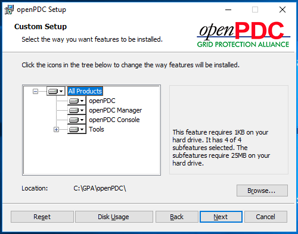]()
5. Continue with the remaining openPDC Setup by accepting the default values until you see the **Completed the openPDC Setup Wizard** screen.
6. Make sure the *Launch Configuration Setup Utility* option is checked then click the *Finish* button

### Configuration Setup Utility

**Do the following tasks in the `OPDC-01` Server**

*Unless otherwise noted, accept the default configuration options and continue to the Next screen.*

1. In the *Set up a database* screen, select the ***SQLite*** radio option and check the *Run sample data script* option, then click the *Next* button.
    - [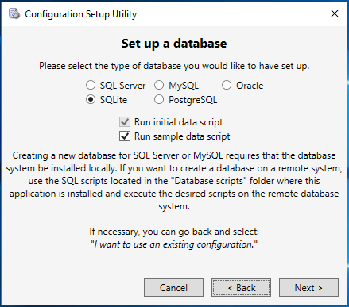]()
2. In the *Set up an SQLite database* screen, change the "*Please select the location in which to save the new database file.*" value to `C:\GPA\openPDC\data\openPDC.db`
    - [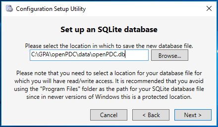]()
3. In the *Define User Account Credentials* verify the user account is correct and that *Allow pass-through authentication for openPDC Manager* is checked
    - [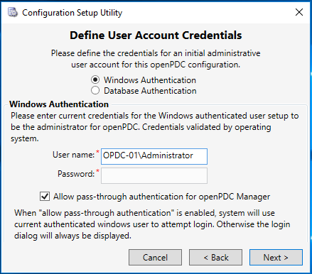]()
4. Continue and accept defaults for the remaining configuration screens. If all goes well, the configuration will complete and display a screen like this:
    - [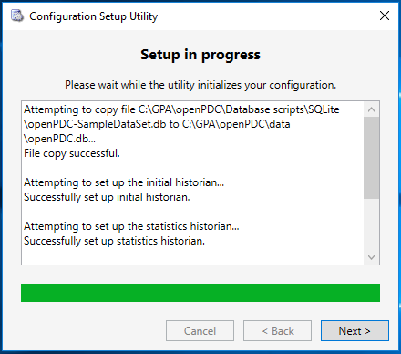]()
5. Run the openPDC service and openPDC Manager
    - [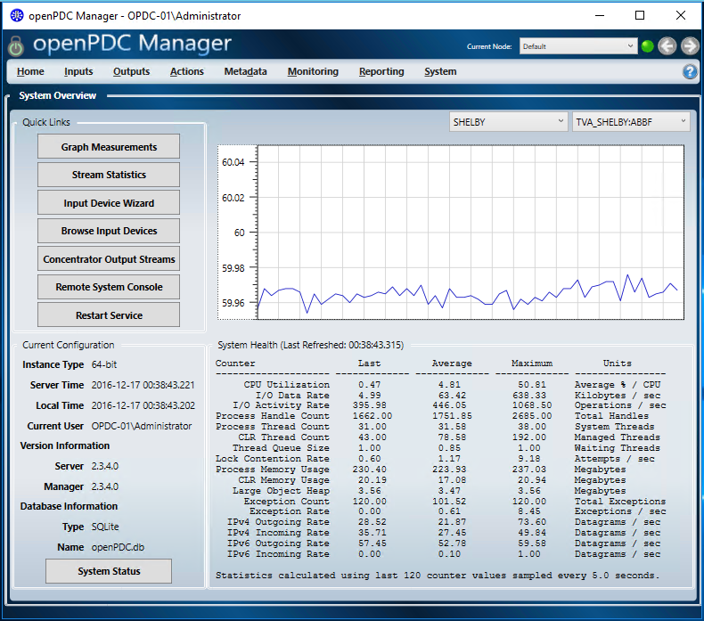]()

### Download the PMU Connection Tester Software and Save it to the `GPA.shared` Folder

**Do the following tasks in the `PMU-TESTER` Workstation:**

1. Open the *Windows Accessories / Internet Explorer* web browser
2. Navigate to the PMU Connection Tester Release page: [https://github.com/GridProtectionAlliance/PMUConnectionTester/releases](https://github.com/GridProtectionAlliance/PMUConnectionTester/releases)
3. Scroll down to the *Downloads* section and click on the [PMUConnectionTesterSetup.zip](https://github.com/GridProtectionAlliance/PMUConnectionTester/releases/download/v4.5.6/PMUConnectionTesterSetup.zip) link to start the download.
    - When prompted, drop down the *Save* button menu and click *Save as*
    - In the *Save As* dialog, browse to the mapped network drive `G:\`, then click the *Save* button.

### Install the PMU Connection Tester Software on the `OPDC-01` Server

**Do the following tasks in the `OPDC-01` Server**

2. Open the *Windows System / File Explorer* and navigate to the `C:\GPA\GPA.shared` folder.
3. Extract the `PMUConnectionTesterSetup.zip` contents to a new `C:\GPA\GPA.shared\PMUConnectionTesterSetup` folder and open the folder.
4. Run the *PMUConnectionTesterSetup64.msi* setup wizard
5. In the *Select Installation Folder* screen, change the *Folder* value to `C:\GPA\PMU Connection Tester\`
    - [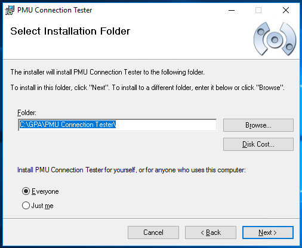]()
6. Continue with the remaining PMU Connection Tester Setup by accepting the default values until it has completed.
7. Run the PMU Connection Tester application with its first time defaults and click the *Connect* button.  
    - [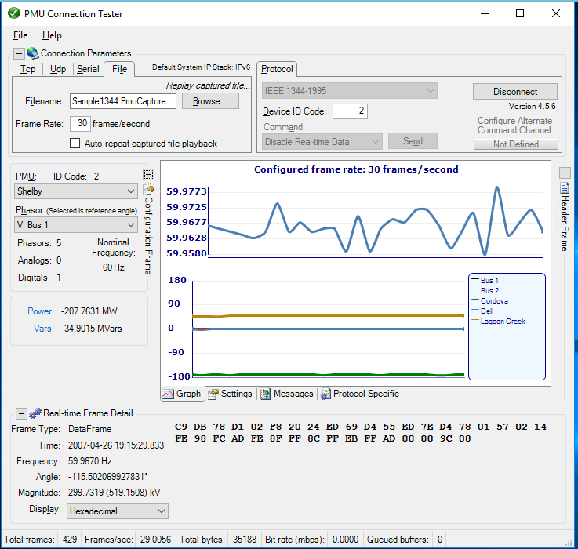]()

---

## `PMU-TESTER` Workstation, GPA Software Installation

1.  Start the `PMU-TESTER` Workstation if it is not already running
    - Sign in with the `tangent` account

### Create a Folder on the `PMU-TESTER` Workstation for Receiving Software and Files

**Do the following tasks in the `PMU-TESTER` Workstation:**

1. Create the following 2 folders:
    - `C:\GPA`
    - `C:\GPA\GPA.shared`

### Download the PMU Connection Tester Software and Save it to the `GPA.shared` Folder

**Do the following tasks in the `PMU-TESTER` Workstation:**

1. Open the *Windows Accessories / Internet Explorer* web browser
2. Navigate to the PMU Connection Tester Release page: [https://github.com/GridProtectionAlliance/PMUConnectionTester/releases](https://github.com/GridProtectionAlliance/PMUConnectionTester/releases)
3. Scroll down to the *Downloads* section and click on the [PMUConnectionTesterSetup.zip](https://github.com/GridProtectionAlliance/PMUConnectionTester/releases/download/v4.5.6/PMUConnectionTesterSetup.zip) link to start the download.
    - When prompted, drop down the *Save* button menu and click *Save as*
    - In the *Save As* dialog, browse to the `C:\GPA\GPA.shared` folder, then click the *Save* button.

### Install the PMU Connection Tester Software on the `PMU-TESTER` Workstation

**Do the following tasks in the `PMU-TESTER` Workstation:**

1. Open the *Windows System / File Explorer* and navigate to the `C:\GPA\GPA.shared` folder.
2. Extract the `PMUConnectionTesterSetup.zip` contents to a new `C:\GPA\GPA.shared\PMUConnectionTesterSetup` folder and open the folder.
3. Run the *PMUConnectionTesterSetup64.msi* setup wizard
4. In the *Select Installation Folder* screen, change the *Folder* value to `C:\GPA\PMU Connection Tester\`
    - []()
5. Continue with the remaining PMU Connection Tester Setup by accepting the default values until it has completed.
6. Run the **PMU Connection Tester** application with its first time defaults and click the *Connect* button.  
    - []()

---

## Test openPDC Concentrator Output Streaming to PMU Connection Tester

1.  Start the `OPDC-01` Server if it is not already running
    - Sign in with the `Administrator` account
2.  Start the `PMU-TESTER` Workstation if it is not already running
    - Sign in with the `tangent` account

### Verify openPDC Concentrator Output Stream Configuration

**Do the following tasks in the `OPDC-01` Server:**

1. Run the **openPDC Manager** application
2. Click the *Outputs* menu and select *Concentrator Output Streams* and review the `TESTSTREAM` properties
    - Set the *TCP Channel* text to "`Port=8900; maxSendQueueSize=-1; interface=0.0.0.0`" (this will force openPDC to use IPv4)
        - Alternatively you can click the *Build Command Channel String* icon button (to the right of the *TCP Channel* textbox)
            - [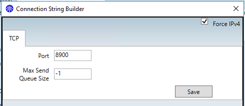]()
    - Set the *UDP Channel* text to "`port=-1; clients=localhost:8800,pmu-tester.gpa.net:8801; interface=0.0.0.0`"
        - Alternatively you can click the *Build Command Channel String* icon button (to the right of the *UDP Channel* textbox)
            - [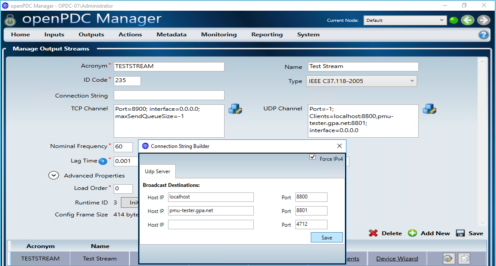]()
    - Click the *Save* button
    - Click the *Initialize* button
    - [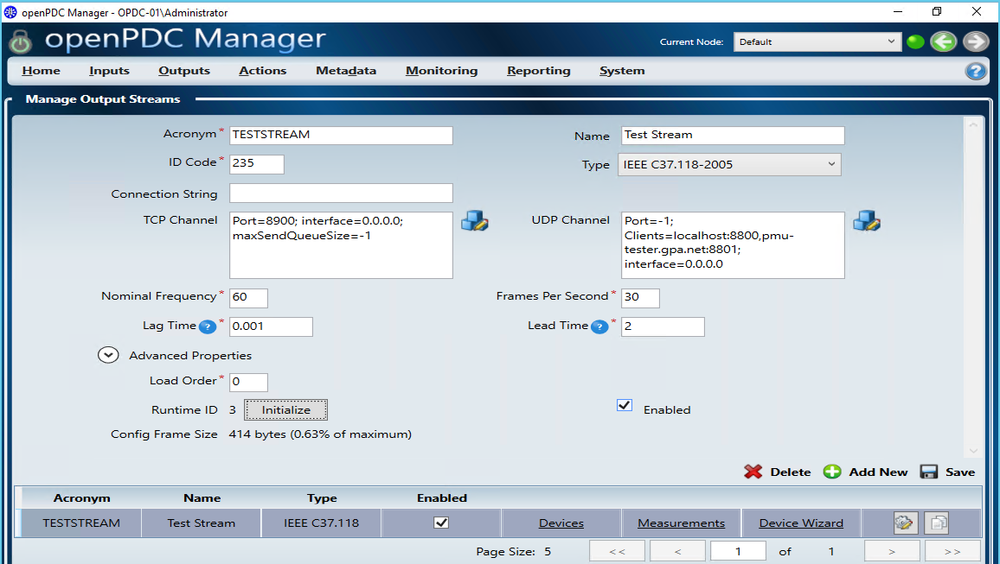]()
    - Click the *Advanced Properties* and scroll down to review them
    - [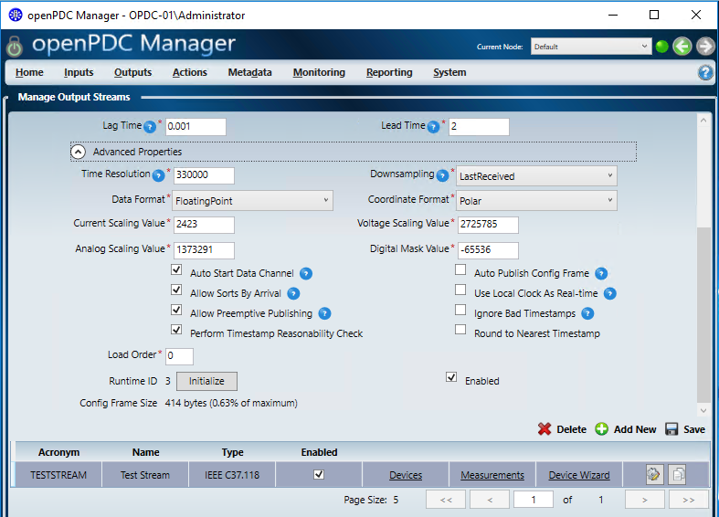]()

### Test the Output Stream with PMU Connection Tester on the `OPDC-01` Server

**Do the following tasks in the `OPDC-01` Server:**

1. Run the **PMU Connection Tester** application
    - Select the *Settings* tab (in the lower middle of the screen). In the *Applications Settings* section, set the following parameters:
        - Set the *ForceIPv4* value to `True`
        - Set the *MaximumFrameDisplayBytes* value to `512` (the IEEE C37-118 Configuration Frame Size)
    - Select the *UDP* tab in the *Connection Parameters*
        - Set the *Local Port* value to `8800` (to match the openPDC Output Stream's *UDP Channel* Port#)
        - Click the *Receive From* link and set *Use Specific Source IP* value to `192.168.1.110` (the `OPDC-01` Server's IPv4 Address)
            - [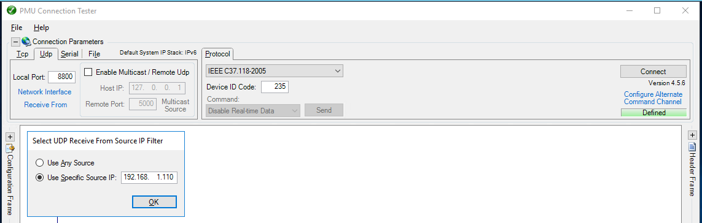]()
    - In the *Protocol* tab
        - Select the `IEEE C37.118.2005` protocol
        - Click the *Configure Alternate Command Channel* link 
            - Set the *Tcp Host IP* value to `192.168.1.110`
            - Set the *Port* value to `8900`
            - Clear the *Not defined* checkbox
            - [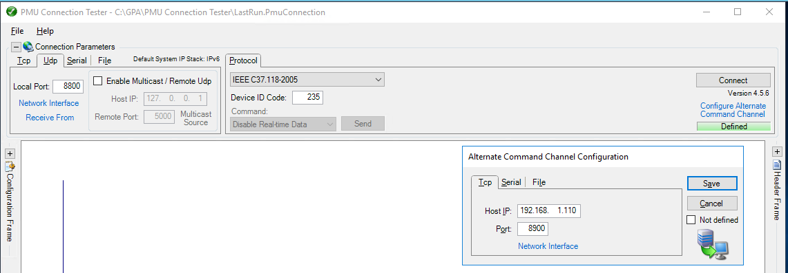]()
    - Click the *Connect* button
    - [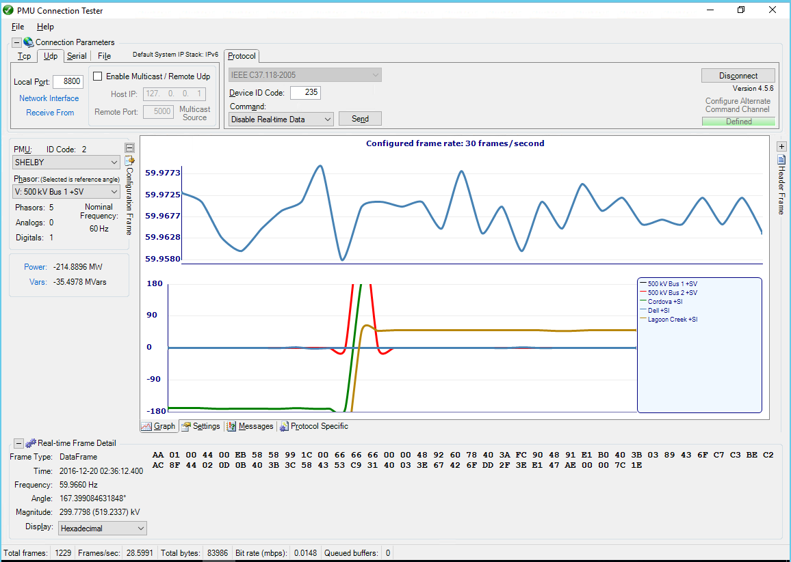]()

### Configure the Windows Firewall on the `OPDC-01` Server for the Output Stream TCP Port 8900 and UDP Ports 8800 to 8809

**Do the following tasks in the `OPDC-01` Server:**

1. Open the `Control Panel\System and Security\Windows Firewall`
2. In the left side menu, click the *Advanced settings* link
3. In the *Windows Firewall with Advanced Security applet's left side tree view, select the *Inbound Rules* node
4. In the right side *Actions* menu, *Inbound Rules* submenu, click the *New Rule...* action item
5. Create a new Inbound Rule using the *New Inbound Rule Wizard*
    - *Rule Type* = **Port**
    - *Protocol and Ports* = **TCP** and *Specific local ports* = **`8900`**
    - *Action* = **Allow the Connection**
    - *Profile* = Check all profiles.  Note: this exercise needs only the **Private** profile checked
    - *Name* = **openPDC Output Stream TCP 8900**.  Note: this can be any name you want
6. Make sure the new **openPDC Output Stream TCP 8900* *Inbound Rule* is *Enabled* and open it up to review its properties
    - [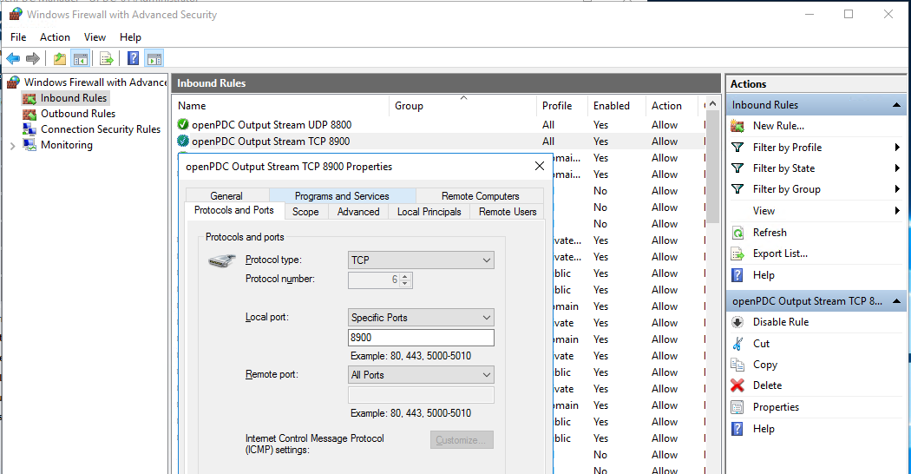]()
7. Create a new Inbound Rule using the *New Inbound Rule Wizard*
    - *Rule Type* = **Port**
    - *Protocol and Ports* = **UDP** and *Specific local ports* = **`8800-8809`** = a range of 10 ports starting at port# 8800
    - *Action* = **Allow the Connection**
    - *Profile* = Check all profiles.  Note: this exercise needs only the **Private** profile checked
    - *Name* = **openPDC Output Stream UDP 8800**.  Note: this can be any name you want
8. Make sure the new **openPDC Output Stream UDP 8800* *Inbound Rule* is *Enabled* and open it up to review its properties
    - [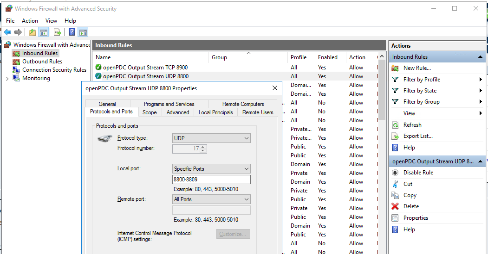]()

### Test the Output Stream over the Network with PMU Connection Tester

**If the PMU Connection Tester on `OPDC-01` Server is still *Connected*, please *Disconnect* it before performing the following tasks.**

**Do the following tasks in the `PMU-TESTER` Workstation:**

1. Run the **PMU Connection Tester** application
    - Select the *Settings* tab (in the lower middle of the screen). In the *Applications Settings* section, set the following parameters:
        - Set the *ForceIPv4* value to `True`
        - Set the *MaximumFrameDisplayBytes* value to `512` (the IEEE C37-118 Configuration Frame Size)
    - Select the *UDP* tab in the *Connection Parameters*
        - Set the *Local Port* value to `8801` (to match the openPDC Output Stream's *UDP Channel* Port#)
        - Click the *Receive From* link and set *Use Specific Source IP* value to `192.168.1.110` (the `OPDC-01` Server's IPv4 Address)
            - [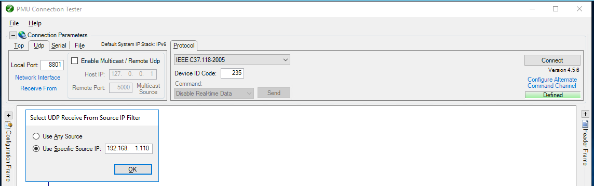]()
    - In the *Protocol* tab
        - Select the `IEEE C37.118.2005` protocol
        - Click the *Configure Alternate Command Channel* link 
            - Set the *Tcp Host IP* value to `192.168.1.110`
            - Set the *Port* value to `8900`
            - Clear the *Not defined* checkbox
            - [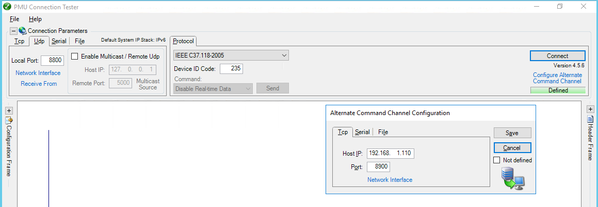]()
    - Click the *Connect* button
    - [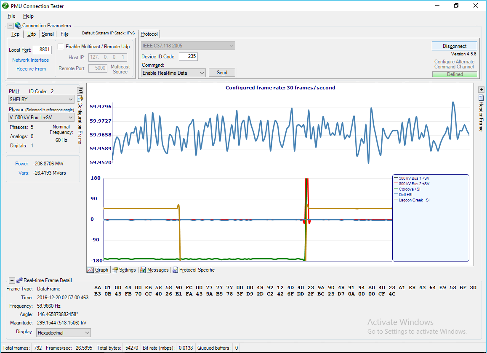]()
2. If you get an error trying to connect and stream data, check the `OPDC-01` Server and make sure PMU Connection Tester is not still connected to the Output Stream.  If it is, then click *Disconnect* and try this step again.

---

## Exercise Conclusion

 - [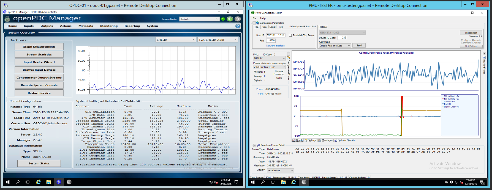]()

---

Dec 19, 2016 - Created by [aj](https://github.com/ajstadlin), version 1.0
Dec 21, 2016 - Updated by [aj](https://github.com/ajstadlin), version 1.1

---

Copyright 2017 [Grid Protection Alliance](http://www.gridprotectionalliance.org)
