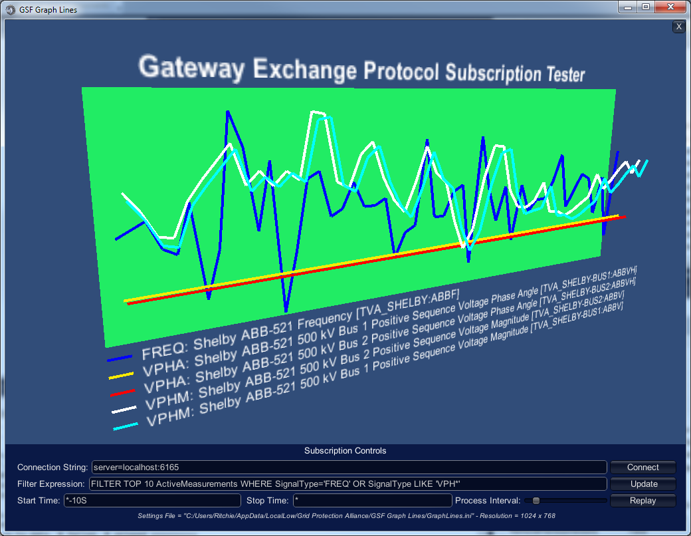

|   |   |   |   |   |
|---|---|---|---|---|
| **[Grid Protection Alliance](http://www.gridprotectionalliance.org "Grid Protection Alliance Home Page")** | **[openPDC Project](https://github.com/GridProtectionAlliance/openPDC "openPDC Project on GitHub")** | **[openPDC Wiki](openPDC_Home.md "openPDC Wiki Home Page")** | **[Documentation](openPDC_Documentation_Home.md "openPDC Documentation Home Page")** | **[Latest Release](https://github.com/GridProtectionAlliance/openPDC/releases "openPDC Releases Home Page")** |

# GEP Subscription Tester
The Gateway Exchange Protocol (GEP) Subscription Tester is a new tool used to validate that a subscription based connection is working as expected. It can also be used to validate filter expressions that can be used to select a set of points in the openPDC and other products.  e.g., [SIEGate](https://github.com/GridProtectionAlliance/SIEGate/) for use as inputs or outputs for any adapter.

The GEP Subscription Tester can be downloaded from [here](http://www.gridprotectionalliance.org/NightlyBuilds/openPDC/GEP%20Subscription%20Tester.zip).

This application is a simple graphical program that uses the [Grid Solutions Framework](https://github.com/GridProtectionAlliance/gsf)
 Unity subscription API to display trending lines for each subscribed measurement in the specified filter expression - trend lines are updated as values are received in real-time. Mouse controls (or finger gestures) will allow rotation and zoom, arrows keys will adjust X/Y location. Clicking on the "Subscription Controls" area at the bottom of the screen will pop-up a control window to allow you to change connection information (e.g., server/port to connect to), the filter expression and even replay data if a historian is enabled.

The GEP Subscription Tester application is built using the [Unity 3D gaming engine](http://unity3d.com/) and can currently run on Windows, Mac, Linux and Android devices. Various other deployment options (e.g., iOS, Xbox, PSP, etc.) are possible.

---

Jul 17, 2013 9:46 AM - Last edited by [ritchiecarroll](https://github.com/ritchiecarroll), version 6  
Oct 4, 2015 - Migrated from [CodePlex](http://openpdc.codeplex.com/wikipage?title=GEP%20Subscription%20Tester) by [aj](https://github.com/ajstadlin)

---

Copyright 2015 [Grid Protection Alliance](http://www.gridprotectionalliance.org)