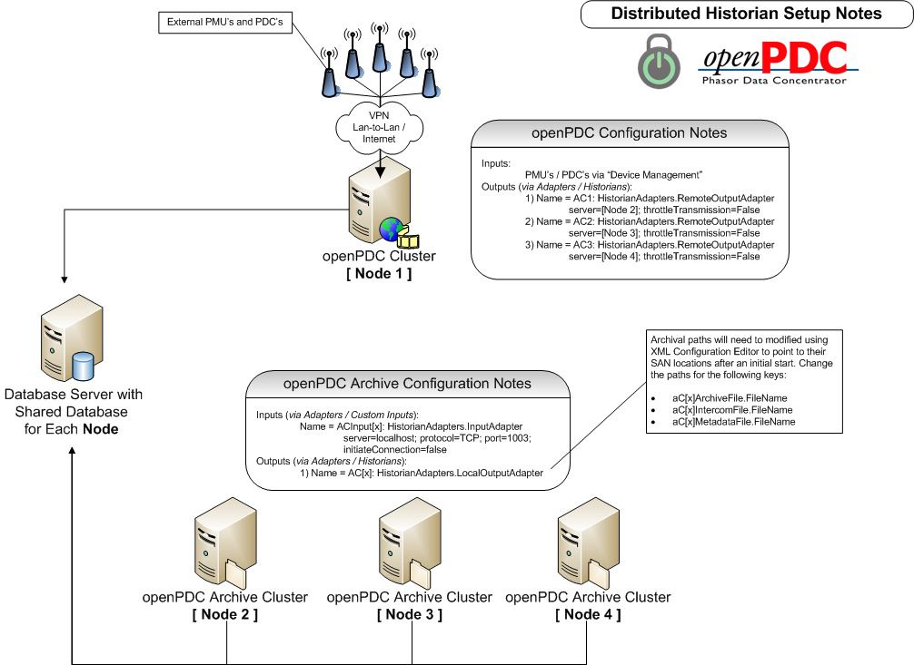

|   |   |   |   |   |
|---|---|---|---|---|
| **[Grid Protection Alliance](http://www.gridprotectionalliance.org "Grid Protection Alliance Home Page")** | **[openPDC Project](https://github.com/GridProtectionAlliance/openPDC "openPDC Project on GitHub")** | **[openPDC Wiki](openPDC_Home.md "openPDC Wiki Home Page")** | **[Documentation](openPDC_Documentation_Home.md "openPDC Documentation Home Page")** | **[Latest Release](https://github.com/GridProtectionAlliance/openPDC/releases "openPDC Releases Home Page")** |

# Historian Distribution Notes

[Download Image](Historian_Distribution_Notes.files/openPDC_Historian_Distribution_154184.png)

---

Jul 5, 2012 6:36 PM - Last edited by [ritchiecarroll](https://github.com/ritchiecarroll), version 3  
Oct 4, 2015 - Migrated from [CodePlex](https://openpdc.codeplex.com/wikipage?title=Historian%20Distribution%20Notes) by [aj](https://github.com/ajstadlin)

---

Copyright 2015 [Grid Protection Alliance](http://www.gridprotectionalliance.org)