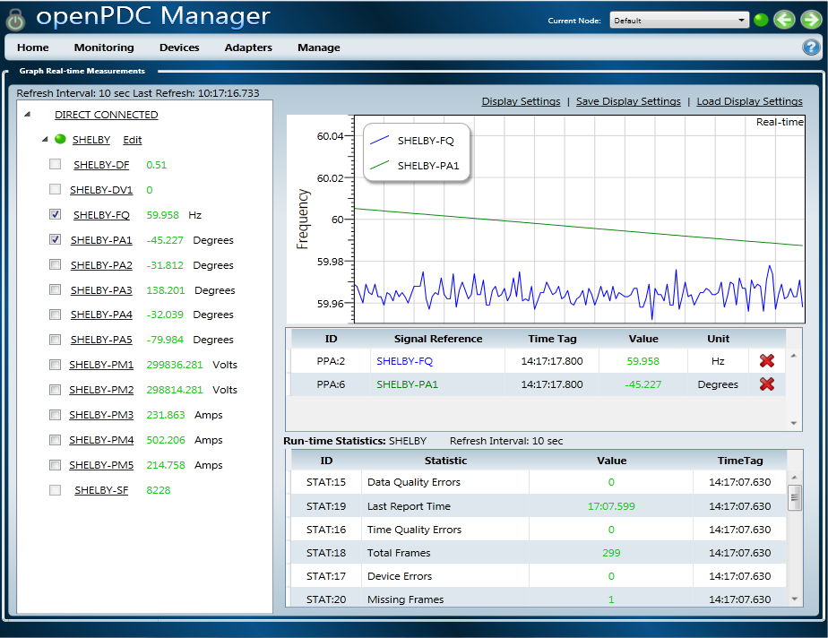
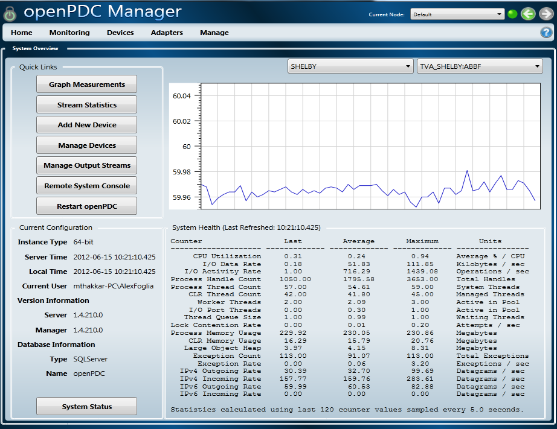
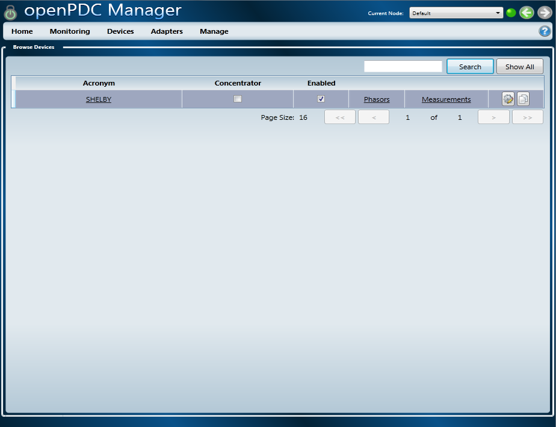
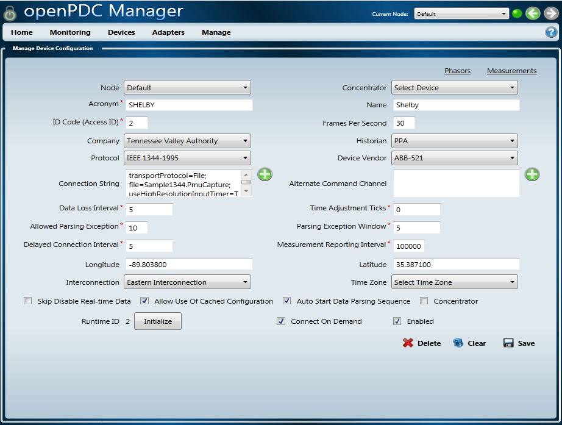
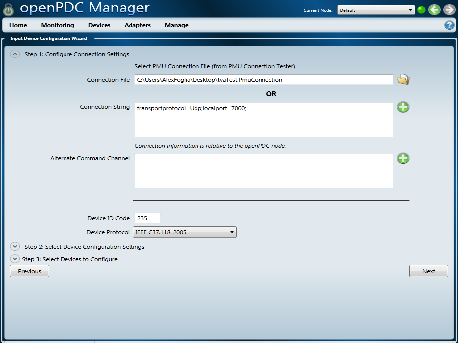
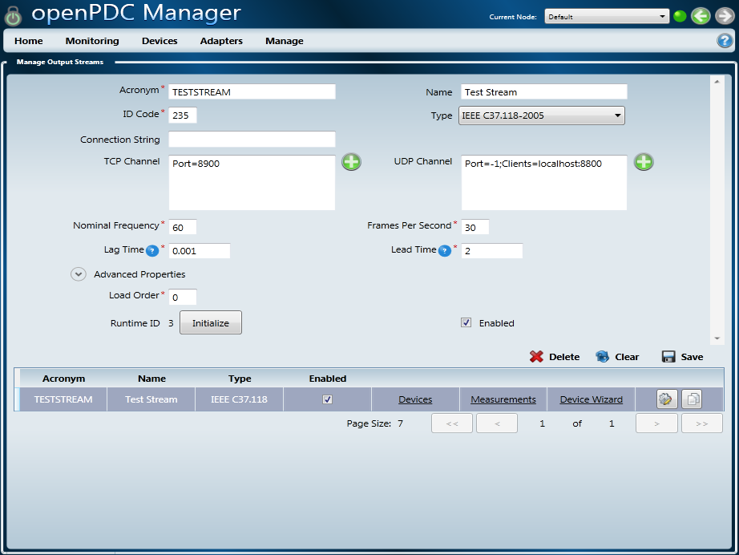
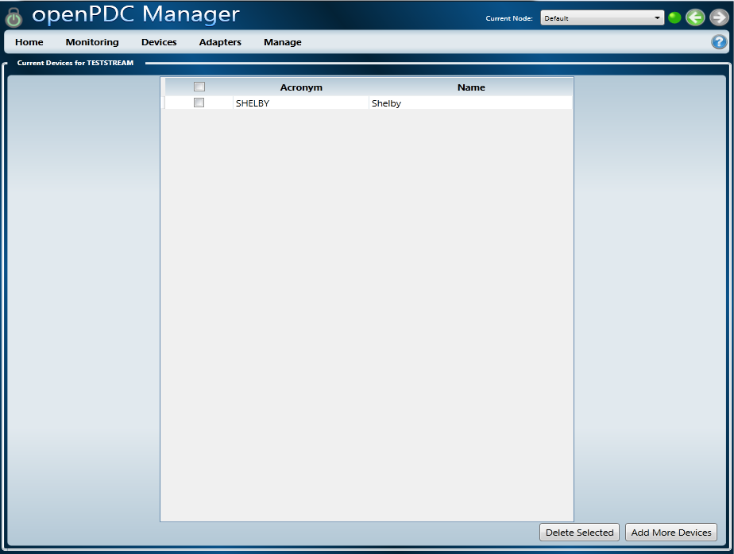
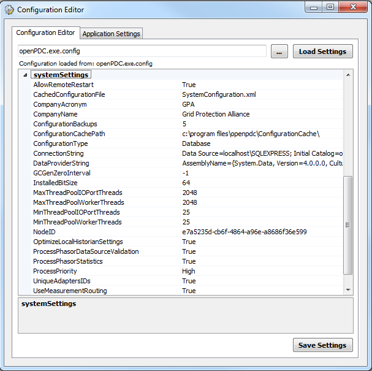
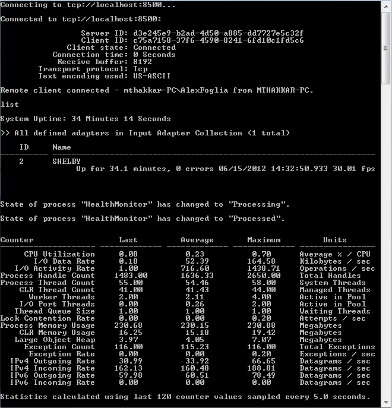

|   |   |   |   |   |
|---|---|---|---|---|
| **[Grid Protection Alliance](http://www.gridprotectionalliance.org "Grid Protection Alliance Home Page")** | **[openPDC Project](https://github.com/GridProtectionAlliance/openPDC "openPDC Project on GitHub")** | **[openPDC Wiki](https://github.com/GridProtectionAlliance/openPDC/wiki)** | **[Documentation](https://github.com/GridProtectionAlliance/openPDC/wiki/Documentation)** | **[Latest Release](https://github.com/GridProtectionAlliance/openPDC/releases "openPDC Releases Home Page")** |

# Introducing the openPDC Management System

## The openPDC includes a simplified configuration and management system that consists of three primary components:

- [The openPDC Manager](#the-openpdc-manager)
- [The System Configuration Editor](#the-system-configuration-editor)
- [The Secured Remote Console Monitor](#the-secured-remote-console-monitor)

---

## The openPDC Manager

The Silverlight based openPDC Manager allows consumers to remotely configure anad manage multiple deployed instances of the openPDC from a single simple to use web application. This application is used to manage and configure system devices, custom system input, action and output adapters as well as to set operational parameters. It also allows for automated device configuration using an XML configuration file captured using connection tester.

[Click here for documentation on how to use the openPDC Manager](openPDC_Manager_Configuration.md)

### Home Screen

### Browse Devices Screen

### Manage Device Screen

### Device Configuration Wizard

### Manage Output Streams Screen (e.g., IEEE C37.118-2005 Output)

### Add Devices to Output Stream

---

## The System Configuration Editor</h2>

The openPDC system configuration editor allows users to modify low-level system settings that are stored in the configuration file from a simple to use GUI based application. These settings are typically only updated when fundamental changes are being made to how the openPDC operates.

---

## The Secured Remote Console Monitor

The openPDC can be remotely monitored and controlled with this secured system console monitor. This application is typically used to manage day-to-day operation of a deployed openPDC system.

---

Jun 15, 2012 2:36 PM - Last edited by [alexfoglia](http://www.codeplex.com/site/users/view/alexfoglia), version 9  
Oct 4, 2015 - Migrated from [CodePlex](http://openpdc.codeplex.com/wikipage?title=Introducing%20the%20openPDC%20Manager) by [aj](https://github.com/ajstadlin)

---

Copyright 2015 [Grid Protection Alliance](http://www.gridprotectionalliance.org)