

|   |   |   |   |   |
|---|---|---|---|---|
| **[Grid Protection Alliance](http://www.gridprotectionalliance.org "Grid Protection Alliance Home Page")** | **[openPDC Project](https://github.com/GridProtectionAlliance/openPDC "openPDC Project on GitHub")** | **[openPDC Wiki](https://github.com/GridProtectionAlliance/openPDC/wiki)** | **[Documentation](https://github.com/GridProtectionAlliance/openPDC/wiki/Documentation)** | **[Latest Release](https://github.com/GridProtectionAlliance/openPDC/releases "openPDC Releases Home Page")** |

***This is an archival document and its contents are no longer maintained or updated. Please see the latest version of the PMU Connection Tester project at [https://github.com/GridProtectionAlliance/PMUConnectionTester](https://github.com/GridProtectionAlliance/PMUConnectionTester "PMU Connectioin Tester Project on GitHub").***

# [PMU Connection Tester](https://github.com/GridProtectionAlliance/PMUConnectionTester)

**Note**: The PMU Connection Tester was originally distributed via the Eastern Interconnection Phasor Project web site - the last publically distributed version of this older tool was 2.2.0.24862. The PMU Connection Tester is now its own stand-alone open source project and has been versioned starting at 4.1.

- [Installation](#installation)
- [Overview](#overview)
- [Navigation](#navigation)
    - [Configuration Frame](#configuration-frame)
    - [Connection Parameters](#connection_-prameters)
    - [Graph Tab](#graph-tab)
    - [Messages Tab](#messages-tab)
    - [Protocol Specific Tab](#protocol-specific-tab)
    - [Settings Tab](#settings-tab)
    - [Header Frame](#header-frame)
    - [Real-time Frame Detail](#real-time-frame-detail)
- [Operations](#operations)
    - [Capturing Sample Frames](#capturing-sample-frames)
    - [Connecting to Devices](#connecting-to-devices)
    - [Loading Configuration Files](#loading-configuration-files)
    - [Recording Data Streams](#recording-data-streams)
    - [Saving Configuration Files](#saving-configuration-files)
    - [Using Previous Connections](#using-previous-connections)
    - [Stream Debug Capturing](#stream_debug_capturing)

---

## Installation

PMU Connection Tester can be installed using the [openPDC snstallers](Getting_Started.md#install-openpdc-with-the-installers).

---

## Overview

The PMU Connection Tester verifies that the data stream from any known phasor measurement device is being received. Device types that can be tested through the PMU Connection Tester application may include:

- Phasor Measurement Unit (PMU)
- Phasor Data Concentrator (PDC)
- Digital Fault Recorder (DFR)
- Power Quality (PQ)

Any device that supports one of the following phasor protocols may be tested:

- IEEE C37.118-2005 (Version 1/Draft 7, Draft 6)
- IEEE 1344-1995
- BPA PDCstream (Revisions 0, 1, and 2, including PDCxchng formatted data)
- Virginia Tech FNet
- SEL Fast Message
- Macrodyne

---

## Navigation

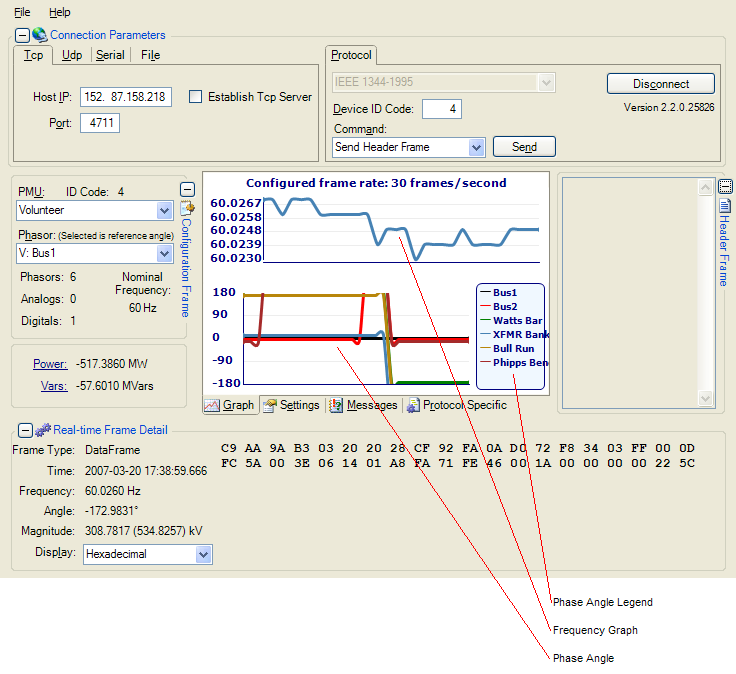

Some portions of the screen can be opened by clicking the Expand button  and closed by clicking the Contract button . Other sections are accessed by clicking on named tabs.

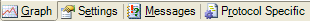

---

### Configuration Frame

The Configuration Frame displays the relevant information from the configured elements in the connected device.

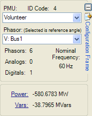

- **PMU**: Lists all of the configured devices that are connected to the tested device.
- **ID Code**: Displays the unique identifier of the tested device. This is populated from the Device ID Code entered on the Protocols tab in the Connection Parameters section.
- **Phasor**: Lists the labels of all phasors measured by the selected device.
- **Phasors**: Displays the total number of phasors in the selected device.
- **Analogs**: Displays the total number of measured analog values in the selected device.
- **Digitals**: Displays the total number of digital values in the selected device.
- **Nominal Frequency**: Displays "60Hz", "50Hz", etc.
- **Power (MW)**: Displays the calculated megawatts, based on the Voltage Phasor and Current Phasor selections on the [Settings tab](#settings-tab).
- **Vars (MVars)**: Displays the calculated megavars, based on the Voltage Phasor and Current Phasor selections on the [Settings tab](#settings-tab).

---

### Connection Parameters

The Connection Parameters screen section displays the details concerning the connection between the PMU Connection Tester and the tested device. The details differ depending upon the communication protocol selected.

#### Tcp

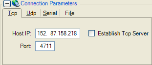

- **Host IP**: The internet address of the device being tested.
- **Port**: The port number through which the PMU Connection Tester is connected to and receiving data from the tested device.
- **Establish Tcp Server**: Select to establish a TCP Server style connection to listen for remote device data streams, such as from FNet devices.

#### Udp

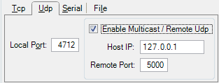

- **Local Port**: The port number through which the PMU Connection Tester is receiving data from the tested device.
- **Enable Multicast / Remote Udp**: If the tested device listens on UDP, select this check box which makes the following screen elements available.
- **Host IP**: The internet address of the device being tested.
- **Remote Port**: The port number on the tested device through which the PMU Connection Tester sends commands.

#### Serial

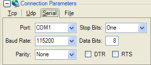

- **Port**: The local serial port through which the PMU Connection Tester is receiving data from the tested device.
- **Baud Rate**: Baud rate to use during transmission to the tested device.
- **Parity**: Parity to use during transmission to the tested device.
- **Stop Bits**: Number of stop bits to use during transmission to the tested device.
- **Data Bits**: Number of data bits to use during transmission to the tested device.
- **DTR**: Enables the Data Terminal Ready flag. 
- **RTS**: Enables the Ready To Send flag.

#### File

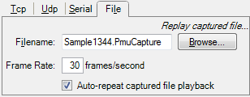

- **Filename**: The name of the saved file created by recording data streams.
- **Frame Rate**: Number of frames per second the saved data streams are displayed.
- **Auto-repeat captured file playback**: Check this box to have the PMU Connection Tester return to the beginning of the sample file once it reaches the end.

#### Protocol and ID

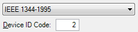

- **Protocol**: Lists the available phasor data protocols.
- **Device ID Code**: Specifies the identification code often needed to establish a connection.

#### Command

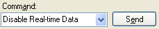

- **Command**: Lists the available commands that the tested device will respond to.

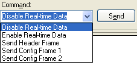

- **Send**: Transmits the selected command to the device.

### Graph Tab

Displays graphically the real-time data stream from the tested device.

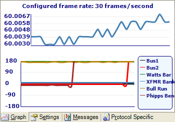

The top graph shows the system frequency as measured by the tested device. The bottom graph displays the phase angles.

If the **Phase Angle Graph Style** ([Settings tab](#settings-tab)) is set to **Relative**, all the displayed phase angles will be relative to the selected device in the [Configuration Frame](#configuration-frame). If it is set to **Raw**, the phase angles are displayed as measured by the tested device.

The legend on the bottom right of the Graph tab displays the configured devices connected to the tested device, as listed in the Phasor box on the [Configuration Frame](#configuration-frame).

---

### Messages Tab

The Messages tab displays any relevant information about, or errors generated by, the connection to the tested device.

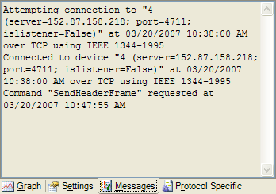

---

### Protocol Specific Tab

Displays a hierarchy of the last parsed protocol specific frames, and includes all data values relevant to the protocol.

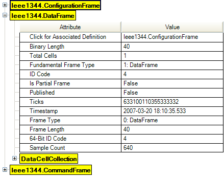

This tab enables quick validation of protocol-specific properties of vendor implementation.

---

### Settings Tab

The Settings tab allows the user to configure various settings related to the PMU Connection Tester display.

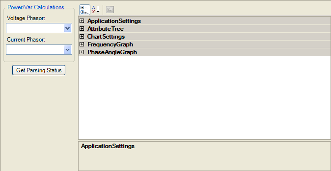

- **Voltage Phasor**: Lists the voltage phasor used in the megawatt and megavar calculation displayed on the [Configuration Frame](#configuration-frame).
- **Current Phasor**: Lists the current phasor used in the megawatt and megavar calculation displayed on the [Configuration Frame](#configuration-frame).
- **Get Parsing Status**: Displays the current connection status on the [Messages tab](#messages-tab).
- **[Application Settings](#application-settings)**: Defines general application settings.
- **[Attribute Tree](#attribute-tree)**: Defines settings associated with the attribute tree visible on the [Protocol Specific tab](#protocol-specific-tab).
- **[Chart Settings](#chart-settings)**: Defines general chart-related settings.
- **[Frequency Graph](#frequency-graph)**: Defines settings related to the frequency graph.
- **[Phase Angle Graph](#phase-angle-graph)**: Defines settings related to the phase angle graph.

#### Application Settings

- **AutoStartDataParsingSequence** [Range: **`True`**`/False`]: Set to `True` to automatically send commands for ConfigFrame2 and EnableRealTimeData.
- **ExecuteParseOnSeparateThread** [Range: `True/`**`False`**]: Allows frame parsing to be executed on a separate thread (other than communications thread) - typically only needed when data frames are very large. This change will happen dynamically, even if a connection is active.
- **MaximumConnectionAttempts** [Range: `1-n`]: Maximum number of times to attempt connection before giving up. Set the value to `-1` to continue connection attempt indefinitely.
- **MaximumFrameDisplayBytes** [Range: `1-n`]: Maximum encoded bytes to display for frames in the [Real-time Frame Detail](#real-time-frame-detail).
- **RestoreLastConnectionSettings** [Range: **`True`**`/False`]: Set to `True` to load previous connection settings at startup.

#### Attribute Tree

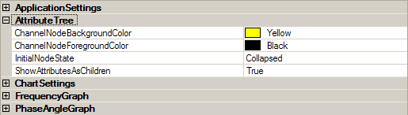

- **ChannelNodeBackgroundColor**: Defines the highlight background color for channel node entries on the attribute tree.
- **ChannelNodeForegroundColor**: Defines the highlight foreground color for channel node entries on the attribute tree.
- **InitialNodeState** [Range: **`Collapsed`**`/Expanded`]: Defines the initial state for nodes when added to the attribute tree. Note that a fully expanded tree will take much longer to initialize.
- **ShowAttributesAsChildren** [Range: **`True`**`/False`]: Set to `True` to show attributes as children of their channel entries.

#### Chart Settings

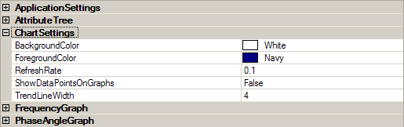

- **BackgroundColor**: Select the background color for the [graph region](#graph-tab).
- **ForegroundColor**: Select the foreground color for [graph region](#graph-tab) (axes, legend border, text, etc.).
- **RefreshRate** [Range: `0.1-n`]: Chart refresh rate in seconds. The typical setting is `0.1`, increase this number if the application runs slowly.
- **ShowDataPointsOnGraphs** [Range: **`True`**`/False`]: Set to `True` to show data points on graphs.
- **TrendLineWidth** [Range: `1-n`]: Enter the trend line graphing width (in pixels).

#### Frequency Graph

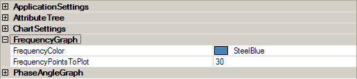

- **FrequencyColor**: Foreground color for frequency trend.
- **FrequencyPointsToPlot** [Range: `1-n`]: Sets the total number of frequency points to display.

#### Phase Angle Graph

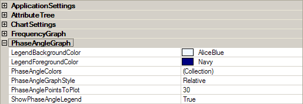
 
- **LegendBackgroundColor**: Background color for phase angle legend.
- **LegendForegroundColor**: Foreground color for phase angle legend text.
- **PhaseAngleColors** [Range: `Collection/`]: Possible foreground colors for phase angle trends.
- **PhaseAngleGraphStyle** [Range: `Raw/`**`Relative`**]: Sets the phase angle graph to plot either raw or relative phase angles.
- **PhaseAnglePointsToPlot** [Range: `1-n`]: Sets the total number of phase angle points to display.
- **ShowPhaseAngleLegend** [Range: **`True`**`/False`]: Set to `True` to show phase angle graph legend.

---

### Header Frame

The Header Frame displays the user-configured information file, usually in the form of a text file, that is stored on the tested device.

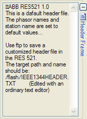

---

### Real-time Frame Detail

The Real-time Frame Detail section displays details about the measurements received from the tested device. 

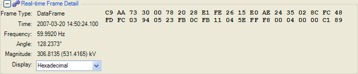

- **Frame type**: Displays the phasor protocol frame type of the frame received from the tested device.
- **Time**: Displays the time value parsed from the received frame, displayed in Universal Coordinated Time (UTC).
- **Frequency**: Displays the measured system frequency received in the frame.
- **Angle**: Displays the measured phase angle of the currently selected Phasor ([Configuration Frame](#configuration-frame) received in the frame.
- **Magnitude**: Displays the measured magnitude of the currently selected Phasor ([Configuration Frame](#configuration-frame) received in the frame (The parenthetical value is the calculated line-to-neutral value when the selected phasor is a voltage.).
- **Display**: Lists the various formats in which the binary data in the received frame can be shown.

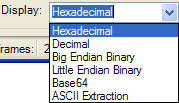

---

## Operations

### Capturing Sample Frames

The PMU Connection Tester allows the user to debug and analyze protocol-specific phasor frames from the tested device. Note that only one of each type of frame can be collected during the capture sequence. 

1. From the File menu, point to Capture and then select the Capture Sample Frames menu option.
2. In the displayed save screen, enter the desired File name of the output file.
3. Click OK on the displayed message (Sample frame collection will complete upon reception of a configuration frame).
4. The file will be displayed in a separate window as a .txt file.

[Click to view a sample file](PMU_Connection_Tester.files/sample_frames.txt).

---

### Connecting to Devices

#### Connecting via TCP

1. Click the **Tcp** tab.
2. Enter the **Host IP** address of the device being tested.
3. Enter the **Port** number through which the PMU Connection Tester is receiving the signal from the tested device.
4. Click **Connect**.

#### Connecting via UDP

1. Click the **Udp** tab.
2. Enter the **Local Port** number through which the PMU Connection Tester is receiving the signal from the tested device.
3. Click the **Remote device listens on Udp** check box, if applicable, and then enter the **Host IP** and **Remote Port** of the tested device.
4. Click **Connect**.

#### Connecting via a Serial Port

1. Click the **Serial** tab.
2. Enter the **Port** through which the PMU Connection Tester is receiving the signal from the tested device.
3. Enter the configuration details the data transfer between the PMU Connection Tester and the tested device.
4. Click Connect.

---

### Loading Configuration Files

1. From the **File** menu, point to **Config File** and then select the **Load** menu option.
2. In the displayed window, select the saved configuration file (XML format), and click **Open**.

---

### Recording and Replaying Data Streams

The PMU Connection Tester allows the user to record all streaming data to a file for later playback and analysis. 

1. From the **File** menu, point to **Capture** and then select the **Start Capture** menu option.
2. In the displayed save screen, enter the desired **File name** of the output file.
3. The capture process will continue until you select the **File > Capture > Stop Capture** menu option.

To replay the data stream:

1. Click the **File** tab.
2. Enter or select the saved **Filename**.
3. Select the **Frame Rate** for the display.
4. Verify the **Protocol** on the [Connection Parameters](#connection-parameters) screen section.
5. Click **Connect**.

---

### Saving Configuration Files

To save a configuration (Only available when connected, and after a configuration frame has been received):

1. From the **File** menu, point to **Config File** and then select the **Save** menu option.
2. In the displayed save screen, enter the desired **File name** of the output file, and click **Save**.

[Click to view a sample configuration file](PMU_Connection_Tester.files/samplefile.xml).

---

### Using Previous Connections

The PMU Connection Tester automatically saves the last connection by default. To save a connection for later use:

1. From the **File** menu, point to **Connection** and then select the **Save** menu option.
2. In the displayed save screen, enter the desired **File name** of the output file, and click **Save**.

To use a previous connection:

1. From the **File** menu, point to **Connection** and then select the **Load** menu option.
2. In the displayed window, select the saved connection file, and click **Open**.
3. Click **Connect**.

Connection files have a `.PMUConnection` extension. When installed, the PMU Connection Tester associates itself with files of that extension.

---

### Stream Debug Capturing

The PMU Connection Tester is capable of capturing raw data to a CSV file for analysis. To capture data to a CSV file: 

1. From the **File** menu, point to **Capture** and then select the **Start Stream Debug Capture...** menu option.
2. In the displayed save screen, enter the desired **File name** of the output file.
3. The capture process will continue until you select the **File > Capture > Stop Stream Debug Capture** menu option.

Once you've captured the data, you can open the file using Microsoft Office Excel and follow these steps to format the timestamps to be human readable. 

1. Select the entire first column, right-click the column header, and select "Format Cells".
2. In the "Category" list, select "Custom".
3. Enter `mm/dd/yyyy h:mm:ss.000` into the "Type" text box and select the "OK" button.

---

Jul 11, 2012 1:20 PM - Last edited by [ritchiecarroll](https://github.com/ritchiecarroll), version 8  
Oct 5, 2015 - Migrated from [CodePlex](http://pmuconnectiontester.codeplex.com) by [aj](https://github.com/ajstadlin)  
Dec 11, 2016 - Updated by [CodePlex](http://pmuconnectiontester.codeplex.com) by [aj](https://github.com/ajstadlin), version 8.1

---

Copyright 2016 [Grid Protection Alliance](http://www.gridprotectionalliance.org)