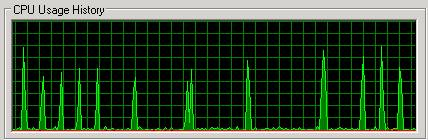
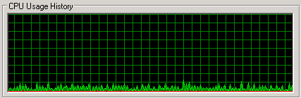

[](openPDC_Home.md "The Open Source Phasor Data Concentrator")

|   |   |   |   |   |
|---|---|---|---|---|
| **[Grid Protection Alliance](http://www.gridprotectionalliance.org "Grid Protection Alliance Home Page")** | **[openPDC Project](https://github.com/GridProtectionAlliance/openPDC "openPDC Project on GitHub")** | **[openPDC Wiki](https://github.com/GridProtectionAlliance/openPDC/wiki)** | **[Documentation](https://github.com/GridProtectionAlliance/openPDC/wiki/Documentation)** | **[Latest Release](https://github.com/GridProtectionAlliance/openPDC/releases "openPDC Releases Home Page")** |

```diff
+ .
- ** THIS DOCUMENTATION IS DEPRECATED **
```

# Setting for Uniform CPU Utilization

In the openPDC version 1.4 SP2 there is a new boolean config file setting called "GCGenZeroInterval" in the "systemSettings" category.

This setting is used to stabilize CPU utilization on boxes with limited RAM by causing garbage collection of all generation zero objects on a quicker interval. If you installed SP2 from scratch, this option may be disabled, if you upgraded SP2 from a previous version, this setting may be set to fire every half second (i.e., 500 milliseconds). If the value is set to -1, it is off which means the system will allow .NET to auto-tune the garbage collection.

Generally, if you have a plenty of RAM and a fast multi-core processor, you might as well leave this setting disabled (i.e., the value equals -1). However, on machines with fewer resources (e.g., memory), you may want to enable this setting (e.g., setting the value to 500).

On a machine loaded with several PMU connections and less working memory, your processor utilization with .NET auto-tuned garbage collection (i.e., GCGenZeroInterval = -1), may look like this:



The CPU spike in the above graph is the .NET garbage collector running. However, with the GCGenZeroInterval setting on a tight interval (e.g., GCGenZeroInterval = 500), the processor utilization will look more like this:



This stabalizes the CPU by not going so long before a garbage collection, however, on average the CPU will be slightly higher since it is executing the garbage collection more often, but it does not spike the CPU.

It is suggested that you leave your system set for auto-tuned garbage collections if either your CPU spikes are small or you have plenty of run-time system resources, however, on a resource constrained system this may be a useful setting to enable.

Generally as we keep optimizing the code, we continue to strive to reuse objects and buffers using preallocated pools to reduce the number of objects created per second, however, when items are being processed 30 to 120 times per second for hundreds of thousands of points some level of non-resuable allocations may always be required.

---

Jul 6, 2012 7:23 PM - Last edited by [ritchiecarroll](https://github.com/ritchiecarroll), version 12  
Oct 4, 2015 - Migrated from [CodePlex](http://openpdc.codeplex.com/wikipage?title=Settings%20for%20Uniform%20CPU%20Utilization%20) by [aj](https://github.com/ajstadlin)

---

Copyright 2016 [Grid Protection Alliance](http://www.gridprotectionalliance.org)
