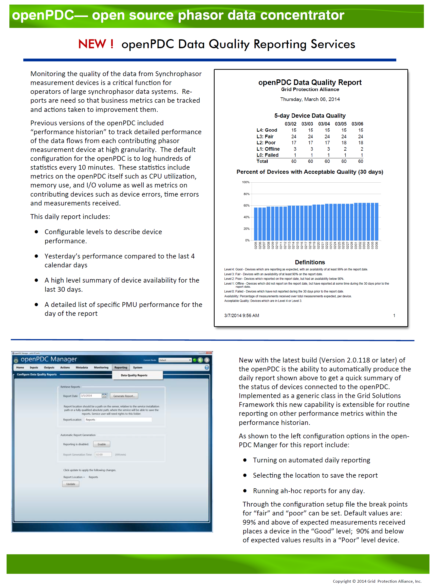

|   |   |   |   |   |
|---|---|---|---|---|
| **[Grid Protection Alliance](http://www.gridprotectionalliance.org "Grid Protection Alliance Home Page")** | **[openPDC Project](https://github.com/GridProtectionAlliance/openPDC "openPDC Project on GitHub")** | **[openPDC Wiki](https://github.com/GridProtectionAlliance/openPDC/wiki)** | **[Documentation](https://github.com/GridProtectionAlliance/openPDC/wiki/Documentation)** | **[Latest Release](https://github.com/GridProtectionAlliance/openPDC/releases "openPDC Releases Home Page")** |

*This is an archival document.  See the [openPDC Project](https://github.com/GridProtectionAlliance/openPDC "openPDC Project on GitHub") for possible updates.*

---

# openPDC Data Quality Reports

---

Mar 14, 2014 1:50 PM - Last edited by [ritchiecarroll](https://github.com/ritchiecarroll), version 4  
Oct 4, 2015 - Migrated from [CodePlex](http://openpdc.codeplex.com/wikipage?title=openPDC%20Data%20Quality%20Reports) by [aj](https://github.com/ajstadlin)

---

Copyright 2015 [Grid Protection Alliance](http://www.gridprotectionalliance.org)