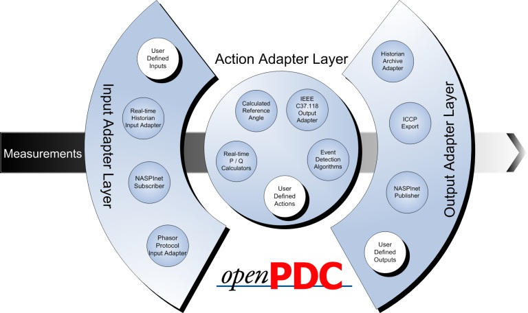

|   |   |   |   |   |
|---|---|---|---|---|
| **[Grid Protection Alliance](http://www.gridprotectionalliance.org "Grid Protection Alliance Home Page")** | **[openPDC Project](https://github.com/GridProtectionAlliance/openPDC "openPDC Project on GitHub")** | **[openPDC Wiki](openPDC_Home.md "openPDC Wiki Home Page")** | **[Documentation](openPDC_Documentation_Home.md "openPDC Documentation Home Page")** | **[Latest Release](https://github.com/GridProtectionAlliance/openPDC/releases "openPDC Releases Home Page")** |

# The Open Source Phasor Data Concentrator - openPDC

 

*The openPDC administered by the [Grid Protection Alliance](http://www.gridprotectionalliance.org) (GPA) is a complete Phasor Data Concentrator software system designed to process streaming time-series data in real-time. Measured data gathered with GPS-time from many hundreds of input sources is time-sorted and provided to user defined actions as well as to custom outputs for archival.*

## News

**August 7, 2015** - Want to build your own application like the openPDC? Or, maybe you have built an action adapter that runs in the openPDC and you want to host the adapter inside of a stand-alone application with your own custom install package and manager application that is specific to your adapter. Check out [Project Alpha!](https://www.gridprotectionalliance.org/projectAlpha.asp) - a complete software application template that includes [GSF TSL Components](GPA.files/tsl-components-2015.pdf); everything you need to build and deploy your
 adapter based application that uses the [Grid Solution Framework](https://www.gridprotectionalliance.org/technology.asp#GSF) and [Time-series Library](href="https://www.gridprotectionalliance.org/technology.asp#TSL).

**March 6, 2015** - After several months of pre-release testing, the [openPDC version 2.1 (SP1)](openPDC_v2.1_SP1_Release_Jul2015.md) has been officially released. There are many new features, optimizations and enhancements plus this is the first version of the openPDC to officially support [POSIX environments](Running_openPDC_on_Linux_and_Mac.files/Deploying_the_openPDC_on_POSIX_Platforms.pdf "How to Deploy openPDC in a POSIX Environment"), e.g., Linux and Mac OS X operating systems. POSIX support is currently for all components within the [Time-Series Library](https://www.gridprotectionalliance.org/technology.asp#TSL) except the openPDC Manager which will still need to run on Windows. See:
[TSL Components Overview](GPA.files/tsl-components-2015.pdf) for more information.

Version 2.1 of the openPDC also includes automated data recovery, or *gap filling*, when connected to other devices that support GPA's [Gateway Exchange Protocol](https://www.gridprotectionalliance.org/technology.asp#GEP "GEP Technology") (GEP). These devices include the openPDC, the new [substation Secure Buffered Gateway](https://www.gridprotectionalliance.org/products.asp#SBG)(substationSBG), [SIEGate](https://www.gridprotectionalliance.org/products.asp#SIEGate) and the [openHistorian](https://www.gridprotectionalliance.org/products.asp#Historian). With this feature, the openPDC can request data that was lost during routine maintenance and other communications outages. The missing data is requested at a rate to minimize adverse impacts to real-time operations.

We have also published a few new openPDC videos to cover new openPDC v2.1 features:
* [Installing the openPDC on Linux and Mac](http://youtu.be/hd8sksEDhAc), March 2015
* [Automated gap filling with the openPDC and substationSBG](http://youtu.be/wcUWMv2iCyk), March 2015
* [The new OSIsoft PI Adapter for the openPDC](http://youtu.be/2bqtGF_fXBM), March 2015

**February 27, 2015** - Check out our new web site: [www.gridprotectionalliance.org[(https://www.gridprotectionalliance.org) - we have updated our content, products, technologies and services offerings - let us know what you think!

**February 20, 2015** - The openPDC is now licensed using [MIT License](MIT.md) - see [openPDC License Information](license.md). This also applies to all other GPA products. See [GPA announcement](https://www.gridprotectionalliance.org/news.asp#N3 "GPA Changes to MIT License") for more information.

**March 11, 2014** - Now included with the latest release of the [openPDC 2.0](openPDC_v2.0_Release_Jul2014.md) is a built-in data quality reporting service based on captured statistics of input devices.

The openPDC captures statistics in a local performance historian to track detailed performance of the data flows from each contributing measurement device at high granularity. These statistics include metrics on the openPDC itself such as CPU utilization, memory use, and I/O volume as well as metrics on contributing devices such as device errors, time errors and measurements received. This daily report includes:

* Configurable levels to describe device performance.
* Yesterday&rsquo;s performance compared to the last 4 calendar days. 
* A high level summary of device availability for the last 30 days.
* A detailed list of specific PMU performance for the day of the report.

[Click here](openPDC_Data_Quality_Reports.md) for more information on this exciting new feature.

**February 5, 2014** - The [openPDC version 2.0](openPDC_v2.0_Release_Jul2014.md) is now officially released! We recommend *all* openPDC installations be updated to this new version. This version of the openPDC has been extensively tested for stability and includes a multitude of security improvements.

Please note that during upgrade you must migrate your existing configuration to the new 2.0 configuration schema (this includes those that may be running any of the release candidates). The Data Migration Utility included with the 2.0 version of the openPDC now supports all database types and can even migrate from one database type to another (e.g., SQLite to Oracle).

Also included with the openPDC 2.0 is a new tool called the "No Internet Fix Utility". As its name suggests, you should run this utility when deploying the openPDC inside an environment that does not have Internet access. This tool will ensure TLS/SSL style connections used by the openPDC startup quickly by skipping timeouts even without Internet availability.

**November 14, 2013** - We've posted a new video about how to setup and use an openPDC in a substation environment, [take a look](http://www.youtube.com/watch?v=QIicc2If-DU). This video walks through the setup, configuration and maintenance of the openPDC as it might be used in a substation to connect to streaming substation devices, such as PMUs.

**September 16, 2013** - You now have a new tool to assist you with managing your Synchrophasor data: the **[Synchrophasor Stream Splitter](http://phasorsplitter.codeplex.com/)**. This service based application allows you to take one incoming stream of synchrophasor data; (e.g., from a substation with limited bandwidth) and redistribute the stream as many times as needed. All common synchrophasor protocols are supported. This tool uses an XML based configuration and does not disaggregate streams into points - it resends exactly what was received. Try it out and let us know what you think: 

 

**July 16, 2013** - The [openPDC v1.5 SP1](openPDC_v1.5_SP1_Release_Sep2013.md) has been officially released - this update includes many important updates over the last several release candidates, including improved support for UTK F-NET, BPA PDCstream and Macrodyne protocols. We recommend that all users upgrade to this version when possible. Also included with this release is a new tool called the [GEP Subscription Tester](GEP_Subscription_Tester.md) which can be used to validate subscription based connections are working as well as validate filter expressions for adapters.

Also released today was a BETA version of the [openPDC v2.0](openPDC_v2.0_Release_Jul2014.md). The new 2.0 version of the openPDC is a major upgrade over version 1.5. The openPDC v2.0 is a .NET 4.5 application built on the new integrated [Grid Solutions Framework](https://gsf.codeplex.com/) (GSF) with a focus on performance, stability and security. Although this is labeled a BETA, the openPDC v2.0 has been through extensive testing and is considered stable and ready to use - please see [important notes](openPDC_v2.0_Release_Jul2014.md) if you plan to upgrade.

**Both openPDC releases also include the latest [PMU Connection Tester, v4.4.0](PMU_Connection_Tester_v4.4.0_109471.md) - all protocol related improvements have been rolled into this connection tester update.**

**Please make sure to join us at our third annual Grid Protection Alliance User's Forum!** We will be covering details about all these new releases as well as what we have planned for next year. The forum will be held in the NERC offices in Atlanta, GA on August 13 and 14 of 2013. [Click here](GPA.files/GPA_2013_-_3rd_Annual_Forum.pdf) for more information. 

**December 4, 2012** - We have posted a release candidate for [openPDC v1.5 SP1](openPDC_v1.5_SP1_Release_Sep2013.md "service pack 1") to the openPDC version 1.5. The service pack has been very stable in general testing and we feel like we are very close to release. If you have a moment, please help us by trying it out and letting us know what you think - thanks!

**October 7, 2012** - It's been three years since the initial release of the openPDC - *how far we've come in those three short years!* In celebration of this event, today we are happy to announce the next major release of the openPDC, [openPDC version 1.5](openPDC_v1.5_Release_Oct2012.md), is now available. We've worked really hard to make this the best version yet, please let us know what you think!

**June 29, 2012** - Hope you will be able to join us at the second Grid Protection Alliance User's Forum, we have a great meeting in store for you! The forum will be held in the NERC offices in Atlanta, GA on August 21 and 22 of 2012. [Click here](GPA.files/GPA_2012_-_2nd_Annual_Forum.pdf) for more information.

**March 26, 2012** - Check it out: we have posted an official [release preview](openPDC_v1.5_Release_Oct2012.md) build of the forthcoming openPDC v1.5. This is the recommended build for those installing the [open phasor gateway v1.0](http://substationsbg.codeplex.com/) and wanting seamless integration using the "gateway exchange protocol".

**December 21, 2011** - It's finally here! Download [openPDC v1.4 service pack 2](openPDC_v1.4_SP2_Release_Dec2011.md) today - we think this is the best build we've ever rolled out! With significant duration performance and usability improvements, openPDC 1.4 SP2 represents a major upgrade. This build includes a completely new user interface experience designed for flexibility that allows addition of new end-user custom UI screens. Every screen has been revisited for usability. There are many other improvements including temporal streaming data playback support that allows historical playback
 through the native subscription services that get installed automatically when a local historian is defined.

**October 7, 2011** - Happy two year anniversary openPDC!

**July 18, 2011** - Please join us for the Inaugural Grid Protection Alliance User's Forum for the Time Series Framework and openPDC to be held in the Georgia Power Building in Atlanta, GA on September 7, 2011. If you can come
 out a day early, on September 6 we will hold a Time-series Framework / openPDC Tutorial. [Click here](GPA.files/GPA_2011_-_1st_Annual_Forum.pdf "GPA User's Forum") for more information - hope to see you there!

**May 12, 2011** - Want even more speed out of your openPDC? Try out our latest [v1.5.5 BETA](openPDC_v1.5_Release_Oct2012.md) version (forthcoming [v1.4 SP2](openPDC_v1.4_SP2_Release_Dec2011.md) - schema update required). We are continuing to make optimizations that reduce CPU utilization and lock contention. The flagship deployment of this new version of the openPDC at TVA has seen a reduction in CPU utilization from 45% to 5% as compared to original 1.4 release, please let us know if you are seeing these kinds of improvements as well! hanks to Jian Zuo (now with Alstom) for continued testing and suggestions related to these new optimizations.

**May 2, 2011** - We have deployed a service pack for the latest version of the openPDC, [release v1.4 SP1](openPDC_v1.4_SP1_Release_May2011.md), which includes several key improvements, updates and corrections - see the [upgrade notes](archives/openPDC_v1.4_SP1_Upgrade_Notes.docx) for full details. One significant improvement in this service release is a non-broadcast method of directly routing measurements within the openPDC which, in our testing, provides at least a **50% reduction in CPU utilization** in most configurations. Performance improvements will be greater with increased internal routing.

**March 11, 2011** - We are excited to announce that a new version of the openPDC, [release v1.4](openPDC_v1.4_Release_Mar2011.md), is now available. This production release build includes integrated system user authentication along with detailed configuration change logging as well as many performance, stability and usability enhancements (see the [change log](http://openpdc.codeplex.com/SourceControl/list/changesets) for details). This version represents a major development effort; much work went into trying to make this the best, most secure openPDC version ever released - we hope you will agree. We look forward to your feedback as we continue to make the openPDC the best Phasor Data Concentrator available.

**January 21, 2011** - One of our common openPDC open source contributors, [Arnold Stadlin](https://github.com/ajstadlin), has created a new related project called the **[Open Source PMU](https://github.com/ajstadlin/GridTrak/)**. The Open Source PMUs are Phasor Measurement Unit (PMU) sensors used to measure SynchroPhasors. The Open Source PMU project's goal is to provide open source resources to enable anyone to build their own PMU sensors that can be used for research, development, and experimentation. The Open Source PMU sensors are designed to work with the openPDC project.

**October 1, 2010** - We have added so many new features in the past few weeks that we have released an update to the August 2010 release of the openPDC, the *October Maintenance Release*, version 1.3.11. There have been many substantial improvements (see the [change log](http://openpdc.codeplex.com/SourceControl/list/changesets) for details), but here a few highlights:

* Input Status &amp; Monitoring screen can now handle PDC stream with higher latency by setting Relative Time Offset in System Settings page.
* Added a &ldquo;Copy&rdquo; button on Browse Devices as well as Manage Output Stream screens
* Added a new configuration option on the Input Wizard screen to create or update configuration manually.
* Modified code to persist database connection from one function call to another for improved performance. *This is a 10x speed improvement for some databases.*
* Better user experience on Input Wizard screen, quick links on the home page for easier navigation, wrapping of large tool-tips in to multiple lines, advanced configuration options for output stream are collapsed by default and allows users to expand if needed, added Check-All checkbox on Output Stream Wizard screens, master-detail pages selects first record by default, etc along with number of bug fixes and improvements.
 
See the [full feature list preview](openPDC_v1.3.11_Release_Oct2010.md) for more information.

**September 15, 2010** - The Grid Protection Alliance has deployed the August 2010 release of the openPDC as a stable build. Based on user feedback and operational experience, we have added several important improvements to this latest version. The August release targets three improvement focus areas: performance, stability and ease-of-use. A [short video](http://www.youtube.com/watch?v=TmuQD3dluxM "openPDC August 2010") has been prepared that highlights the ease and speed of the openPDC and openPDC manager installation.

Various performance and stability enhancements are included with this release (see the [change log](http://openpdc.codeplex.com/SourceControl/list/changesets) for details) along with additional benefits, including fundamental multi-threading improvements, coming from the upgrade to .NET 4.0. Simplicity was targeted at both ease-of-use in the user interface and a simplified system installation. This version of the openPDC comes with a completely new, tightly integrated GUI based version of the openPDC manager. The GUI manager automatically installs along with the openPDC so no further setup or installation will be required to use the system. The web based openPDC manager is still available for web based deployments where desired, but this is now an optional component and the more complicated IIS installation can be turned over to IT staff.
 
The August 2010 release includes over 180 commits, an upgrade to Visual Studio 2010 and separation of the major products and frameworks. We look forward to your comments. See the [full feature list preview](openPDC_v1.2_Features_Aug2010.md) and [release v1.2](openPDC_v1.2_Release_Aug2010.md) for more information.

**August 24, 2010** - Phasor Data, Inc. (PDI) is pleased to provide professional support services to customers who use the openPDC and openHistorian (Hadoop). Our technical staff is fully equipped with a source-code level of knowledge in openPDC and has over 4 years of experiences in the development, implementation and operation of large-scale Hadoop clusters. Our services include:

* Deployment, implementation and configuration services 
* Software patch and upgrade services 
* Custom software engineering, trouble-shooting and consulting services 
* Technical support services via on-line, email and telephone as well as on-site services
* Training services
* [www.phasordata.com](http://www.phasordata.com)

Please contact Paul Sung for further information at [paul.sung@phasordata.com](mailto:paul.sung@sk.com)

**June 30, 2010** - The Grid Protection Alliance has deployed the June 2010 release of the openPDC as a stable build today. Industry feedback and operational experience has informed numerous improvements and additions in this latest version to further improve usability and add desired features all while maintaining high reliability. One of these great new features is a user can add a PMU or concentrator into the system directly using only the openPDC manager. It will query the devices configuration using connection information fed to the openPDC and the resulting configuration will be added directly into the New Device Wizard for addition into the system. 

Additionally the solidified security stance sees other improvements with the release of an authentication API in the Framework along with support for encrypted settings when using the Configuration Editor. Compatibility has been expanded with options for native 64-bit installers for the PMU Connection Tester and the openPDC. Further an overhauled database structure includes support for a new statistics feature which will track important metrics expected to be needed by grant awardees. A Database Upgrade Utility will allow the user to migrate the data from the existing database into the new schema. Overall there are more than 300 improvements made in various portions of the code and the primary submitters to the project at Grid Protection Alliance look forward to your comments. See the [full feature list preview](openPDC_v1.1_Features_Jun2010.md) and [release v1.1](openPDC_v1.1_Release_Jun2010.md) for more information.

**May 4, 2010** - The source code and current build for the [NASPI PMU Registry](https://naspi.tva.com/pmuregistry/) has been added to the openPDC open source community. The purpose of the PMU Registry is to provide a structure for mapping synchrophasor data from multiple substations and multiple utilities so that this data can be used as an integrated set of information with all parties knowing where and how the phasor measurements are taken. As a name server, one of the most important services of the PMU registry is provide attribute information about phasor measurements as based on a unique measurement key.

**May 1, 2010** - The June 2010 production release of the openPDC is close approaching and we've been working hard to add some important features to the openPDC as well as to make it the most stable and feature rich version of the system ever. Some of these features include multi-mode down-sampling, improved support for IPv6, more fault tolerant PMU handling, ability to use cached device configurations for pure UDP streams without the need for the device to periodically send a configuration frame, preemptive publishing that allows the PDC to send data frames ahead of schedule so long as all the expected data has arrived, several common power system calculations including loss-of-field and frequency excursion detection, a new discarded flag that will archive if a measurement actually made it into the real-time stream, streaming playback utility that can be used to replay events from the local historian archive and extract large datasets, as well as several major productivity enhancements to the openPDC Manager including automatic retrieval of device configuration without the need to upload a configuration file and many popup connection string builders to simply system configuration. See the[full feature list preview](openPDC_v1.1_Features_Jun2010.md) and [release v1.1](openPDC_v1.1_Release_Jun2010.md) for more information on this highly anticipated release.

**April 1, 2010** - The [Grid Protection Alliance](http://www.gridprotectionalliance.org) (GPA) has assumed responsibility for the maintenance and development of the openPDC. GPA is building on the six years of work on the openPDC by the Tennessee Valley Authority. TVA will continue to be a major user of the openPDC as they operate the major PDC for the US Eastern Interconnection. GPA is a not-for-profit corporation whose mission is to support the electric utility industry. GPA has entered into a contract with NERC to improve the openPDC to enable it to be implemented as a multi-node system that will enable the reliable and cost effective collection of phasor data in the US.

**March 3, 2010** - As the openPDC is being widely adopted, many vendors are now in the process of providing commercial plug-in's and connectivity to the openPDC that work directly with their products. You can now monitor the [openPDC Commercial Extensions](Extensions.md) page to watch for vendor supported commercial products that directly integrate with the openPDC.

**February 23, 2010** - Broken URL [AREVA T&amp;D](http://www.areva-td.com) has announced commercial support of the openPDC, here is the official statement:

AREVA is pleased to provide support services to companies who would like to implement the openPDC. These services include:

* Deployment of the openPDC, 
* Configuration of the openPDC to communicate with existing PMUs and PDCs 
* Annual maintenance support for resolution of critical openPDC software issues
* Periodic implementation of openPDC software patches and upgrade releases
* Training 
* openPDC customization &amp; related consulting services

Please contact Jay Giri for further information at [jay.giri@areva-td.com](mailto:jay.giri@areva-td.com)

**January 28, 2010** - We are excited to introduce the **[openPDC Management System](Introducing_the_openPDC_Manager.md)!** As you know, the primary components of openPDC Management System have been under development for some time. In the latest code release you will find a very useful application called the *openPDC Manager* that is used to manage multiple openPDC instances from one simple to use web application. It provides tremendous improvements that simplify configuration and operation of the openPDC, including a device configuration wizard that will take a configuration collected directly from a device and use this information to automatically configure the system. [Click here](Introducing_the_openPDC_Manager.md) for more information.

Other recent developments include the addition of the **[openPDC Data Quality and Monitoring System](Data_Quality_Monitoring.md)** that allows users to monitor any number of system signals for quality. The data quality system currently includes a range tester, a data flat-line tester and a timestamp quality tester. The quality monitoring system also includes a series of web services that allow consumers to take monitored signal quality and integrate the results into existing operational alarming systems. [Click here](Data_Quality_Monitoring.md) for more information.

**January 28, 2010 - [openPDC v1.0 Release](openPDC_v1.0_Release_Jan2010.md)**

**October 7, 2009** - The Tennessee Valley Authority ([TVA](http://www.tva.gov)) is pleased to publicly provide the source code for its data concentration software known in the industry as the Super Phasor Data Concentrator (SPDC) -- see [BROKEN URL](http://www.tva.gov/news/releases/octdec09/data_collection_software.htm)
press release. It is our hope that this code will be used to support the development of the smart grid and facilitate the Department of Energy ([DOE](http://www.energy.gov/)) plans to accelerate the use of synchrophasors in the U.S. as part of the [BROKEN URL](http://www.energy.gov/news2009/7503.htm) federal economic stimulus programs. We believe that this software will be an enabling technology for both vendors and the electric power system industry as a whole.

## About the openPDC

The open source phasor data concentrator (openPDC) is a system that is used to manage, process and respond to dynamic changes in fast moving streaming phasor data. More specifically, the openPDC can process any kind of data that can be described as "time-stamped measured values". These measured values are simply numeric quantities that have been acquired at a source device and are typically called points, signals, events, time-series values or *measurements*. Examples of measurements include temperature, voltage, vibration, location, luminosity and, of course, phasors. When a value gets measured, an exact timestamp is taken, typically using a GPS-clock for accuracy - the value, along with its timestamp, is then streamed to the openPDC where it can be "time-aligned" with other incoming measurements so that an action can then be taken on a complete *slice* of data that was all measured at the exact same moment in time.

Although the system was specifically developed to manage real-time streaming synchrophasors and generate time-sorted concentrated data streams using standard protocols, its completely modular based design makes the system a general purpose [distributed stream processing engine](Event_stream_processing.md). This adaptive system design also makes it simple to integrate the openPDC with other systems that you may want to use to help manage and archive streaming event data (e.g., Microsoft's StreamInsight CEP Platform, [OSIsoft's PI Historian](http://www.osisoft.com/software-support/what-is-pi/what_is_pi_.aspx), etc.) The openPDC will have a broad range of uses outside of synchrophasors where real-time streaming measured data needs to be processed and archived, for example: consumer energy usage (smart-grid), seismic metering, high-speed location tracking, fast changing temperature monitoring, surveillance applications, network traffic processing, etc.

Below is an image that shows the openPDC modular system design used to manage streaming measurements. User defined input adapters are used to collect streaming data and assign incoming measurements an ID. Measurements are then sorted by time and passed along to custom action adapters that process the data. Finally, all measurements are sent to output adapters that are used to queue up data for archival. The high level data flow is:
 
*map, sort, queue* where *map* is the step of assigning an ID to a measurement, *sort* is the step of sorting the measurements by time so that an action can be taken, and *queue* is the step of queuing up measurements so they can sent to different outputs. The system loads user defined "assemblies" to perform all of these steps - that is, users can develop their own input, action and output adapters to provide extensible processing of any streaming measured data. The project includes a variety of adapters to make the system operate as a "phasor data concentrator" as well as to archive time-series measurements into files that can be processed in bulk by [Hadoop](Hadoop.md). The map-reduce code needed to allow Hadoop to mass process the time-series archive files is also included.

[Click here for a technical diagram](files/IaonAdapters.png) that more accurately describes the adapter relationships and data flows.

## Background

TVA began development of a Phasor Data Concentrator (PDC) in 2004, in order to advance the efforts of the Eastern Interconnection Phasor Project (EIPP). With the help of this system the EIPP continued to grow, is now under [NERC](http://www.nerc.com) oversight and has been expanded as the North American Synchrophasor Initiative ([NASPI](http://www.naspi.org/)). TVA has made this PDC available to the public as an open source project called the openPDC.

[Phasor measurements](Phasor_measurement_unit.md) complement traditional electric utility control systems and measure electrical information on the grid in order to determine its health. The electric system information is sampled at very high speeds with individual measured values getting transmitted at 30 times per second. Each measurement carries a precise time stamp taken from GPS satellites so that the electric grid can be analyzed at a specific (synchronized) time (see also: BROKEN URL [https://naspi.tva.com/PhasorMeasurementData/Documents/WhatIsAPhasor.ppt]() What is a phasor?).

Advancing the use of these "synchrophasors" is considered to be among the most important next steps to the improvement of power systems.

TVA was among the early pioneers in the use of synchrophasors having installed its first phasor measurement units (PMUs) in 1993. TVA currently collects information from over 120 PMUs throughout the eastern half of North America. Data continually streams to the TVA SPDC from locations ranging from Miami, Florida to Manitoba, Canada.

[PMU Map](files/PMUMap_small.png)

[Click for larger image](files/PMUMap.png)

---

The current implementation of this project at TVA handles:

* Space utilization rate of 1.5 GB/hr (36 GB a day) 
* Measurement archival rate of 150 million/hr (3.6 billion a day)
* 120 online PMUs 
* 1850 defined measurements
* As of October 2009 the total synchrophasor storage totals more than 20TB.

## Community Involvement

We provided the openPDC to the public with the goal that users would take the code and extend it. In the spirit of this cooperative effort, here are some items we are hoping the openPDC community can help with:

* Building n-unit tests around critical system components </li><li>Additional needed protocol parsers (e.g., IEC 61850) 
* Standard historian output adapters (e.g., OSI-PI, Instep, etc.) </li><li>Common useful action adapters (e.g., typical power calculations) 
* Improvements in security, optimizations and efficiency </li><li>Continued development of operational documentation

[Click here](Developers_Getting_Started.md) for more information on becoming an openPDC developer.

## Attributions

### Primary Contributors

* J. Ritchie Carroll
* Brian B. Fox
* Pinal C. Patel
* Josh L. Patterson
* F. Russell Robertson
* Mehulbhai Thakkar
* Paul B. Trachian
* Stephen C. Wills
* Darrell Zuercher
* Jian Ryan Zuo
* Andy Hill
* Galen Riley
* Mihir Brahmbhatt
* Arnold Stadlin
* Andrew Krohne
* Aniket Salver
* Tim Yardley
* Erich Heine
* Steven Chisholm
* Chuanlin Zhao
* Barbara Motteler
* Vijay Sukhavasi

### Other Contributors
* Shyni John
* Jeffery Kinzer
* Steven A. Lowe
* John H. Shugart
* Tim M. Shults
* Magdiel Lorenzo
* S. Danyelle Gilliam

### Special Thanks

* Rob St. Andre
* Craig Goodwin
* Matthew Hauer
* Rakesh Bobba
* Alan Karlak
* Himanshu Khurana
* Austin White
* Scott Staples
* Mani Venkatasubramanian
* Luigi Vanfretti
* Moustafa Chenine
* Patrick Pentz
* David A. McKinnon
* Mark D. Hadley
* Manu Parashar

Also special thanks to [JetBrains](http://www.jetbrains.com/) for creating excellent products like [ReSharper](http://www.jetbrains.com/resharper/) and supporting open source projects like the openPDC.

**Tags:**

**complex event concentrator data concentrator event processing event stream FNET gateway GPA Grid Protection Alliance Hadoop historian IEEE 1344 IEEE C37.118 IEC 61850-90-5 Macrodyne map reduce measurement routing NASPI NASPInet openPDC PDC Phasor PMU protocol parsing real-time SEL Fast Message smart grid smartgrid sockets stream processing streaming data Synchrophasor time-series data TVA**

---

* Aug 7, 2015 - Updated by [ritchiecarroll](https://github.com/ritchiecarroll), version 241  
* Sep 30, 2015 - Migrated from [CodePlex](http://openpdc.codeplex.com) by [aj](https://github.com/ajstadlin)  
* Dec 7, 2016 - Updated [aj](https://github.com/ajstadlin), version 241.2

---

Copyright 2016 [Grid Protection Alliance](http://www.gridprotectionalliance.org)