[](openPDC_Home.md "The Open Source Phasor Data Concentrator")

|   |   |   |   |   |
|---|---|---|---|---|
| **[Grid Protection Alliance](http://www.gridprotectionalliance.org "Grid Protection Alliance Home Page")** | **[openPDC Project](https://github.com/GridProtectionAlliance/openPDC "openPDC Project on GitHub")** | **[openPDC Wiki](https://github.com/GridProtectionAlliance/openPDC/wiki)** | **[Documentation](https://github.com/GridProtectionAlliance/openPDC/wiki/Documentation)** | **[Latest Release](https://github.com/GridProtectionAlliance/openPDC/releases "openPDC Releases Home Page")** |

# How to Use the openPDC Manager

The openPDC Manager is a Silverlight application designed to make configuring the openPDC easier. This guide is designed to assist you in configuring the openPDC using the openPDC Manager. The following sections will explain how to install, configure, and run the openPDC Manager as well as how to configure the inputs and outputs of the openPDC.

- [Installation](#installation)
    - [Using the installers](#using-the-installers)
    - [Configuration](#configuration)
        - [Changing the Base Service URL](#changing-the-base-service-url)
        - [Configuring the database connection](#configuring-the-database-connection)
- [Run the openPDC Manager](#run-the-openpdc-manager)
- [Using the openPDC Manager](#using-the-openpdc-manager)
    - [Creating the first node](#creating-the-first-node)
    - [Modifying a node](#modifying-a-node)
    - [Creating additional nodes](#creating-additional-nodes)
- [Configuring inputs](#configuring-inputs)
    - [Creating historians](#creating-historians)
    - [Creating devices using the Configuration Wizard](#creating-devices-using-the-configuration-wizard)
        - [Step 1: Configure Connection Settings](#step-1-configure-connection-settings)
        - [Step 2: Select Device Configuration Settings](#step-2-select-device-configuration-settings)
        - [Step 3: Select Devices to Configure](#step-3-select-devices-to-configure)
    - [Creating devices](#creating-devices)
    - [Modifying devices](#modifying-devices)
    - [Creating phasors](#creating-phasors)
    - [Creating measurements](#creating-measurements)
- [Configuring outputs](#configuring-outputs)
    - [Creating output streams](#creating-output-streams)
    - [Using the device wizard](#using-the-device-wizard)
- [Creating virtual output devices](#creating-virtual-output-devices)
    - [Creating a second output stream](#creating-a-second-output-stream)
    - [Creating a virtual output device](#creating-a-virtual-output-device)
    - [Creating phasors for your virtual output device](#creating-phasors-for-your-virtual-output-device)
    - [Creating digitals for your virtual output device](#creating-digitals-for-your-virtual-output-device)
    - [Attaching measurements to the output stream](#attaching-measurements-to-the-output-stream)
- [Viewing real-time data](#viewing-real-time-data)
    - [Finding the Time Series Data Service URL](#finding-the-time-series-data-service-url)
    - [The real-time data graph](#the-real-time-data-graph)
    - [The device measurements tree](#the-device-measurements-tree)
- [Using the console monitor](#using-the-console-monitor)
    - [Finding the Remote Status Service URL](#finding-the-remote-status-service-url)
- [The console monitor](#the-console-monitor)

---

## Installation

The GUI based openPDC Manager application is installed with the openPDC itself. No additional setup is required. If you are using the GUI based openPDC Manager, please skip ahead to [Using the openPDC Manager](#using-the-openpdc-manager).

The web based openPDC Manager must be installed separately. The following subsections will explain what you need and how to install it.

### Using the installers

In order to use the installers, you will need to install Internet Information Services 4.0 or later. If IIS is not already installed on your machine, we recommend rebooting your system between the installation of IIS and the installation of the openPDC Manager.

The openPDC installers can be found on the [Latest Release](https://github.com/GridProtectionAlliance/openPDC/releases) downloads page. Once you have extracted the installers, you will need to run both the "openPDCManagerWebInstaller.exe" and the "openPDCManagerServicesInstaller.exe" files. If you have trouble with the installation, please check this  [FAQ](FAQ.md#i-receive-an-error-saying-the-installer-was-interrupted-before-openpdc-manager-could-be-installed-you-need-to-restart-the-installer-to-try-again-but-when-i-restart-it-simply-tells-me-the-same-thing-what-should-i-do).

After the installations are complete, you need to move "clientaccesspolicy.xml" (located in wwwroot/openPDCManagerServices by default) up one level in the directory structure (into the wwwroot directory).

Additionally, you will need to register the following MIME types on the server.

```xml
.xaml --> application/xaml+xml
.xap --> application/x-silverlight-app
```

---

## Configuration

### Changing the Base Service URL

If you built the web based openPDC Manager from source, you should skip to the [Configuring the database connection](#configuring-the-database-connection) step. If you used the installers, you will need to modify the "web.config" file in the openPDCManager (this is different from ";web.config" in the openPDCManagerServices) to point to the correct services URL.

Change this setting:

```xml
<appSettings>
    <add key="BaseServiceUrl" value="http://localhost:1068/" />
</appSettings>
```

This is what you need to change it to:

```xml
<appSettings>
    <add key="BaseServiceUrl" value="http://localhost/openPDCManagerServices/">
</appSettings>
```

### Configuring the database connection

You need to modify "web.config" in the openPDCManagerServices (this is different from web.config in the openPDCManager). If you built the openPDC Manager from source, you can find this file in the `SOURCEDIR\Synchrophasor\Current Version\Source\Applications\openPDCManager\Services` directory (SOURCEDIR is the directory where you extracted the openPDC source code).

*Note: If you installed openPDCManagerServices using the installer, the Configuration Setup Utility provided with the openPDC is also capable of modifying this file to configure your database connection.*

This table contains the values for the settings in the configuration file that you need to modify. Refer to the code block below to find the settings that you need to modify.

| Database | `[ConnectionString]` | `[DataProviderString]` | Notes |
| -------- | -------------------- | ---------------------- | ----- |
| Access | `Provider=Microsoft.Jet.OLEDB.4.0; Data Source=C:\Path\to\openPDC.mdb` | `AssemblyName={System.Data, Version=2.0.0.0, Culture=neutral, PublicKeyToken=b77a5c561934e089}; ConnectionType=System.Data.OleDb.OleDbConnection; AdapterType=System.Data.OleDb.OleDbDataAdapter` | In the connection string, you will need to enter the full, absolute path to the .mdb file that you are using to configure the openPDC. |
| SQL Server | `Data Source=`*serverName*`; Initial Catalog=openPDC; User Id=`*username*`; Password=`*password* | `AssemblyName={System.Data, Version=2.0.0.0, Culture=neutral, PublicKeyToken=b77a5c561934e089}; ConnectionType=System.Data.SqlClient.SqlConnection; AdapterType=System.Data.SqlClient.SqlDataAdapter ` | Replace *serverName* with the name of your database server, *username* with your username, and *password* with your password. |
| MySQL | `Server=`*serverName*`; Database=openPDC; Uid=`*username*`; Pwd=`*password* | `AssemblyName={MySql.Data, Version=6.2.4.0, Culture=neutral, PublicKeyToken=c5687fc88969c44d}; ConnectionType=MySql.Data.MySqlClient.MySqlConnection; AdapterType=MySql.Data.MySqlClient.MySqlDataAdapter` |Replace *serverName* with the name of your database server, *username* with your username, and *password* with your password. Additionally, [install MySQL Connector Net](http://dev.mysql.com/downloads/connector/net/6.2.html) if you haven't already. You may also need to modify the Version key in the data provider string depending on your version of MySQL Connector Net. |

You will need to modify the value property of the following settings using the values from the table above. Simply copy and paste the `[ConnectionString]` and `[DataProviderString]` corresponding to your database from the table.

```xml
<configuration>
    <categorizedSettings>
        <systemSettings>
            <add name"ConnectionString" value=[Connection String]" />
            <add name="DataProviderString" value="[DataProviderString]" />
        </systemSettings>
    </categorizedSettings>
</configuration>
```

---

## Run the openPDC Manager

If you are using the GUI based openPDC Manager, the Configuration Setup Utility should give you the option of running the openPDC Manager at the end of the setup. Additionally, you can run "openPDCManager.exe", located in the [openPDC installation directory](Getting_Started.md#installation-directory).

Upon launching the executable for the GUI based openPDC Manager, you will see a login screen.

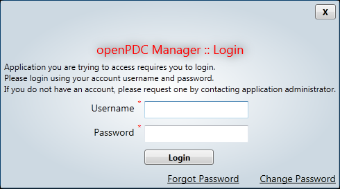

Simply enter the credentials you defined during your first run of the Configuration Setup Utility and then click the "Login" button.

If you installed the web based openPDC Manager using the installers, simply open up a web browser and navigate to http://localhost/openPDCManager/. If you built it from source, you will need to follow these steps.

1. Open the Synchrophasor solution in Microsoft Visual Studio 2008.
2. In the Solution Explorer, right-click on the "Web" project (in Applications\openPDCManager) and select "Set as StartUp Project".
3. Still in the Solution Explorer, right-click "Default.aspx" (in the Web project) and select "Set As Start Page".
4. In the toolbar, go to "Debug > Start Debugging".

---

## Using the openPDC Manager

This section will describe the process by which you can configure the openPDC using the openPDC Manager. Since the node table is the first table you will need to configure, we will be using it to demonstrate how to create and modify entries.

Before you begin your configuration, please note that this guide assumes you have used only the initial data set to set up your database; not the sample data set. In the case of Access, this means copying the "openPDC-InitialDataSet.mdb" file instead of the "openPDC-SampleDataSet.mdb" file. In the case of SQL Server and MySQL, it means running only the "openPDC.sql" and "InitialDataSet.sql" files when you set up your database. If you need to reset your database in order to do this, please read the [Reset Database FAQ](FAQ.md#i-need-to-reset-my-database-what-should-i-do). The Configuration Setup Utility will set up the initial data set for you by default.

### Creating the first node

The first step to configuring the openPDC is to create a node. Each node corresponds to an instance of the openPDC.

In order to configure your nodes, go to "Manage > Nodes".

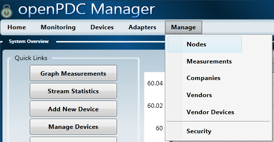

The following describes each of the fields and the types of information you can enter.

**Node ID**

Once your node has been saved, its node ID will be automatically generated and will be available in this text box. It can then be copied and pasted into your openPDC configuration file.

**Name**

Enter a name for the node to help you identify the node later on.

**Company**

Select the company who owns the node. The values of this list come from the Companies table.

**Longitude and Latitude**

Optionally enter the physical location of the node.

**Description**

Optionally enter a short description of the node.

**Image**

Optionally enter the path to an image that represents or helps identify the node.

**Settings**

Enter Remote Status Server Connection String and the Data Publisher Port.

**Load Order**

Enter an integer value that represents the order in which this table's records are pulled from the database. The order goes from smallest to largest.

**Master**

Indicates whether the node is a master. Currently, this does not affect how the node operates and is simply there for the user's reference.

**Enabled**

Indicates whether the node is enabled or not. If your node is not enabled, you will not be able to add new devices or measurements to the node using the openPDC Manager.

Once you have entered all the information, click the "Add" button. The following example setup has one node.

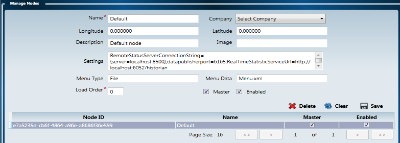

### Modifying a node

When you click on a node in the list, the information you entered will appear in the text fields. Select the node you wish to modify, edit the information in the fields, and click the "Update" button.

### Creating additional nodes

The process for creating additional nodes is essentially the same as creating the first node. The only caveat is if you have a node selected in the list, you will need to click the "Clear" button before entering the new information. The "Update" button will change back to the "Add" button, and you will be able to enter the information about your new node. If you do not click the "Clear" button first, then you will end up modifying the node you have selected.

---

## Configuring inputs

This section will go over how to use the openPDC Manager to configure the openPDC to receive data from your devices.

### Creating historians

Before you can create any devices, you have to create a historian that will archive the data received by the openPDC.

In order to configure your historians, go to "Adapters > Historians".

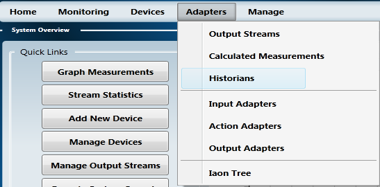

The following describes each of the fields and the types of information you can enter.

**Node**

Choose the node that will be using the historian to archive its collected data.

**Acronym**

Enter a character identifier for your historian. By convention, the acronym should be entered using only capital letters and underscores.

**Name**

Enter a name by which you can identify the historian.

**Type Name**

Enter the name, including the namespace, of the .NET class extending from OutputAdapterBase.

**Assembly Name**

Enter the name of the dll containing the .NET class extending from OutputAdapterBase.

**ConnectionString**

Optionally enter a connection string used to connect to the historian.

**Description**

Optionally enter a short description of the historian.

**Load Order**

Enter an integer value that represents the order in which this table's records are pulled from the database. The order goes from smallest to largest.

**Measurement Reporting**

Optionally enter an integer value that is used to determined how many measurements should be processed before reporting status. Set it to zero to disable status reporting.

**Runtime ID**

The integer identification number used to send commands to the historian. The link labeled "Initialized" can be used to send the initialization command to the adapter from the historian management screen.

**Local**

Indicates whether the historian runs on the node machine.

**Enabled**

Indicates whether the historian is enabled.

Common values:

| Name | Assembly Name | Type Name | Connection String |
| ---- | ------------- | --------- | ----------------- |
| TVA Local Historian | HistorianAdapters.dll | HistorianAdapters.LocalOutputAdapter |    |
| TVA Remote Historian | HistorianAdapters.dll | HistorianAdapters.RemoteOutputAdapter | `Server=localhost; Port=1003; PayloadAware=True; MaximumSamples=100000; ConserveBandwidth=True` |

Once you have entered all the information, click the "Save" button. The following example setup has one historian.

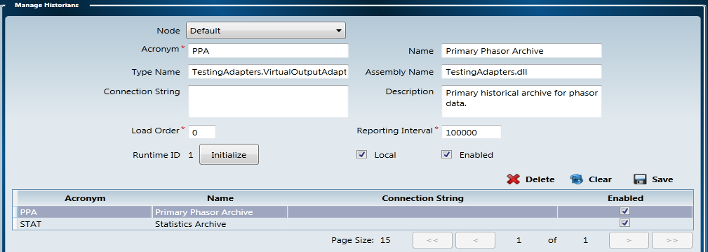

The next section details how to create devices using the [Configuration Wizard](#creating-devices-using-the-configuration-wizard). If you would rather create your devices manually, you may skip ahead to [Creating devices](#creating-devices).

### Creating devices using the Configuration Wizard

Now that you have a historian to archive the measurements, it's time to start creating devices that will be sending the measurements to the openPDC. The easiest way to create devices is to use the Configuration Wizard.

In order to get to the Configuration Wizard, go to "Devices > Input Wizard".

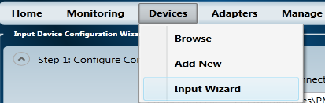

#### Step 1: Configure Connection Settings

The following describes each of the fields in this step and the types of information you can enter.

**Connection File**<br>
This is the connection file for your device that was [generated by the PMU Connection Tester](PMU_Connection_Tester.md#using-previous-connections). Using this file will automatically configure your device's connection string and phasor protocol. This file is completely optional.

**Connection String**

Enter the connection string for the device. This will be automatically configured if you specified a Connection File. Descriptions and examples of connection strings can be found on the [Getting Started](Getting_Started.md#configuring-a-connection-string) page.

**Alternate Command Channel**

Enter the connection string that defines the connection used to send commands to the device. This will be automatically configured if you specified a Connection File. The command channel cannot be a UDP connection. Descriptions and examples of connection strings can be found on the [Getting Started](Getting_Started.md#configuring-a-connection-string) page.

**Device ID Code**

Enter the ID Code of the device that you are connecting to.

**Device Protocol**

This is the phasor protocol used by the device that you are connecting to.

Once you've entered all the necessary information, click "Next". The following shows an examples of this step.<

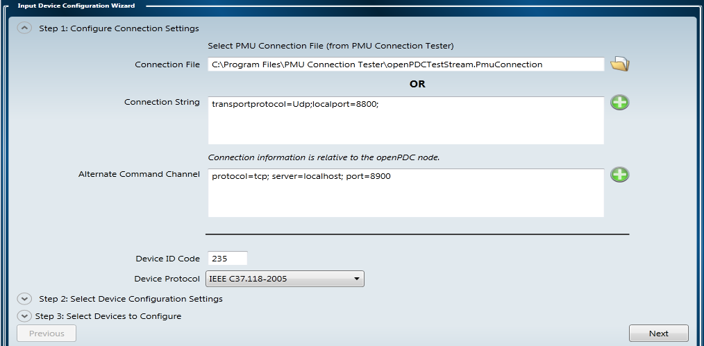

#### Step 2: Select Device Configuration Settings

The following describes each of the fields in this step and the types of information you can enter.

**Request Configuration From openPDC**

The openPDC is capable of retrieving device configuration information upon request from the openPDC Manager. Doing so allows you to easily receive the device configuration without the use of an XML configuration file generated by the PMU Connection Tester. In order for configuration retrieval to be successful, the openPDC must be running, the [Remote Status Service URL](#viewing-real-time-data) must be configured properly, the connection string and command channel for the device must be configured properly in step 1, and the device must be available to communicate with the openPDC.

**Configuration File**

This is the configuration file for your device that was [generated by the PMU Connection Tester](PMU_Connection_Tester.md#saving-configuration-files). If configuration retrieval from the openPDC is unsuccessful and the XML configuration is available, enter the path to the XML configuration file here.

**Connection is to Concentrator**

Check this box if you are connecting to a PDC.

**PDC Acronym** (only visible if Connection is to Concentrator is checked)

The acronym of the PDC you are connecting to.

**PDC Name** (only visible if Connection is to Concentrator is checked)

The name of the PDC you are connecting to.

**PDC Device Vendor** (only visible if Connection is to Concentrator is checked)

The vendor of the PDC you are connecting to.

**Company**

Select the company that owns the device.

**Historian**

Select the historian that will be archiving the measurements being received by the device.

**Interconnection**

Select the interconnection of the device.

Once you've entered all the necessary information, click "Next". The following example setup shows the fields populated with valid values with and without a PDC.

**No PDC**

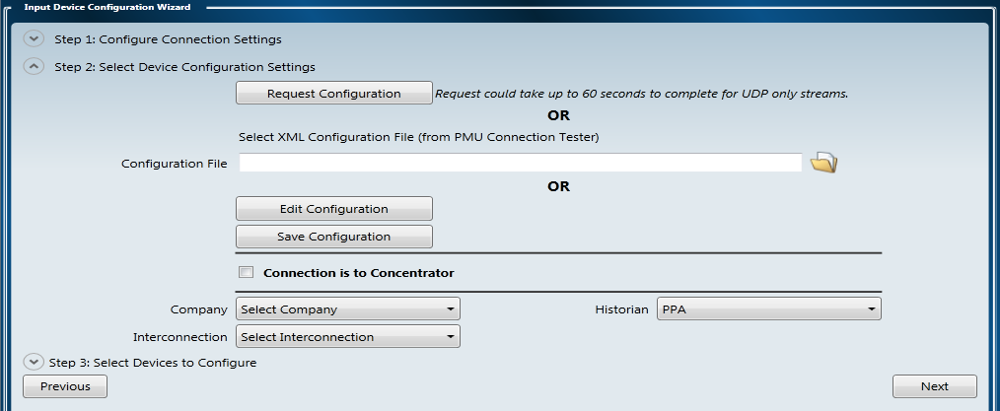

**PDC**

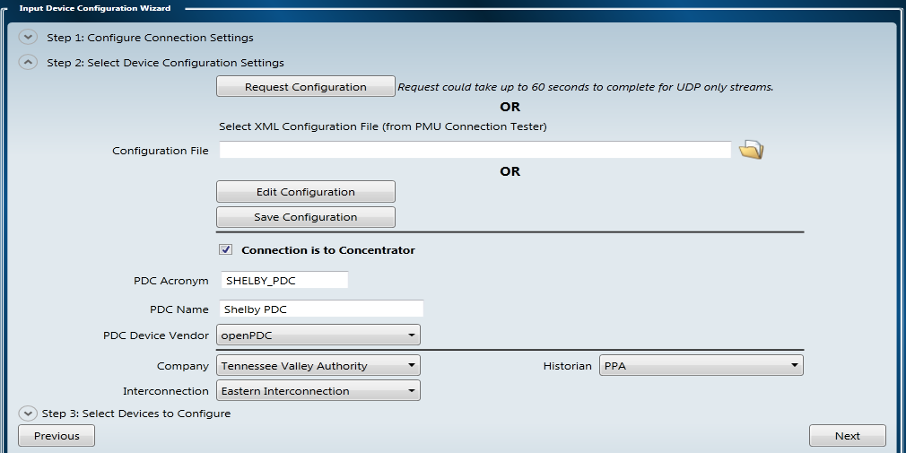

#### Step 3: Select Devices to Configure

In this step, the checkboxes allow you to choose which devices and phasors you wish to add to your openPDC configuration. The following describes each of the fields in this step and the types of information you can enter.

**Acronym**
The acronym of the device.

**Name**

The name of the device.

**Longitude and Latitude**

Optionally enter the physical location of the device.

**Digital and Analogs**

Check these boxes to include digital values and/or analog values in the device configuration.

**Label**

The label describing the phasor.

**Type**

Voltage or current.

**Phase**

Positive Sequence = "+", Negative Sequence = "-", Phase A = "A", Phase B = "B", or Phase C = "C".

Once you've entered all the necessary information, click "Finish". The following example setup shows the fields populated with valid values.

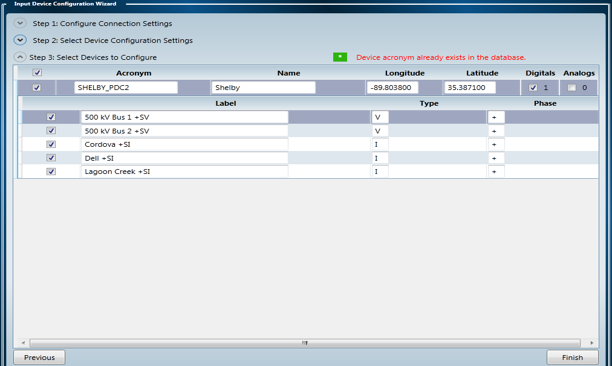

At this point, you may wish to skip ahead to [Configuring outputs](#configuring-outputs).

### Creating devices

Note that if you have a concentrator that collects data from multiple PMUs and then sends that data to one of your nodes, you will need to add individual records for that concentrator and each of the PMUs sending data to it. If you have any concentrators you will be creating records for, you will need to add them before you start adding your PMUs.

In order to add new devices, go to "Devices > Add New".

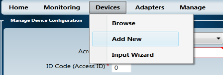

The following describes each of the fields and the types of information you can enter.<br>

**Node**

Choose the node that will be receiving data from the device.

**Concentrator (Dropdown)**

If you have any devices that send data to another concentrator which then forwards that data to one of your nodes, select that concentrator from this list.

**Acronym**

Enter a character identifier for your device. By convention, the acronym should be entered using only capital letters and underscores. This field can be a maximum of 16 characters.

**Name**

Enter a name by which you can identify the device.

**Company**

Select the company who owns the device.

**Historian**

Select the historian which will be archiving measurements received from this device.

**ID Code (AccessID)**

Every device has an Access ID (also known as Device ID) assigned to it by the owner in its configuration. Enter that value here. It is important that this field matches the ID number assigned by the manufacturer.

**Interconnection**

Select the interconnection that the device is collecting data from.

**Device Vendor**

Select the model of the device.

**Protocol**

Select the protocol used by the device to send the data.

**Longitude and Latitude**

Optionally enter the physical location of the device.

**Connection String**

Enter the connection string used to connect to the device. Descriptions and examples of connection strings can be found on the
[Getting Started](Getting_Started.md#configuring-a-connection-string) page.

**Note**: The example connection strings include two records you do not need to enter. Please remove the "phasorProtocol" and "accessID" records from the connection string when entering the connection string into this field.

**Alternate Command Channel**

If a device uses an alternate command channel, for instance if the device sends data over a UDP connection and receives commands over a TCP connection, then you can define that command channel here.

**FramesPerSecond**

**Enter the frame rate of the device in frames per second.

**Time Zone**

Enter the timezone of the device.

**Data Loss Interval**

If the device stops reporting measurements, this is the amount of time (in seconds) that the openPDC will wait before attempting to re-establish the connection.

**Time Adjustment Ticks**

Enter a number of ticks that will be added to the time reported by the device. (This allows for adjustment if the device's GPS clock is off.)

**Allowed Parsing Exceptions**

Enter an integer value that represents the number of exceptions that can occur within the parsing exception window before the device is disconnected

**Delayed Connection Interval**

Enter a numeric value that represents the number of seconds between connection attempts when a connection cannot be established with the device.

**Parsing Exception Window**

Enter a numeric value that represents the number of seconds to wait before resetting the exception count. If the exception count reaches the number of allowed parsing exceptions within this time interval, the device will be disconnected.

**Measurement Reporting Interval**

Optionally enter an integer value that is used to determined how many measurements should be processed before reporting status. Set it to zero to disable status reporting.

**Skip Disable Real-Time Data**

Indicates whether to skip automatic disabling of the real-time data stream on startup or shutdown.

**Allow Use Of Cached Configuration**

Indicates whether the use of a cached configuration during initial connection is allowed when a configuration has not been received within the data loss interval.

**Auto Start Data Parsing Sequence**

Indicates whether to begin parsing data from the device automatically or to wait for the user to start it manually.

**Concentrator**

Indicates whether the device is a concentrator.

**Enabled**
Indicates whether the device is enabled.

**Contact List**

Optionally enter contact information for the person associated with the device.

**Runtime ID**

The integer identification number used to send commands to the device. The link labeled "Initialized" can be used to send the initialization command to the adapter from the device management screen.

**Connect On Demand**

Indicates whether the adapter will be running or not upon requests from other adapters.

Common values:

| Protocol | Connection String | 
| -------- | ----------------- |
| BPA PDCstream | `iniFileName=TestConfig.ini; transportProtocol=udp; port=8500` |
| IEEE 1344-1995 | `transportProtocol=File; file=Sample1344.PmuCapture` |
| IEEE C37.118-2005 | `transportProtocol=tcp; server=localhost:8888` |
| SEL Fast Message | `transportProtocol=serial; port=COM1; baudrate=57600; parity=None; stopbits=One; databits=8` |

Once you have entered all the information, click the "Save" button. The following example setup shows the fields populated with valid values.

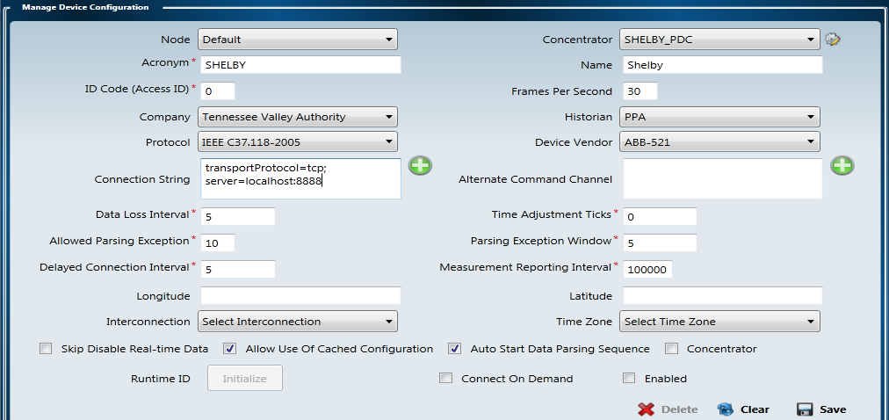

Once you have successfully added a device, you can go to "Devices > Browse" to see the new device.

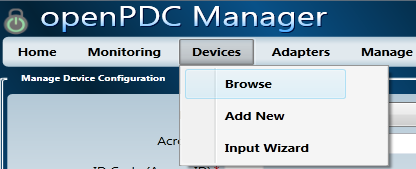

Additionally, the openPDC Manager will automatically create measurements for that device which you can view by going to "Manage > Measurements" or by clicking the "Measurements" link for that device on the devices page.

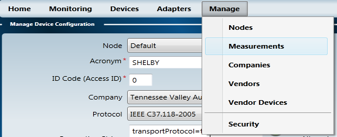

**OR**


### Modifying devices

In order to modify a device, go to the devices page ("Devices > Browse") and click on the acronym of the device you wish to modify. The "Manage Devices" page will appear with the information for that device filled in. Simply modify that information and click the "Save" button.

*Note: When making changes to a device's acronym, it is important to double-check the SignalReference field of all of its associated measurements to make sure they all changed accordingly.*

### Creating phasors

On the devices page ("Devices > Browse"), find the device for which you wish to define phasors and click the "Phasors" link.

The following describes each of the fields and the types of information you can enter in this window.

**Label**

Enter a label by which you can identify the phasor.

**Type**

Select the type of phasor. They can be a voltage or a current.

**Phase**

Select the phase. The choices are + (positive), - (negative), A (phase A), B (phase B), and C (phase C).

**Source Index**

Enter a number specifying the position of the phasor in the measurement stream. The indexes must start at 1 and be in the correct order so that the openPDC can correctly interpret the phasor data stream.

The following example has five phasors belonging to the device Shelby.

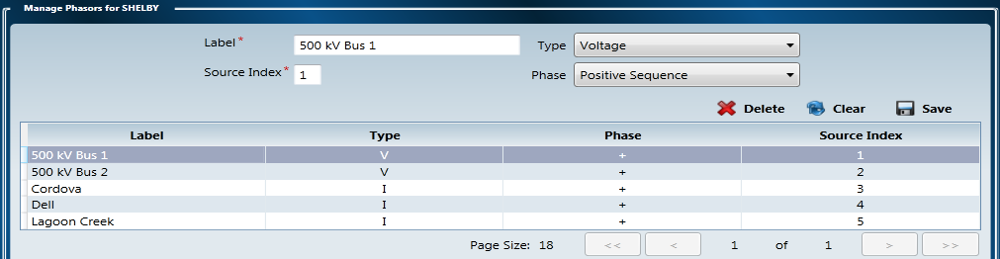

Whenever a phasor is created, the openPDC Manager automatically creates measurements corresponding with the phasor. You can view those measurements by going to "Manage > Measurements" or by clicking the "Measurements" link for that device on the devices page.

#### Creating measurements

By now, the openPDC Manager should have created most of the measurements for you. However, you have to enter any analog values, digital values, and calculated values by hand. You can manage your measurements by going to "Manage > Measurements".

The following describes each of the fields and the types of information you can enter.

**Historian**

Select the historian that will be archiving the measurement.

**Device**

Select the device that is sending the measurement to one of your nodes.

**Measurement Type**

Choose the type of measurement, such as Analog Value or Digital Value.

**Point Tag**

The point tag is a short, formatted description of the measurement. The following convention is suggested.

```
CCC_PPPP-DDDD:IIIH
CCC is a three character company identifier.
PPPP is a four character identification of the device.
DDDD is an optional destination identifier (if there is no destination, leave this identifier out and remove the dash; not the colon)
III is a manufacturer identifier.
H is an abbreviation for the signal type (A for analog value, D for digital value, C for calculated value).
```

**Alternate Tag**

An optional tag used to describe the measurement. This could be, for instance, the OSI-PI tag for a point.

**Signal Reference**

The signal reference is vitally important to the system. It defines a link between a measurement and its device. The following describes the syntax for the signal reference.

**`ACRONYM-SX#`**

`ACRONYM` is the acronym of the device sending the measurement.

`SX` is a two character suffix for the signal type (`AV`for analog value, `DV` for digital value, `CV` for calculated value).

`#` is the index of the measurement, starting from 1 and incrementing by 1 for each additional measurement of the same signal type.

A more detailed description of how to enter the signal reference can be found on the [Manual Configuration](Manual_Configuration.md#the-signalreference-column) page.

**Description**

Optionally enter a short description of the measurement.

**Adder**
Enter a value that will be added to the measurement before any processing takes place.

**Multiplier**

Enter a value that will be multiplied with the measurement before any processing takes place.
<br>
**Enabled**

Indicates whether the measurement is enabled.

**Subscribed**

Indicates whether the measurement is subscribed from another openPDC or openPG.

**Internal**

Indicates whether the measurement is internal to the openPDC or openPG and that can be subscribed by another one of any of these two.

The following is an example of the result of having added a digital value to a device.

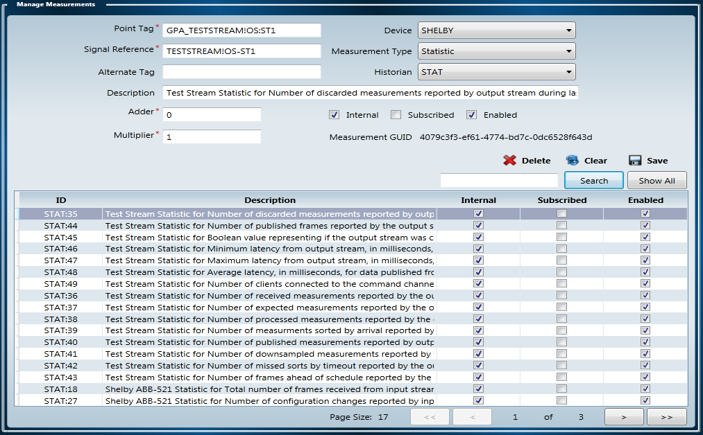

---

## Configuring outputs

Now that you have created some inputs, you can begin configuring your outputs. This section will go over how to configure the openPDC to send the data to other devices or applications.

### Creating output streams

The first step toward sending data out of the system is to create an output stream.

In order to manage your output streams, go to "Adapters > Concentrator Output Streams".

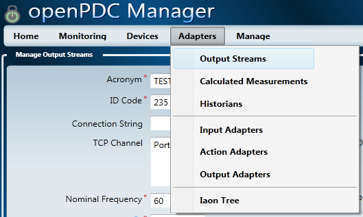

The following describes each of the fields and the types of information you can enter.

**Acronym**

Enter a character identifier for your output stream. By convention, the acronym should be entered using only capital letters and underscores.

**Name**

Enter a name by which you can identify the output stream.

**Type**

Select the protocol used to send the data. You can choose between IEEE C37.118 and BPA.

**ID Code**

Enter an identification number. This number is used in some protocols to identify the sender. In other cases it is simply ignored.

**Connection String**

If necessary, enter a string that defines the connection to the stream.

**TCP Channel**

Enter connection settings (in connection string format) for the channel through which to issue commands to the stream.

**UDP Channel**

Enter connection settings (in connection string format) for the channel through which data is being sent from the openPDC.

**Nominal Frequency**

Enter the nominal frequency of the stream as an integer.

**Frames Per Second**

Enter the number of frames per second of the stream as an integer.

**Lag Time**

Enter the lag time in seconds as a floating point number. The lag time defines the amount of time to wait for all the data for a particular time frame to arrive. Any data arriving after the lag time has passed is discarded.

**Lead Time**

Enter the lead time in seconds as a floating point number. The lead time is a measure of the accuracy of the local clock. Any measurements arriving with future timestamps that exceed the local time plus the lead time will be discarded.

**Auto Publish Config Frame**

Indicates whether the system should automatically publish the configuration frame periodically in addition to waiting for requests on the command channel.

**Auto Start Data Channel**

Indicates whether to automatically start the data channel.

**Use Local Clock As Real Time**

Indicates whether the system should use the local clock as real time. If this is unchecked, the timestamp of the most recent measurement is used as real time.

**Allow Sorts By Arrival**

Indicates whether to use the arrival time to sort the measurements instead of the timestamp.

**Load Order**

Enter an integer value that represents the order in which this table's records are pulled from the database. The order goes from smallest to largest.

**Enabled**

Indicates whether the output stream is enabled.

Common Values:

| Type | Connection String |
| ---- | ----------------- |
| IEEE C37.118 |    |
| BPA | `iniFileName=TESTSTREAM.ini` |

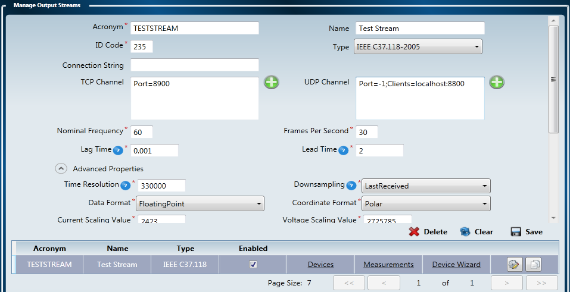

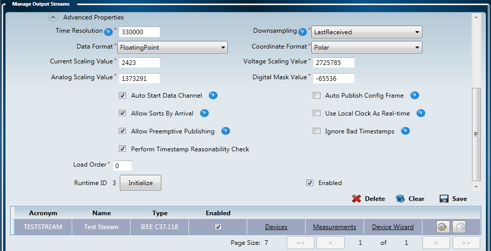

### Using the device wizard

The simplest way to attach input devices to your output streams is to use the device wizard.

In order to launch the wizard, pick the stream you wish to add devices to and click the "Launch Device Wizard" link.

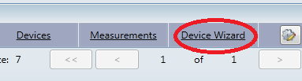

A small window titled "Current Devices for TESTSTREAM" should appear in a new page. At the bottom of the window, select the "Add More Devices" button.

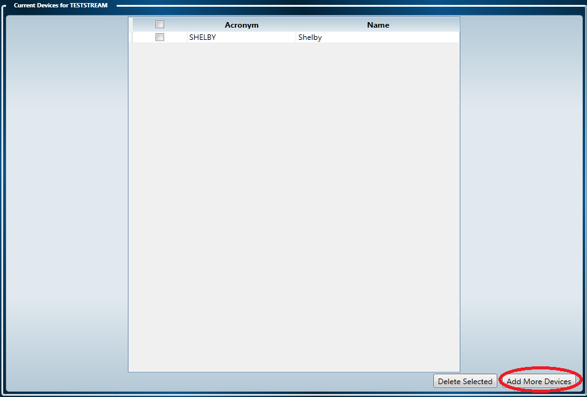

Another window should then appear listing the input devices defined for the system. Select the devices you wish to add, don't forget to mark "Add Analogs" or "Add Digitals" if you so desire, and click the "Add Selected" button.

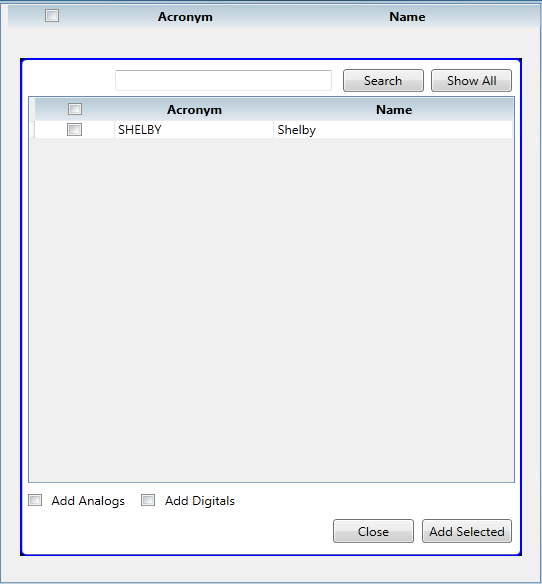

Any devices you added to the output stream will then disappear from this list and will be added to the "Current Devices" list. Once you are finished, close both windows and you will return to the output stream page. You can view any changes by clicking the "Devices" and "Measurements" links.

---

## Creating virtual output devices

The openPDC also allows you to create virtual output devices. A virtual output device is a device that does not physically exist, but devices and applications receiving the data will believe it exists. These devices are useful if you want to pick and choose which measurements should be sent to a certain device or application. In order to demonstrate the concept, we will go over an example of creating an output stream that sends all measurements from Shelby except for current magnitudes and current phase angles. We will be creating a virtual output device named Lupi to illustrate that the device does not physically exist.

This section assumes you've gone through the previous sections and will not be describing the fields and types of information that can be entered in each window. Additionally, the examples in the previous section showed how to create the sample data set using the openPDC Manager (there are minor differences between the example and the sample data set, but for the purposes of this document they might as well be the same). This section will be building on those examples so if you wish to follow along, feel free to either use the examples or simply start with the sample data set.

### Creating a second output stream

The first thing we need to do is create a brand new output stream. Test Stream was designed to take all the measurements from Shelby and send them out to other applications or devices. This new output stream will be used to send all measurements except for current magnitudes and current phasors. The following image shows the screen with our Example Stream. The data entered into the fields is listed beneath the image.

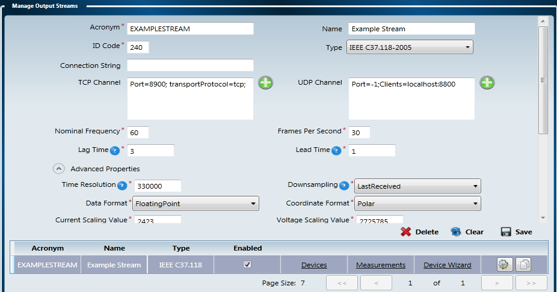

| Field | Value |
| ----- | ----- |
| Node | Development |
| Acronym | EXAMSTREAM |
| Name | Example Stream |
| Type | IEEE C37.118 |
| ID Code | 240 |
| Connection String |     |
| Command Channel | `port=8950; transportprotocol=tcp; interface=0.0.0.0` |
| Data Channel | `port=-1; clients=localhost:8850; interface=0.0.0.0` |
| Nominal Frequency | 60 |
| Frames Per Second | 30 |
| Lag Time | 3 |
| Lead Time | 1 |
| Auto Publish Config Frame | unchecked |
| Auto Start Data Channel | checked |
| Use Local Clock As Real Time | checked |
| Allow Sorts By Arrival | checked |
| Load Order | 1 |

### Creating a virtual output device

Click the "Devices" link on the new output stream and a window should appear titled "Manage Devices For Output Stream". This is where we will be creating our virtual output device. Below is an image of the example as well as a list of the data entered into the fields.

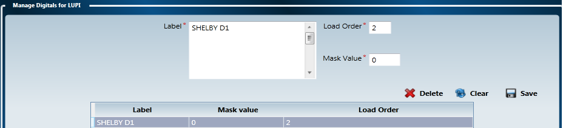

| Field | Value |
| ----- | ----- |
| Acronym | LUPI |
| Name | Lupi |
| BPA Acronym |   |
| ID Code | 240 |
| Load Order | 1 |
| Enabled | checked |

**Note**: BPA Acronym must be set for devices attached to a stream using the BPA protocol. The BPA Acronym can be a maximum of four characters.

### Creating phasors for your virtual output device

Click the "Phasors" link on your virtual output device to start defining phasors. Since we are discarding all the measurements that are currents, we only need to define voltages in this table. Shelby has two voltages so we create two phasors in this table. The following image shows the two phasors and the table beneath it lists the values for each of them.

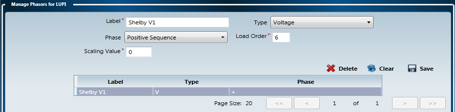

| Field | Value |
| ----- | ----- |
| Label | Shelby V1 |
| Type | Voltage |
| Phase | Positive |
| Load Order | 6 |

### Creating digitals for your virtual output device

When you create virtual output devices, you have to define the analog values and digital values just like how you define your phasors. In this example, Shelby has one digital value so we will only be defining one digital value for our virtual output device. Click the "Digitals" link for your virtual output device to start defining digital values. The following image shows the digital value and the table beneath it lists the values for the fields.


| Field | Value |
| ----- | ----- |
| Label | Shelby D1 |
| Load Order | 2 |

### Attaching measurements to the output stream

This is the point where we pick and choose which input measurements will be associated with our virtual output device. Click the "Measurements" link on the output stream. A window will appear titled "Manage Measurements For Output Stream".

Click the button labeled "..." next to "Source Measurement". Another window will appear containing a list of the measurements that were defined by your inputs. The measurements are identified by their point tag. The abbreviation for current magnitude is "I" and current angle is "IH" so we will choose all the measurements that do not end in either "I" or "IH".

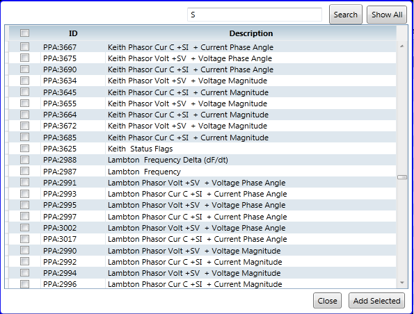

Once you have selected all the measurements you want to associate with your virtual output device, click the "Add Selected" button. They will disappear from the list. Close that window and the measurements you selected will now appear in the "Manage Measurements For EXAMPLESTREAM" window. You will then need to modify the Signal Reference of the measurements you added in order to associate the measurements with your virtual output device.

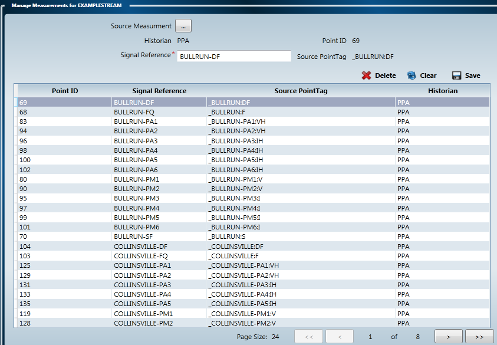

---

## Viewing real-time data

The node management page has a text field you can use to define a Time Series Data Service URL. It allows you to view openPDC data in real-time from an openPDC instance that is archiving the data locally. The following subsections will guide you in setting up and using this feature.

### Finding the Time Series Data Service URL

The Time Series Data Service URL can be found in the openPDC configuration file named openPDC.exe.config. The value is found in the following location.

```xml
<configuration>
    <catgorizedSettings>
        <historianTimeSeriesDataService>
            <add name="ServiceURI" value="[Time Series Data Service URL]" />
        </historianTimeSeriesDataService>
    </catgorizedSettings>
</configuration>
```

*Note: The &lt;historianTimeSeriesDataService> tag will vary based on the acronym of your local historian. The word "historian" will be replaced by the acronym.*

Enter this value into the Time Series Data Service URL field on the node management page and click the "Save" button to save your changes.

### Finding the Real-Time Statistic Service URL

The Real-Time Statistic Service URL can be found in the openPDC configuration file named openPDC.exe.config. The value is found in the following location.

```xml
<configuration>
    <catgorizedSettings>
        <statTimeSeriesDataService>
            <add name="ServiceURI" value="[Real-Time Statistic Service URL]"/>
        </statTimeSeriesDataService>
    </catgorizedSettings>
</configuration>
```

Enter this value into the Real-Time Statistic Service URL field on the node management page and click the "Save" button to save your changes.

### The real-time data graph

The real-time data graph can be found in the upper-right corner of the openPDC Manager home page. This graph can be used to see the value of a specific measurement in real-time. The drop-down list on the left allows you to select the device from which to select a measurement. The drop-down list on the right contains a list of the measurements associated with that device. The measurements are identified by their PointTag.

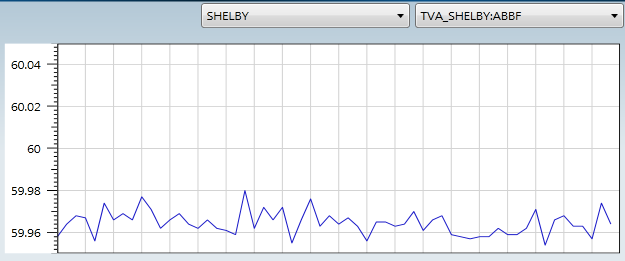

### The device measurements tree

The device measurements tree can be reached by going to "Monitoring >Device Measurements".

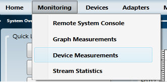

This tree shows information about all devices defined for the currently active node. Beneath each device is a list of all of the device's measurements as well as recent values and the timestamp for those values. These values are refreshed every 10 seconds. The lists can be collapsed or expanded at the user's will.

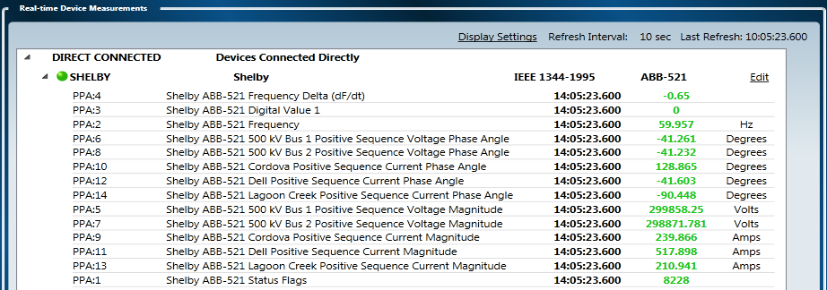

---

## Using the console monitor

The node management page has a text field you can use to define a Remote Status Service URL. It allows you to view the openPDC Console output from within the openPDC Manager and also to send commands to the openPDC. The following subsections will guide you in setting up and using this feature.

### Finding the Remote Status Service URL

The Remote Status Service URL can be found in the openPDC Console configuration file named openPDCConsole.exe.config. The value is found in the following location.

```xml
<configuration>
    <catgorizedSettings>
        <remotingClient>
            <add name="ConnectionString" value="[Remote Status Service URL]" />
        </remotingClient>
    </catgorizedSettings>
</configuration>
```

*Note: The value will not look like a URL. Be sure to use the entire ConnectionString value within the quotes.*

Enter this value into the Remote Status Service URL field on the node management page and click the "Save" button to save your changes.

### The console monitor

The console monitor can be found by going to "Monitoring > Remote Console".

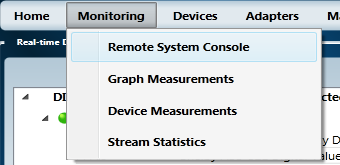

On the left of this page is the system monitor which looks similar to the openPDC Console itself. On the right is a service command text box where you can enter the commands you would normally enter into the openPDC Console. Once you've entered a command, press Enter or click the "Send" button to send that command to the openPDC. The results will appear in the system monitor just like they would in the openPDC Console window.


For more information about the commands you can send to the openPDC, see the [Getting Started](Getting_Started.md#using-the-openpdc-console) page.


---

Jun 20, 2012 3:00 PM - Last edited by [alexfoglia](http://www.codeplex.com/site/users/view/alexfoglia), version 71  
Oct 4, 2015 - Migrated from [CodePlex](http://openpdc.codeplex.com/wikipage?title=Manager%20Configuration) by [aj](https://github.com/ajstadlin)  
Dec 9, 2016 - Updated by [aj](https://github.com/ajstadlin), version 71.1

---

Copyright 2016 [Grid Protection Alliance](http://www.gridprotectionalliance.org)