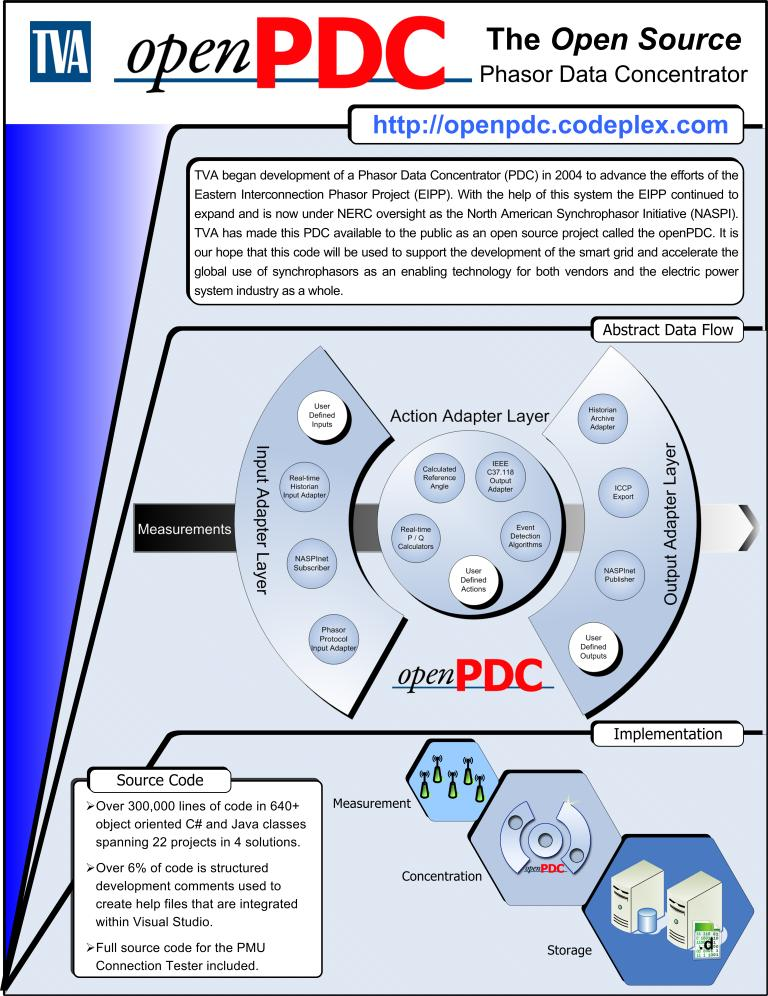
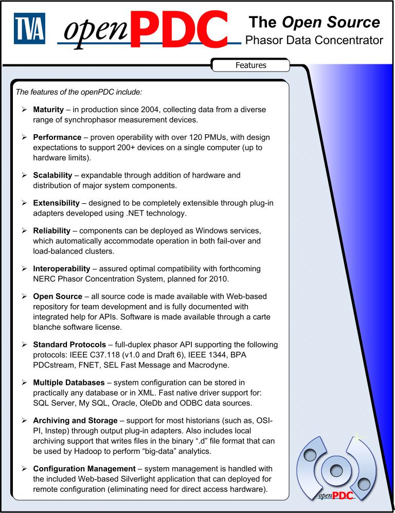

|   |   |   |   |   |
|---|---|---|---|---|
| **[Grid Protection Alliance](http://www.gridprotectionalliance.org "Grid Protection Alliance Home Page")** | **[openPDC Project](https://github.com/GridProtectionAlliance/openPDC "openPDC Project on GitHub")** | **[openPDC Wiki](openPDC_Home.md "openPDC Wiki Home Page")** | **[Documentation](openPDC_Documentation_Home.md "openPDC Documentation Home Page")** | **[Latest Release](https://github.com/GridProtectionAlliance/openPDC/releases "openPDC Releases Home Page")** |

***This is an archival document and its contents are no longer maintained or updated. Please see the latest version of the openPDC project at [https://github.com/GridProtectionAlliance/openPDC](https://github.com/GridProtectionAlliance/openPDC).***

---

# openPDC Overview

Below is a one-page flyer (front and back) that we developed to provide an overview of the openPDC. Click [here](openPDC_Overview.files/Overview.pdf) to download the overview in PDF form.

---

Oct 16, 2009 1:39 AM - Last edited by [ritchiecarroll](https://github.com/ritchiecarroll), version 7  
Oct 4, 2015 - Migrated from [CodePlex](http://openpdc.codeplex.com/wikipage?title=Overview) by [aj](https://github.com/ajstadlin)

---

Copyright 2016 [Grid Protection Alliance](http://www.gridprotectionalliance.org)