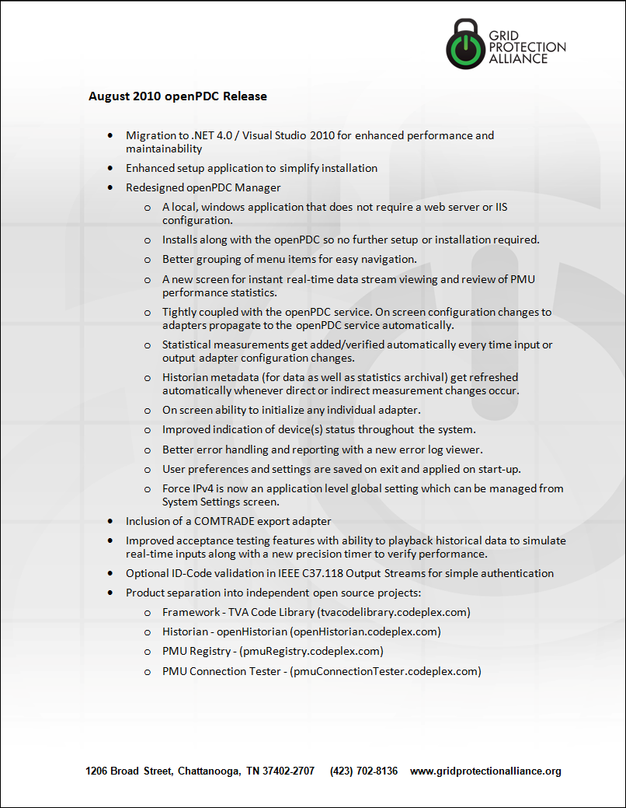

|   |   |   |   |   |
|---|---|---|---|---|
| **[Grid Protection Alliance](http://www.gridprotectionalliance.org "Grid Protection Alliance Home Page")** | **[openPDC Project](https://github.com/GridProtectionAlliance/openPDC "openPDC Project on GitHub")** | **[openPDC Wiki](openPDC_Home.md "openPDC Wiki Home Page")** | **[Documentation](openPDC_Documentation_Home.md "openPDC Documentation Home Page")** | **[Latest Release](https://github.com/GridProtectionAlliance/openPDC/releases "openPDC Releases Home Page")** |

***This is an archival document and its contents are no longer maintained or updated. Please see the latest version of the openPDC project at [https://github.com/GridProtectionAlliance/openPDC](https://github.com/GridProtectionAlliance/openPDC).***

---

# [openPDC August 2010 Release](openPDC_v1.2_Release_Aug2010.md)

---

Sep 21, 2010 at 2:58 PM Last edited by [ritchiecarroll](https://github.com/ritchiecarroll), version 1  
Oct 8, 2015 Migrated from [CodePlex](http://openpdc.codeplex.com/wikipage?title=August 2010 version 1.2 Release Features) by [aj](https://github.com/ajstadlin)

---

Copyright 2016 [Grid Protection Alliance](http://www.gridprotectionalliance.org)