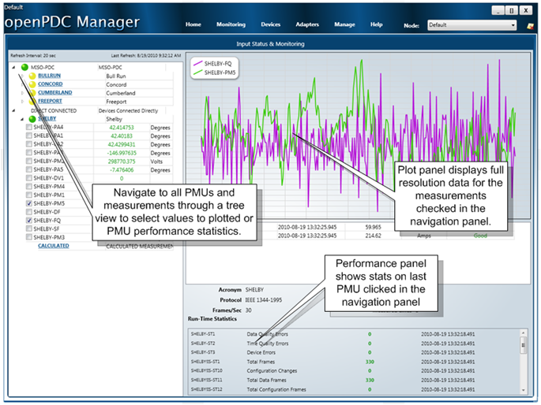

|   |   |   |   |   |
|---|---|---|---|---|
| **[Grid Protection Alliance](http://www.gridprotectionalliance.org "Grid Protection Alliance Home Page")** | **[openPDC Project](https://github.com/GridProtectionAlliance/openPDC "openPDC Project on GitHub")** | **[openPDC Wiki](https://github.com/GridProtectionAlliance/openPDC/wiki)** | **[Documentation](https://github.com/GridProtectionAlliance/openPDC/wiki/Documentation)** | **[Latest Release](https://github.com/GridProtectionAlliance/openPDC/releases "openPDC Releases Home Page")** |

***This is an archival document and its contents are no longer maintained or updated. Please see the latest version of the openPDC project at [https://github.com/GridProtectionAlliance/openPDC](https://github.com/GridProtectionAlliance/openPDC).***

---

# openPDC v1.2 August 2010 Release

|   |   |
|---|---|
| Change Set: [57499 on CodePlex](http://openpdc.codeplex.com/SourceControl/changeset/view/57499) | Released: Sep 15, 2010 7:00:00 AM |
| Dev status:  Stable | Uploaded: Sep 21, 2010 |

## Recommended Download

[ openPDCSetup.zip (18731K, uploaded Sep 21, 2010)](http://openpdc.codeplex.com/downloads/get/151227 "Zip Archive, 18731K uploaded Sep 21, 2010 8:27:42 PM")

### Release Notes

 This is the August 2010 release build of the openPDC, version 1.2.40

Note that this version of the openPDC has been upgraded to work with .NET 4.0. Make sure your system has .NET 4.0 before installation:

[Microsoft .NET Framework 4 (Web Installer)](http://www.microsoft.com/downloads/en/details.aspx?FamilyID=9cfb2d51-5ff4-4491-b0e5-b386f32c0992&amp;displaylang=en)

[See our YouTube video for quick installation of the openPDC August 2010 Release](http://www.youtube.com/watch?v=TmuQD3dluxM")

The August release has three improvement focus areas:

* Performance
* Stability
* Simplicity

A multitude of performance and stability enhancements are included with this release - see the deep [change log](http://openpdc.codeplex.com/SourceControl/list/changesets) for details. Additional performance and stability benefits, including fundamental multi-threading improvements, come from the upgrade to .NET 4.0.

Simplicity was targeted at both ease-of-use in the user interface and easier installation. This version of the openPDC comes with a completely new, tightly integrated GUI based version of the openPDC manager. The GUI manager automatically installs along with the openPDC so no further setup or installation will be required to use the system. The web based openPDC manager is still available for web based deployments where desired, but this is now an optional component and the more complicated IIS installation can be turned over to IT staff.

---

Sep 23, 2010 8:43:52 PM - Updated by [ritchiecarroll](https://github.com/ritchiecarroll)  
Oct 8, 2015 - Migrated from [CodePlex](http://openpdc.codeplex.com/releases/view/48468) by [aj](https://github.com/ajstadlin)

---

Copyright 2016 [Grid Protection Alliance](http://www.gridprotectionalliance.org)